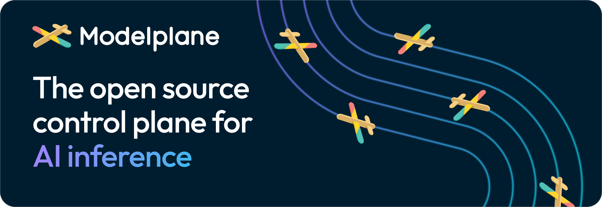

[](https://github.com/modelplaneai/modelplane/actions/workflows/ci.yml)
[](https://github.com/modelplaneai/modelplane/releases)
[](LICENSE)

<p align="center">
  
</p>

Modelplane is software you install and run in your own environment to orchestrate
models, the serving stack, and the infrastructure underneath across cloud,
neocloud, and on-premise. It runs any model on any engine on any infrastructure,
from a single GPU to disaggregated, multi-node deployments. Built on
[Crossplane], it is an active system that continuously reconciles your fleet
toward the state you declare: provisioning inference clusters, scheduling
deployments onto compatible clusters, scaling replicas, caching weights, and
routing traffic.

Platform teams provision clusters and publish hardware classes. Developers
declare a model and get back a unified, OpenAI-compatible endpoint. Neither team
has to know the details of the other's job.

> [!WARNING]
> Modelplane is an early v0.1 release under active development. Its APIs and
> behavior can change between releases. We are building it in the open,
> collaborating with the AI inference community on integrations and capabilities.

## Deploy a model

Once a platform team has provisioned inference clusters and declared the
available GPUs, a developer deploys a model with a declarative manifest:

```yaml
apiVersion: modelplane.ai/v1alpha1
kind: ModelDeployment
metadata:
  name: qwen-demo
  namespace: ml-team
spec:
  replicas: 1
  engines:
  - name: qwen
    members:
    - role: Standalone
      nodeSelector:
        devices:
        - name: gpu
          count: 1
          selectors:
          - cel: device.capacity["gpu.nvidia.com"].memory.compareTo(quantity("20Gi")) >= 0
      template:
        spec:
          containers:
          - name: engine
            image: vllm/vllm-openai:v0.23.0
            args: ["--model=Qwen/Qwen2.5-0.5B-Instruct"]
```

Modelplane schedules the replica onto a cluster with free, compatible GPUs and
deploys the serving engine. Expose it behind one OpenAI-compatible endpoint with
a `ModelService`:

```yaml
apiVersion: modelplane.ai/v1alpha1
kind: ModelService
metadata:
  name: qwen
  namespace: ml-team
spec:
  endpoints:
  - selector:
      matchLabels:
        modelplane.ai/deployment: qwen-demo
```

## Getting started

Follow the [getting started guide][getting-started] to deploy Modelplane on a
local kind cluster and serve a model. The [how it works][how-it-works] page
covers the resources and what happens when you deploy a model.

The [example manifests][examples] are validated, end-to-end recipes that serve
specific models, each covering the full workflow from inference class and cluster
through model cache, deployment, and service.

## How it works

Modelplane runs as a control plane on its own cluster, above the inference
clusters that serve models. Its API is two sets of resources, one per role, with
everything in between composed for you:

- **Platform teams** create `InferenceClusters` (the GPU fleet, provisioned by
  Modelplane or brought as-is) and `InferenceClasses` (hardware recipes: the
  devices a node pool offers and how to provision it), fronted by an
  `InferenceGateway`.
- **Developers** create a `ModelDeployment` (a model's engines, replica count,
  and an optional `ModelCache`) and a `ModelService` (one endpoint across the
  replicas it selects).
- **Modelplane composes** a `ModelReplica` per cluster and a `ModelEndpoint` per
  replica.

Once those resources exist, Modelplane keeps the fleet matching them across five
concerns: **provisioning** clusters and their node pools, **scheduling** each
replica onto a cluster and pool whose hardware fits, **scaling** replicas through
the standard Kubernetes scale subresource, **routing** through one
OpenAI-compatible endpoint with weighted canary and A/B rollouts, and **caching**
model weights once per cluster.

Modelplane is unopinionated about the engine. A `ModelDeployment` describes the
shape of a deployment, how many pods, on how many nodes, with which devices; the
engine flags you write carry parallelism, quantization, and KV transfer.
Modelplane never injects them. That is what lets one API serve any
container-based engine and any topology.

## Current status

Modelplane is at v0.1. It is early and evolving fast. See [issues labeled `enhancement`][enhancements] for what's planned.

## Get involved

Contributions, bug reports, and feature requests are welcome.

- **Issues:** [GitHub Issues][issues]
- **Discussions:** [GitHub Discussions][discussions]
- **Slack:** [#modelplane][slack] in the Kubernetes workspace

See [CONTRIBUTING.md] for how to get set up, run checks, and submit changes.

## License

Modelplane is under the [Apache 2.0 license](LICENSE).

Modelplane™ is a trademark. The Apache 2.0 license grants no trademark rights:
the Modelplane name and logos are not covered by it.

<!-- Named links -->
[Crossplane]: https://crossplane.io
[CONTRIBUTING.md]: CONTRIBUTING.md
[getting-started]: https://docs.modelplane.ai/getting-started/
[how-it-works]: https://docs.modelplane.ai/overview/how-it-works/
[examples]: docs/manifests/examples/
[issues]: https://github.com/modelplaneai/modelplane/issues
[enhancements]: https://github.com/modelplaneai/modelplane/issues?q=is%3Aissue+is%3Aopen+label%3Aenhancement
[discussions]: https://github.com/modelplaneai/modelplane/discussions
[slack]: https://kubernetes.slack.com
