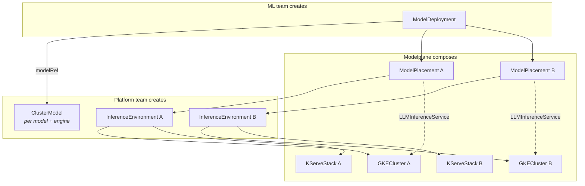

# Modelplane v0.1 — Product Requirements Document

**Status:** Draft  
**Date:** March 2026  
**Author:** Nic Cope

---

## Executive summary

Modelplane is an open-source Crossplane-based inference platform that enables enterprise platform teams to offer self-service LLM inference to their organizations. Built on Crossplane v2 with Python composition functions, Modelplane provides a declarative API for deploying, scaling, and managing open-weight LLM inference workloads across inference environments.

The core insight: enterprise platform teams at companies like Apple and JPMC already use Crossplane to manage their Kubernetes clusters, applications, and cloud infrastructure. These same teams are now being asked to provide inference infrastructure to internal ML teams. Modelplane gives them a native Crossplane extension to do so — one that fits their existing workflows, tools, and mental models.

v0.1 is a proof-of-concept release. Its job is to demonstrate that a Crossplane-native inference platform is viable and compelling — not to be production-complete. It supports open-weight LLM inference via KServe LLMInferenceService as the backend, runs on both vanilla Crossplane and Upbound Spaces, and ships as a standard Crossplane Configuration package.

Modelplane's API has five resources. The minimum a platform team needs to provide is an inference environment and a model catalog entry:

```yaml
apiVersion: modelplane.ai/v1alpha1
kind: InferenceEnvironment
metadata:
  name: gpu-us-central
spec:
  backend: KServe
  kserve:
    version: v0.16.0
    cluster:
      provider: GKE
      gke:
        project: acme-ml-platform
        region: us-central1
---
apiVersion: modelplane.ai/v1alpha1
kind: ClusterModel
metadata:
  name: llama-8b-vllm
spec:
  model:
    name: meta-llama/Llama-3.1-8B-Instruct
  source: HuggingFace
  huggingFace:
    repo: meta-llama/Llama-3.1-8B-Instruct
  resources:
    gpu:
      type: nvidia.com/gpu
      count: 1
      memory: 80Gi
    memory: "32Gi"
    cpu: "8"
  engine: vLLM
  vLLM:
    image: vllm/vllm-openai:latest
  modelSize: 16Gi
```

An ML team deploys a model with two lines of spec — no engine config, no Kubernetes concepts, no scaling knobs:

```yaml
apiVersion: modelplane.ai/v1alpha1
kind: ModelDeployment
metadata:
  name: llama
  namespace: ml-team
spec:
  modelRef:
    kind: ClusterModel
    name: llama-8b-vllm
```

Under the hood, each ModelDeployment composes `ModelPlacements` — one per target environment — that handle the backend-specific work of actually running the model. The ML team gets a unified OpenAI-compatible endpoint while Modelplane handles per-environment composition, status aggregation, and routing.



---

## Target personas

### Platform team (provider)

The platform team already operates Crossplane to manage infrastructure for the wider engineering organization. They control which Kubernetes clusters exist, what GPU hardware is available, and what policies govern resource usage. In the Modelplane model, they:

- Install and configure Modelplane on their Crossplane control plane
- Define `InferenceEnvironment` resources that describe available inference targets and their capabilities
- Optionally curate a catalog of `ClusterModel` resources for approved open-weight models
- Set organizational defaults for engine configuration, resource limits, and security policies
- Monitor inference workloads across clusters via Crossplane's existing observability patterns

Their primary concern is operational: can they provide inference capacity without becoming a bottleneck, while maintaining the guardrails their organization requires?

### ML / application team (consumer)

The consumer team needs to run inference against open-weight models as part of their product or research. They don't want to learn Kubernetes, Helm, or KServe. In the Modelplane model, they:

- Create a `ModelDeployment` resource in their namespace specifying what model they want and optionally which environments to target
- Receive a unified OpenAI-compatible endpoint that routes across all target environments
- Optionally bring their own fine-tuned model weights via a `Model` resource
- Inspect per-environment `ModelPlacement` resources to debug issues on specific clusters

Their primary concern is velocity: how quickly can they go from "I need Llama 3 70B running" to "here's my endpoint"?

---

## Backend: KServe LLMInferenceService

v0.1 uses KServe's `LLMInferenceService` (v1alpha1) as the sole inference backend. This CRD, introduced in KServe v0.16 (February 2026), is purpose-built for generative AI workloads and built on the llm-d framework.

### Why KServe LLMInferenceService

KServe is the most credible inference orchestration project in the Kubernetes ecosystem — a CNCF Incubating project with 35+ production adopters including Bloomberg, Red Hat, NVIDIA, and IBM. LLMInferenceService is its next-generation CRD for LLM serving, and offers the feature depth that enterprises need to see in order to take Modelplane seriously:

- **KV-cache-aware routing** via the Endpoint Picker (EPP), which routes requests to replicas with relevant cache state for lower latency
- **Prefill/decode disaggregation** via a `prefill` section, allowing separate GPU pools for prompt processing and token generation
- **Multi-node inference** via LeaderWorkerSet for models that don't fit on a single node
- **Model caching** via `LocalModelCache` — node-local persistent volumes that eliminate repeated multi-gigabyte downloads, reducing Llama 3 70B startup from 15-20 minutes to ~1 minute
- **Config inheritance** via `LLMInferenceServiceConfig`, enabling platform teams to define shared base configurations
- **Gateway API integration** via Envoy Gateway and Envoy AI Gateway, aligning with the emerging Kubernetes routing standard

The `v1alpha1` API status is a known tradeoff. For a v0.1 proof-of-concept, the feature set matters more than API stability — we can track KServe's API evolution and update compositions accordingly.

### KServe dependency chain

LLMInferenceService requires the following components on each GPU cluster:

1. **cert-manager** — TLS certificate management
2. **Gateway API CRDs** — Kubernetes routing primitives
3. **Envoy Gateway** — Gateway API implementation
4. **Envoy AI Gateway** — AI-specific traffic management (token rate limiting, model routing)
5. **LeaderWorkerSet** — Multi-node pod coordination
6. **KServe LLMInferenceService CRDs and controller** — The inference control plane

KServe provides a single install script (`llmisvc-full-install-with-manifests.sh`) and Helm charts (`kserve-llmisvc-crd`, `kserve-llmisvc-resources`) for deployment. Modelplane will bootstrap these via `provider-helm`.

### What KServe does NOT provide in v0.1 scope

- **Scale-to-zero:** LLMInferenceService does not support scale-to-zero (only the older InferenceService with Knative does). GPU pods stay running at `minReplicas`. This is a known gap; future Modelplane versions may add a KubeAI backend that provides native scale-to-zero.
- **SGLang support:** LLMInferenceService is vLLM-only as of KServe v0.16. SGLang support is tracked in KServe issue #4254.
- **Request-based autoscaling out of the box:** Autoscaling requires KEDA + Prometheus with custom vLLM metrics. Modelplane v0.1 will compose this configuration but it adds complexity.

---

## API design

Modelplane defines five Custom Resource Definitions (XRDs) using Crossplane v2's `apiextensions.crossplane.io/v2` API. The API group is `modelplane.ai`.

| CRD | Scope | Created by | Purpose |
|-----|-------|------------|---------|
| `ClusterModel` | Cluster | Platform team | Model catalog |
| `Model` | Namespace | ML team | Private fine-tuned models |
| `InferenceEnvironment` | Cluster | Platform team | Inference environment with backend stack |
| `ModelDeployment` | Namespace | ML team | Multi-environment deployment and unified endpoint |
| `ModelPlacement` | Namespace | Typically composed by ModelDeployment | Per-environment status and backend-specific composition |

`ClusterModel` and `InferenceEnvironment` are cluster-scoped (platform infrastructure). `Model`, `ModelDeployment`, and `ModelPlacement` are namespace-scoped (team resources). This eliminates cross-namespace references — namespaced resources reference cluster-scoped resources or resources in their own namespace.

### Engine configuration model

Engine configuration lives on `ClusterModel` / `Model` — the single source of truth for how a model should be served. Each inference engine (vLLM, SGLang, TensorRT-LLM) has its own set of knobs with engine-specific names and semantics. Rather than abstracting these behind common typed fields that inevitably leak (SGLang's `mem_fraction_static` is not the same as vLLM's `--gpu-memory-utilization`), Modelplane uses the same discriminated union pattern used elsewhere in the API: an `engine` discriminator paired with engine-specific config objects.

```yaml
engine: vLLM
vLLM:
  image: vllm/vllm-openai:v0.16.0
  maxModelLen: 32768
  gpuMemoryUtilization: 0.9
  # ...
```

v0.1 supports `vLLM` as the only engine. Adding a second engine (e.g., SGLang) is a non-breaking change — add a new enum value and a sibling config object.

Engine config does not appear on `InferenceEnvironment`, `ModelDeployment`, or `ModelPlacement`. The platform team's opinion is about the *backend* (KServe, KubeAI, OME), not the engine — the backend choice implicitly constrains which engines are possible (KServe v0.16 means vLLM, OME means SGLang). Platform-wide base settings (image version, etc.) flow through the backend's own configuration mechanism (e.g., KServe's `LLMInferenceServiceConfig`), not through a parallel engine config on InferenceEnvironment. ML teams don't configure engine settings at all — they pick a model, and the Model carries the engine config.

Compatibility between a Model and an InferenceEnvironment is derived, not declared. The placement function reads the Model's engine and the InferenceEnvironment's backend, checks whether the backend supports that engine, and sets a status condition (`Compatible: False, reason: BackendDoesNotSupportEngine`) if it doesn't. A ModelDeployment referencing a vLLM-configured Model won't be placed on an OME-only InferenceEnvironment — it's effectively unschedulable there.

Because engine config is engine-specific, a given Model's defaults only apply to one engine. A platform team curating the model catalog creates one ClusterModel per model-engine combination (e.g., `llama-3.1-70b-instruct-vllm`). This is a feature, not a bug — different engines have different optimal configurations for the same model.

### ClusterModel and Model

`ClusterModel` (cluster-scoped) and `Model` (namespace-scoped) share the same schema. `ClusterModel` is for the platform team's curated catalog — approved open-weight models available organization-wide. `Model` is for ML teams to register their own fine-tuned models privately within their namespace. This dual pattern follows OME (`ClusterBaseModel` / `BaseModel`) and KServe (`ClusterServingRuntime` / `ServingRuntime`).

#### ClusterModel (`clustermodels.modelplane.ai/v1alpha1`)

```yaml
apiVersion: modelplane.ai/v1alpha1
kind: ClusterModel
metadata:
  name: llama-3.1-70b-instruct-vllm  # No namespace — cluster-scoped
  labels:
    modelplane.ai/family: llama
    modelplane.ai/size: 70b
    modelplane.ai/engine: vLLM
spec:
  # Model identity
  model:
    name: meta-llama/Llama-3.1-70B-Instruct    # Model name passed to the serving engine

  # Where to download the model from (source and its config object are paired)
  source: HuggingFace                # HuggingFace | S3 | GCS | PVC
  huggingFace:
    repo: meta-llama/Llama-3.1-70B-Instruct
    revision: main                   # Git revision (branch, tag, commit)
    secretRef:                       # Optional: for gated models
      namespace: platform-system
      name: hf-token
  # s3:
  #   bucket: my-models
  #   key: llama-70b/
  #   region: us-east-1
  #   secretRef:
  #     namespace: platform-system
  #     name: aws-creds
  # gcs:
  #   bucket: my-models
  #   path: llama-70b/
  #   secretRef:
  #     namespace: platform-system
  #     name: gcp-creds
  # pvc:
  #   claimName: model-weights
  #   subPath: llama-70b

  # Hardware requirements — what this model needs to run
  resources:
    gpu:
      type: nvidia.com/gpu          # GPU resource key
      count: 4                       # Minimum GPUs required
      memory: 80Gi                   # Per-GPU VRAM (informational, for scheduling)
    memory: "128Gi"                  # System memory (resource.Quantity string)
    cpu: "16"                        # CPU cores (resource.Quantity string, e.g. "16" or "500m")

  # Engine configuration — the single source of truth for how this model is
  # served. Uses discriminated union: engine selects the config object.
  engine: vLLM                       # vLLM | (SGLang in v0.2+)
  vLLM:
    image: vllm/vllm-openai:latest
    maxModelLen: 32768               # Context window length
    prefixCaching: true              # KV cache prefix reuse
    gpuMemoryUtilization: 0.9        # Fraction of GPU VRAM to use (0.0–1.0)
    quantization: none               # none | awq | gptq | fp8
    parallelism:
      tensor: 4                      # Tensor parallelism across GPUs

  # Estimated model size on disk (used for cache PV provisioning)
  modelSize: 150Gi

status:
  conditions:
    - type: Ready                    # Summary condition: model is registered
      status: "True"
      reason: Available
      lastTransitionTime: "2026-03-03T10:00:00Z"
      observedGeneration: 1
```

Note: `ClusterModel` secret refs (e.g., `huggingFace.secretRef`) include a `namespace` field — the standard Crossplane pattern for cluster-scoped resources referencing Secrets.

#### Model (`models.modelplane.ai/v1alpha1`)

Same schema, namespace-scoped. ML teams use this for private fine-tuned models. Secret refs resolve in the Model's own namespace.

```yaml
apiVersion: modelplane.ai/v1alpha1
kind: Model
metadata:
  name: customer-support-llama-ft
  namespace: ml-team-a                # Team's own namespace
spec:
  model:
    name: ml-team-a/customer-support-llama-ft
  source: S3
  s3:
    bucket: ml-team-a-models
    key: customer-support-llama-ft/
    region: us-east-1
    secretRef:
      name: aws-model-creds           # Resolves in ml-team-a namespace
  resources:
    gpu:
      type: nvidia.com/gpu
      count: 1
      memory: 80Gi
    memory: "32Gi"
    cpu: "8"
  engine: vLLM
  vLLM:
    image: vllm/vllm-openai:latest
    maxModelLen: 8192
    parallelism:
      tensor: 1
  modelSize: 16Gi
```

**Design rationale:** The Cluster/Namespaced dual eliminates cross-namespace references for model sources. Platform teams curate `ClusterModels` visible organization-wide; ML teams register private `Models` in their own namespace. A `ModelDeployment` can reference either kind — the `modelRef.kind` field disambiguates. The `source` discriminator and its paired config object (`huggingFace`, `s3`, `gcs`, `pvc`) give each source type purpose-built fields instead of overloading a single URI string. Adding a new source type is a non-breaking change. Each source type carries its own `secretRef` for credentials — on cluster-scoped `ClusterModel` the `secretRef` includes a `namespace` field (standard Crossplane pattern); on namespace-scoped `Model` the Secret resolves in the same namespace. The `engine` block uses the discriminated union pattern (`engine` + engine-specific config object). Model is the single source of truth for engine config — engine settings don't appear on InferenceEnvironment, ModelDeployment, or ModelPlacement. This makes it explicit that a Model is engine-coupled: a platform team creates one ClusterModel per model-engine combination (e.g., `llama-3.1-70b-instruct-vllm` and `llama-3.1-70b-instruct-sglang`). Platform-wide base settings (image version, etc.) flow through the backend's own mechanism (e.g., KServe's `LLMInferenceServiceConfig`), not through Modelplane's API.

### InferenceEnvironment (`inferenceenvironments.modelplane.ai/v1alpha1`)

An `InferenceEnvironment` represents a target where inference workloads can run. In v0.1 this is always a Kubernetes cluster with a KServe stack, but the abstraction is deliberately broad enough to cover hosted inference services in future versions. It is cluster-scoped — InferenceEnvironments are infrastructure managed by platform teams, not owned by any single namespace.

The `backend` discriminator is the top-level intent: "I want an inference environment running KServe." Everything else — including the cluster the backend runs on — is a property of the backend's configuration. A KServe backend needs a Kubernetes cluster, so `spec.kserve.cluster` carries a second discriminated union for the cloud provider (`provider: GKE` paired with `gke: {...}`). A future hosted backend (e.g., a SaaS inference API) wouldn't have a `cluster` block at all — just credentials and region config.

The env function reads these discriminators and composes lower-level XRs accordingly. For `backend: KServe` with `cluster.provider: GKE`, it composes a `GKECluster` XR and a `KServeStack` XR, wires them together (GKECluster outputs a ProviderConfig, KServeStack consumes it), and handles environment-level concerns (model caching, capacity discovery, labels). There is a single Composition for InferenceEnvironment — the function dispatches based on the spec, not by selecting different Compositions.

v0.1 assumes dedicated inference environments — the environment exists solely for Modelplane workloads, with no shared scheduling or noisy-neighbor concerns. This simplifies RBAC, resource accounting, and the composition functions significantly.

The cloud-specific config is designed for progressive disclosure. The only required GKE fields are `project` and `region` — if `nodePools` is omitted, the env function provisions a default system pool (e2-standard-4, 2 nodes) and a single GPU pool (g2-standard-4, 1x nvidia-l4). This default is the cheapest available inference GPU on GKE and sufficient for 8B parameter models. The resolved configuration — spec with defaults filled in — is written to `status.resolved` so the platform team can inspect what they got, copy the bits they want to customize into their spec, and re-apply.

```yaml
apiVersion: modelplane.ai/v1alpha1
kind: InferenceEnvironment
metadata:
  name: gpu-us-east                      # No namespace — cluster-scoped
  labels:
    modelplane.ai/tier: production
    modelplane.ai/region: us-east
spec:
  # Inference backend — top-level intent. The backend discriminator selects
  # the config object; the config object includes everything the backend
  # needs, including cluster provisioning for backends that run on Kubernetes.
  backend: KServe                        # KServe | (KubeAI in v0.2)
  kserve:
    version: v0.16.0
    # Prefill/decode disaggregation — backend-specific because it depends on
    # KServe's EPP, RDMA topology, and pool scheduling. The platform team
    # enables it per-environment and defines GPU pool assignments.
    # prefillDecode:
    #   enabled: true
    #   prefill:
    #     nodeSelector:
    #       modelplane.ai/gpu-pool: prefill
    #   decode:
    #     nodeSelector:
    #       modelplane.ai/gpu-pool: decode

    # Cluster provisioning — not every backend needs a cluster. KServe does.
    # The provider discriminator selects the cloud-specific config object.
    cluster:
      provider: GKE                      # GKE | (EKS in v0.2)
      gke:
        project: acme-ml-platform
        region: us-east1
        # nodePools is optional. If omitted, the env function provisions a
        # default system pool and a single L4 GPU pool. The resolved config
        # (with defaults filled in) appears in status.resolved.
        nodePools:
        - name: system
          machineType: e2-standard-4
          nodeCount: 2
        - name: gpu
          machineType: a3-highgpu-8g
          gpu:
            acceleratorType: nvidia-h100-80gb
            acceleratorCount: 8
          nodeCount: 2
          maxNodeCount: 8

  # kubeAI:                              # v0.2 — different backend, different config
  #   version: v0.18.0
  #   cluster:
  #     provider: EKS
  #     eks:
  #       region: us-east-1
  #       ...

  # Model caching — configure the LocalModelNodeGroup
  modelCache:
    enabled: true
    storageClass: local-nvme
    storageCapacity: 500Gi               # Per-node cache volume size

status:
  conditions:
    - type: Ready                        # Summary: environment is accepting deployments
      status: "True"
      reason: AllComponentsHealthy
      lastTransitionTime: "2026-03-03T10:00:00Z"
      observedGeneration: 1
    - type: ClusterReady                 # Underlying cluster is provisioned and healthy
      status: "True"
      reason: ClusterRunning
      lastTransitionTime: "2026-03-03T09:50:00Z"
      observedGeneration: 1
    - type: StackInstalled               # Backend and all dependencies are installed
      status: "True"
      reason: AllReleasesDeployed
      lastTransitionTime: "2026-03-03T09:55:00Z"
      observedGeneration: 1
    - type: GatewayReady                 # Envoy gateway is healthy and has an address
      status: "True"
      reason: AddressAssigned
      lastTransitionTime: "2026-03-03T09:58:00Z"
      observedGeneration: 1
    - type: ModelCacheReady              # LocalModelNodeGroup is operational
      status: "True"
      reason: NodeGroupCreated
      lastTransitionTime: "2026-03-03T09:59:00Z"
      observedGeneration: 1
  # Resolved configuration — the spec with defaults filled in. Same shape as
  # spec, same discriminated unions. When nodePools is omitted from spec, the
  # default pool config that was actually provisioned appears here.
  resolved:
    backend: KServe
    kserve:
      version: v0.16.0
      cluster:
        provider: GKE
        gke:
          project: acme-ml-platform
          region: us-east1
          nodePools:
          - name: system
            machineType: e2-standard-4
            nodeCount: 2
          - name: gpu
            machineType: a3-highgpu-8g
            gpu:
              acceleratorType: nvidia-h100-80gb
              acceleratorCount: 8
            nodeCount: 2
            maxNodeCount: 8
  # Discovered capacity — populated by the env function reading the
  # provisioned cluster's node/GPU info.
  capacity:
    gpuTypes:
      - type: nvidia.com/gpu
        model: H100
        vram: 80Gi
        available: 16
    nodeGroups:
      - name: gpu
  gateway:
    address: 10.0.1.50
```

**Design rationale:** The `backend` discriminator is the top-level intent — "I want an inference environment running KServe." Everything the backend needs, including the cluster it runs on, is nested inside the backend's config object. This avoids an unprincipled split where the backend is a spec concern but the cluster is a Composition concern — the platform team is equally opinionated about both, and they're part of one decision.

The cluster is a property of the backend because not every backend needs one. A Kubernetes-based backend like KServe needs a cluster; a hosted inference API wouldn't. Nesting `cluster` inside `kserve` makes this explicit — when a backend requires infrastructure, its config object says so. The `cluster.provider` discriminator with its paired cloud-specific config object (`gke`, and `eks` in v0.2) handles the cloud axis the same way `backend` handles the backend axis.

The env function reads these discriminators and composes lower-level XRs: `GKECluster` and `KServeStack` for `backend: KServe` with `cluster.provider: GKE`. There is a single Composition for InferenceEnvironment — the function dispatches based on the spec, not by selecting different Compositions. Adding a new cloud (EKS) means adding a new `cluster.provider` enum value, a sibling `eks` config object, and a branch in the function that composes an `EKSCluster` XR. Adding a new backend (KubeAI) means adding a new `backend` enum value and a sibling `kubeAI` config object with its own `cluster` block. The InferenceEnvironment Composition never changes.

The backend choice implicitly constrains which engines are compatible — KServe v0.16 means vLLM, OME means SGLang. Engine config itself lives on Model, not here.

GPU capacity and hardware info live in `status`, not `spec` — the env function discovers them by reading node and GPU info from the provisioned cluster.

Cloud-specific config is designed for progressive disclosure. The only required GKE fields are `project` and `region` — `nodePools` is optional with a sane default (a system pool and a single L4 GPU pool). The resolved configuration — spec with all defaults filled in — lives in `status.resolved`, mirroring the spec's discriminated union shape so it's parseable the same way: follow the discriminators, read the backend-specific config. A platform team can start with a minimal InferenceEnvironment, inspect the resolved config with `kubectl get`, copy the fields they want to customize into their spec, and re-apply. This avoids front-loading infrastructure decisions while keeping full control available.

Model caching is configured solely on InferenceEnvironment. If caching is enabled, any ModelPlacement landing on this environment will have its model weights cached via KServe's `LocalModelCache`. This avoids the complexity of two-sided caching config (environment vs. model source) and puts the decision where it belongs — with the platform team that manages storage and infrastructure.

Labels on InferenceEnvironment serve a dual purpose: informational metadata and selection targets. ModelDeployments can target environments by label selector (e.g., `modelplane.ai/tier: production`), which is how multi-environment deployment works without hard-coded environment references. The env function also projects `spec.backend` as a well-known label (`modelplane.ai/backend: KServe`) so the deploy function can filter compatible environments via label selectors without reading each environment's full spec.

### ModelDeployment (`modeldeployments.modelplane.ai/v1alpha1`)

A `ModelDeployment` is the primary consumer-facing API. ML teams create one to deploy a model across one or more InferenceEnvironments. Modelplane creates a `ModelPlacement` for each matched environment, aggregates their status, and surfaces a unified OpenAI-compatible endpoint.

The simplest possible deployment:

```yaml
apiVersion: modelplane.ai/v1alpha1
kind: ModelDeployment
metadata:
  name: llama-70b-production
  namespace: ml-team-a
spec:
  # What model to deploy
  modelRef:
    kind: ClusterModel          # ClusterModel | Model
    name: llama-3.1-70b-instruct-vllm

status:
  conditions:
    - type: Ready                    # Summary: at least one placement is serving traffic
      status: "True"
      reason: PlacementsAvailable
      lastTransitionTime: "2026-03-03T10:05:00Z"
      observedGeneration: 1
  endpoint:
    url: https://llama-70b-production.inference.example.com
  placements:
    total: 1
    ready: 1
  model:
    name: meta-llama/Llama-3.1-70B-Instruct
```

That's the entire spec. "Deploy this model. Modelplane figures out where." The deploy function matches model requirements (GPU count, VRAM from Model `spec.resources`) and engine compatibility (Model engine vs. InferenceEnvironment backend) against available environments.

For power users who need to target specific environments, `environmentSelector` is an optional escape hatch:

```yaml
apiVersion: modelplane.ai/v1alpha1
kind: ModelDeployment
metadata:
  name: llama-70b-global
  namespace: ml-team-a
spec:
  modelRef:
    kind: ClusterModel
    name: llama-3.1-70b-instruct-vllm

  # Optional: target specific environments by label
  environmentSelector:
    matchLabels:
      modelplane.ai/tier: production

status:
  conditions:
    - type: Ready
      status: "True"
      reason: PlacementsAvailable
      lastTransitionTime: "2026-03-03T10:05:00Z"
      observedGeneration: 1
  endpoint:
    url: https://llama-70b-global.inference.example.com
  placements:
    total: 2
    ready: 2
  model:
    name: meta-llama/Llama-3.1-70B-Instruct
```

If a new InferenceEnvironment appears that matches the selector (or model requirements, when no selector is specified), Modelplane automatically creates a ModelPlacement for it.

**Design rationale:** ModelDeployment is deliberately minimal. The ML team's job is to say *what* model they want running. *Where* it runs, *how* it's scaled, and *what engine settings* to use are platform concerns handled by InferenceEnvironment and Model respectively.

`spec.modelRef` is the only required field. The Model already carries engine config, hardware requirements, and download source — there's nothing else the ML team needs to specify for the common case.

`spec.environmentSelector` is optional. When omitted, Modelplane selects compatible environments automatically by matching model requirements against environment capacity and backend compatibility. When specified, it's a label selector on InferenceEnvironments — if you want to target a specific environment, use a label that uniquely identifies it.

Routing strategy and scaling are absent from the v0.1 API. Routing defaults to round-robin; scaling is determined by the backend and platform team configuration. These may become configurable in future versions — potentially via separate policy resources that the platform team creates, rather than fields on ModelDeployment — but adding them later is non-breaking.

The relationship between a ModelDeployment and its placements is tracked via Crossplane's standard owner references and a `modelplane.ai/deployment` label, following the Kubernetes pattern where Pods don't carry an explicit `spec.deploymentRef`.

The unified `status.endpoint.url` is what ML teams actually use. It's a single URL that routes across all healthy placements. Individual placement endpoints are available on the ModelPlacement resources for debugging, but the intended production pattern is to always go through the unified endpoint.

### ModelPlacement (`modelplacements.modelplane.ai/v1alpha1`)

A `ModelPlacement` represents a model's presence on a single InferenceEnvironment. ModelPlacements are typically composed by ModelDeployment's composition function, but can also be created directly — this is useful for debugging and for advanced users who want per-environment control without ModelDeployment.

ModelPlacement's spec is minimal: a model source reference and an environment reference. Its composition function owns the entire resolution pipeline for a single environment: reading the referenced Model and InferenceEnvironment, checking engine/backend compatibility, composing backend-specific resources, and reporting resolved config in status. This is where backend-specific composition happens — `LLMInferenceService` for KServe, a different set of resources for KubeAI, or an API call wrapper for a serverless backend.

```yaml
apiVersion: modelplane.ai/v1alpha1
kind: ModelPlacement
metadata:
  name: llama-70b-global-us-east      # Generated by ModelDeployment composition
  namespace: ml-team-a
  labels:
    modelplane.ai/deployment: llama-70b-global
spec:
  # What to deploy
  modelRef:
    kind: ClusterModel
    name: llama-3.1-70b-instruct-vllm

  # Where to deploy it
  inferenceEnvironmentRef:
    name: gpu-cluster-us-east

status:
  conditions:
    - type: Ready                    # Model is serving traffic on this environment
      status: "True"
      reason: Available
      lastTransitionTime: "2026-03-03T10:05:00Z"
      observedGeneration: 1
    - type: Compatible               # Model engine is supported by this backend
      status: "True"
      reason: BackendSupportsEngine
      lastTransitionTime: "2026-03-03T10:02:00Z"
      observedGeneration: 1
    - type: ModelCached              # Weights were found in cache at startup
      status: "True"
      reason: CacheAvailable
      lastTransitionTime: "2026-03-03T10:03:00Z"
      observedGeneration: 1
    - type: EndpointAvailable        # Per-environment endpoint is reachable
      status: "True"
      reason: GatewayRouteConfigured
      lastTransitionTime: "2026-03-03T10:04:00Z"
      observedGeneration: 1
  # Resolved engine config — read from the Model's engine config,
  # with backend base settings applied by the backend's own mechanism
  # (e.g., KServe's LLMInferenceServiceConfig)
  resolvedEngine:
    engine: vLLM
    vLLM:
      image: vllm/vllm-openai:v0.16.0
      maxModelLen: 32768
      prefixCaching: true
      gpuMemoryUtilization: 0.9
      parallelism:
        tensor: 4
  model:
    name: meta-llama/Llama-3.1-70B-Instruct
  endpoint:
    internalURL: http://llama-70b-global.ml-team-a.svc.cluster.local:8000
```

```
$ kubectl get modelplacements -n ml-team-a
NAME                        ENVIRONMENT          READY
llama-70b-global-us-east    gpu-cluster-us-east  True
llama-70b-global-us-west    gpu-cluster-us-west  True
```

**Design rationale:** ModelPlacement solves two problems. First, it provides a uniform status surface for "is the model running and healthy on this specific environment?" regardless of what backend resources are composed underneath. A KServe-backed placement composes an `LLMInferenceService`, KEDA ScaledObject, and associated resources. A future KubeAI-backed placement would compose entirely different resources. Without ModelPlacement, ModelDeployment's composition function would need to understand every backend and aggregate heterogeneous status — and there'd be no kubectl-inspectable resource showing per-environment state.

Second, it isolates backend-specific composition logic. The composition function for ModelPlacement is the only function that knows about KServe, KubeAI, or any other backend. Adding a new backend means updating this one function. ModelDeployment's composition function is backend-agnostic — it stamps placements and aggregates their status.

ModelPlacement's spec is just `modelRef` and `inferenceEnvironmentRef`. Engine config, scaling, and other infrastructure concerns are not in the spec — engine config comes from the Model, scaling is determined by the backend and platform configuration, and the placement function reads both sources to compose the right backend resources. The deploy function stamps placements from ModelDeployment's `modelRef` plus a resolved environment reference, much as a Kubernetes Deployment controller stamps PodSpec onto each Pod. The relationship between a ModelDeployment and its placements is tracked via Crossplane's owner references and the `modelplane.ai/deployment` label. ModelPlacements can also be created directly for debugging or advanced per-environment control.

The resolved engine config — the Model's engine settings as actually applied to the backend — lives in `status.resolvedEngine`. It's computed output, not user intent. The `Compatible` condition tells you whether the Model's engine is supported by the InferenceEnvironment's backend.

ModelPlacement is mutable — this is the path of least resistance for v0.1, not a deliberate design choice. Crossplane continuously reconciles, so changes to Model engine config propagate automatically to running placements. This is useful for a platform team pushing changes — update a ClusterModel's vLLM image version and all placements using that source pick it up. However, the lack of revision tracking is a known gap: there's no way to answer "what changed and when" after the fact. Future versions should add a `propagationPolicy` to give ML teams control over when changes propagate (see Future Work).

---

## Composition architecture

### Overview

Each XRD has a corresponding Composition powered by a Python composition function. `ClusterModel` and `Model` share the same function since their schemas are identical. The functions are standalone packages built with `function-sdk-python` (v0.11.0), not inline scripts — this is a production project, not a prototype.

```
modelplane/
├── apis/
│   ├── clustermodel/
│   │   ├── definition.yaml           # XRD (scope: Cluster)
│   │   └── composition.yaml          # Composition referencing function
│   ├── model/
│   │   ├── definition.yaml           # XRD (scope: Namespaced)
│   │   └── composition.yaml          # Same function, different XRD
│   ├── inferenceenvironment/
│   │   ├── definition.yaml           # XRD (scope: Cluster)
│   │   └── composition.yaml
│   ├── modeldeployment/
│   │   ├── definition.yaml           # XRD (scope: Namespaced)
│   │   └── composition.yaml
│   └── modelplacement/
│       ├── definition.yaml           # XRD (scope: Namespaced)
│       └── composition.yaml
├── functions/
│   ├── function-modelplane-model/    # Shared by ClusterModel and Model
│   ├── function-modelplane-env/       # InferenceEnvironment composition logic
│   ├── function-modelplane-deploy/    # ModelDeployment → ModelPlacement fan-out
│   └── function-modelplane-placement/ # ModelPlacement → backend-specific resources
├── package/
│   └── crossplane.yaml               # Configuration package metadata
└── examples/
    ├── clustermodel-llama-8b.yaml
    ├── clustermodel-llama-70b.yaml
    ├── environment-gke-kserve.yaml
    ├── deployment-single-env.yaml
    └── deployment-multi-env.yaml
```

### Function: `function-modelplane-env`

The env function is a **dispatch layer** that reads the discriminated unions in the InferenceEnvironment spec and composes the appropriate lower-level XRs. There is a single Composition for InferenceEnvironment — the function handles all backend and cloud provider combinations.

For `backend: KServe` with `cluster.provider: GKE`, the function composes:

1. **A `GKECluster` XR** that provisions the GKE cluster, GPU node pools, and outputs a ProviderConfig (provider-kubernetes + provider-helm) for targeting the cluster.

2. **A `KServeStack` XR** that consumes the GKECluster's ProviderConfig and installs the full KServe dependency chain on the cluster — cert-manager, Gateway API CRDs, Envoy Gateway, LeaderWorkerSet, KServe CRDs and controller, GatewayClass, and Gateway.

3. **Environment-level Kubernetes objects** on the provisioned cluster — `LLMInferenceServiceConfig` (platform-wide base engine config), `LocalModelNodeGroup` (if `modelCache.enabled`), and RBAC grants.

The `GKECluster` and `KServeStack` XRs are internal implementation details — they have their own XRDs, Compositions, and composition functions (in the `modelplane-infra` repo), but they're not part of Modelplane's public API. ML teams never interact with them. They provide clean boundaries for the env function's composition logic: the env function doesn't know how to create GKE clusters or install KServe — it delegates to specialist XRs and wires them together.

The env function also projects `spec.backend` as a well-known label on the InferenceEnvironment XR, populates `status.capacity` by reading node and GPU info from the provisioned cluster, and writes `status.resolved` — the spec with defaults filled in (e.g., default node pool config when `nodePools` is omitted).

Adding a new cloud provider (EKS) means adding an `EKSCluster` XR with its own composition function and a new branch in the env function. Adding a new backend (KubeAI) means adding a `KubeAIStack` XR and a new branch. The InferenceEnvironment Composition never changes.

### Function: `function-modelplane-model`

This function serves both `ClusterModel` and `Model` — the logic is identical since they share a schema. When either is created, it validates the model source configuration and updates XR status. Model caching is handled at the InferenceEnvironment level (via `LocalModelNodeGroup`), not by the source function — the source function's job is registration and validation, not cache orchestration.

### Function: `function-modelplane-deploy`

This function handles the fan-out from ModelDeployment to ModelPlacements and status aggregation. It is backend-agnostic. When a `ModelDeployment` XR is created, it:

1. **Resolves target InferenceEnvironments.** If `spec.environmentSelector` is specified, evaluates it against InferenceEnvironment labels. If omitted, matches model requirements (GPU count, VRAM from the referenced Model's `spec.resources`) and engine/backend compatibility against all available environments. Reads matched environments via required resources.

2. **Composes a `ModelPlacement` XR** for each compatible target environment, with `modelRef` and `inferenceEnvironmentRef`. It also applies the `modelplane.ai/deployment` label for discoverability.

3. **Aggregates status** across ModelPlacements and surfaces the unified endpoint URL on the ModelDeployment's status.

The function is deliberately simple — its job is fan-out, compatibility filtering, and aggregation. All backend-specific composition happens downstream in `function-modelplane-placement`.

### Function: `function-modelplane-placement`

This function owns the complete resolution-to-backend pipeline for a single environment. It's the only function that knows about specific backends. When a `ModelPlacement` XR is created, it:

1. **Reads the referenced Model** (ClusterModel or Model, based on `spec.modelRef.kind`) and the **target InferenceEnvironment** via required resources.

2. **Checks engine/backend compatibility.** The Model declares an engine (e.g., vLLM); the InferenceEnvironment declares a backend (e.g., KServe). If the backend doesn't support the engine, the function sets a `Compatible: False` status condition and composes nothing.

3. **Composes backend-specific resources** on the target cluster using the Model's engine config. For KServe, this means:

   ```yaml
   apiVersion: serving.kserve.io/v1alpha1
   kind: LLMInferenceService
   metadata:
     name: llama-70b-global
     namespace: ml-team-a
   spec:
     baseRefs:
       - name: modelplane-base-config
     model:
       uri: hf://meta-llama/Llama-3.1-70B-Instruct
       name: meta-llama/Llama-3.1-70B-Instruct
     replicas: 3
     parallelism:
       tensor: 4
     template:
       containers:
         - name: main
           image: vllm/vllm-openai:v0.16.0
           args:
             - --max-model-len=32768
             - --enable-prefix-caching
             - --gpu-memory-utilization=0.9
           resources:
             limits:
               nvidia.com/gpu: "4"
               cpu: "16"
               memory: 128Gi
     router:
       gateway: {}
       route: {}
       scheduler: {}
   ```

   Note how the vLLM-specific engine config fields from the Model are translated to vLLM CLI args here — `maxModelLen: 32768` becomes `--max-model-len=32768`, `prefixCaching: true` becomes `--enable-prefix-caching`, and so on. This translation is engine-specific and contained within this function.

4. **Optionally composes KEDA ScaledObject** and Prometheus ServiceMonitor for autoscaling.

5. **Reports resolved config in status.** The `status.resolvedEngine` field carries the engine config as applied to the backend.

6. **Maps backend resource status** onto ModelPlacement's uniform status conditions. The Ready, ModelCached, and EndpointAvailable conditions on ModelPlacement are derived from the LLMInferenceService's status, but the mapping logic is backend-specific and contained within this function.

Adding a new backend (KubeAI, direct vLLM, a serverless provider API) means updating or branching this function. Nothing else changes — `function-modelplane-deploy` stamps placements identically regardless of backend, and the ModelPlacement XRD's status conditions are backend-agnostic.

### Cross-resource references and required resources

The composition functions rely heavily on Crossplane v2's **required resources** mechanism to read across XR boundaries:

- `function-modelplane-deploy` requests the target `InferenceEnvironment` resources (by label selector or all, for compatibility matching) and the referenced `Model` (for resource requirements) for fan-out.
- `function-modelplane-placement` requests the referenced `ClusterModel` or `Model` (based on `spec.modelRef.kind`) and the target `InferenceEnvironment` for compatibility checking and backend composition.
- `function-modelplane-model` validates model source configuration and does not require cross-resource reads.
- `function-modelplane-env` reads the observed state of composed `GKECluster` and `KServeStack` XRs (e.g., to get the ProviderConfig name from GKECluster's status) and populates capacity by reading cluster node info.

This uses Crossplane v2.2's bootstrap requirements in the Composition YAML, avoiding extra gRPC round-trips where possible:

```yaml
pipeline:
  - step: compose-placements
    functionRef:
      name: function-modelplane-deploy
    requirements:
      requiredResources:
        # InferenceEnvironments resolved dynamically by the function
        # from spec.environmentSelector
```

For dynamically-named resources, the function returns requirements in the `RunFunctionResponse` and Crossplane re-invokes with the resolved resources (up to 5 iterations). The placement function's two required resource reads (Model and InferenceEnvironment) have known names from its own spec, so they resolve in a single iteration.

---

## Developer experience

### No custom CLI for v0.1

Modelplane v0.1 does not include a dedicated CLI tool. The standard Crossplane / `kubectl` workflow is sufficient:

```bash
# Install Modelplane on your Crossplane control plane
crossplane xpkg install configuration xpkg.crossplane.io/modelplane/modelplane:v0.1.0

# Platform team: define an environment (cluster-scoped)
kubectl apply -f environment-gpu-cluster.yaml

# Platform team: register a model in the catalog (cluster-scoped)
kubectl apply -f clustermodel-llama-70b.yaml

# ML team: deploy the model (namespaced)
kubectl apply -f - <<EOF
apiVersion: modelplane.ai/v1alpha1
kind: ModelDeployment
metadata:
  name: llama-70b-production
  namespace: ml-team-a
spec:
  modelRef:
    kind: ClusterModel
    name: llama-3.1-70b-instruct-vllm
  environmentSelector:
    matchLabels:
      modelplane.ai/environment: gpu-cluster-us-east
EOF

# ML team: check deployment status
kubectl get modeldeployment llama-70b-production -n ml-team-a
# → READY  PLACEMENTS  ENDPOINT
# → True   1/1         https://llama-70b-production.inference.example.com

# ML team: inspect per-environment status
kubectl get modelplacements -n ml-team-a
# → NAME                          ENVIRONMENT          READY
# → llama-70b-production-us-east  gpu-cluster-us-east  True

# ML team: use the unified endpoint
curl https://llama-70b-production.inference.example.com/v1/chat/completions \
  -H "Content-Type: application/json" \
  -d '{"model": "meta-llama/Llama-3.1-70B-Instruct", "messages": [{"role": "user", "content": "Hello"}]}'
```

The `crossplane render` command provides local composition testing without a cluster. `up composition render` provides the same capability in the Upbound toolchain.

### Future: `modelplane` CLI (v0.2+)

A dedicated CLI could streamline the consumer experience:

```bash
modelplane models list                    # Browse the model catalog
modelplane deploy llama-3.1-70b \
  --env gpu-cluster-us-east               # Create a ModelDeployment
modelplane status llama-70b-production    # Rich status output with per-placement detail
modelplane logs llama-70b-production      # Stream inference logs
```

This is explicitly out of scope for v0.1.

---

## What ships beyond compositions

Modelplane v0.1 is primarily a Crossplane Configuration package — XRDs, Compositions, and composition functions. However, a few additional components are necessary.

### Composition functions (4 packages)

Four standalone Python composition functions, each packaged as a Crossplane Function xpkg:

| Function | Responsibility |
|----------|---------------|
| `function-modelplane-env` | Dispatches on backend and cluster provider discriminators, composes lower-level XRs (GKECluster, KServeStack), wires them together, discovers capacity, manages environment lifecycle |
| `function-modelplane-model` | Validates model catalog entries, manages model registration |
| `function-modelplane-deploy` | Fans out ModelPlacements, aggregates status, manages unified endpoint |
| `function-modelplane-placement` | Resolves model source, checks engine/backend compatibility, creates backend-specific resources (LLMInferenceService, etc.), reports resolved config in status |

Built with `function-sdk-python` v0.11.0, packaged as multi-arch OCI images with embedded runtime.

### RBAC ClusterRoles

Crossplane v2 can compose any Kubernetes resource, but needs RBAC grants for non-Crossplane types. Modelplane ships ClusterRoles with the `rbac.crossplane.io/aggregate-to-crossplane: "true"` label to grant Crossplane access to:

- KServe CRDs (`serving.kserve.io/*`)
- Gateway API CRDs (`gateway.networking.k8s.io/*`)
- Gateway API Inference Extension CRDs (`inference.networking.k8s.io/*`, `inference.networking.x-k8s.io/*`)
- LeaderWorkerSet CRDs (`leaderworkerset.x-k8s.io/*`)
- KEDA CRDs (`keda.sh/*`) — for autoscaling
- Core resources composed directly (ConfigMaps, Secrets, Services)

### provider-kubernetes and provider-helm

Modelplane depends on existing Crossplane providers:

- **`provider-gcp`** — for provisioning GKE clusters and GPU node pools (used by the `GKECluster` XR's composition function)
- **`provider-kubernetes`** (v1.2.1+) — for creating KServe resources (LLMInferenceService, LocalModelCache, etc.) on provisioned clusters via ProviderConfig + kubeconfig
- **`provider-helm`** (v1.2.0+) — for installing KServe and its dependencies as Helm releases on provisioned clusters

These are declared as dependencies in the Configuration package's `crossplane.yaml`, not bundled.

---

## Upbound Spaces considerations

Modelplane is designed to work on both vanilla Crossplane (v2.2+) and Upbound Spaces. The architecture is the same in both cases — Compositions and Functions are portable. However, Spaces provides additional capabilities that enhance the Modelplane experience:

- **Managed control planes** eliminate the operational burden of running Crossplane itself. Platform teams get a production-grade control plane without managing etcd, API server, or Crossplane upgrades.
- **MCP Connector / API Connector** makes Modelplane's XR APIs available directly in GPU clusters without installing Crossplane there. ML teams can `kubectl apply` a `ModelDeployment` from within their GPU cluster, and the MCP Connector syncs it to the control plane.
- **Multi-control-plane management** through the Spaces console provides visibility across environments.

For v0.1, no Spaces-specific features are required. The composition functions should avoid Spaces-specific assumptions to maintain portability.

---

## Scope boundaries

### In scope for v0.1

- Five XRDs: `ClusterModel`, `Model`, `InferenceEnvironment`, `ModelDeployment`, `ModelPlacement`
- KServe LLMInferenceService as the sole backend
- Open-weight LLM inference (text generation)
- Model caching via KServe LocalModelCache (configured on InferenceEnvironment)
- Multi-GPU single-node deployments (tensor parallelism)
- Multi-node deployments via LeaderWorkerSet (pipeline parallelism)
- Backend-managed scaling (KEDA-based autoscaling composed by the placement function, not exposed in the user-facing API)
- Multi-environment deployment via label selector or automatic environment matching (directional — round-robin routing only)
- Unified OpenAI-compatible inference endpoint per ModelDeployment
- GKE cluster provisioning via InferenceEnvironment (GKE is the v0.1 cloud provider)
- KServe stack bootstrap and lifecycle management on provisioned clusters
- Configuration package installable on Crossplane v2.2+ and Upbound Spaces
- Example resources for 2-3 popular models (Llama 3.1 8B, Llama 3.1 70B, Qwen 2.5 72B)
- Unit tests for all composition functions
- Local render tests via `crossplane render`
- **KServe v0.16 validation spike** — stand up a real cluster and validate the full stack (basic deployment, LocalModelCache, gateway, autoscaling) before finalizing backend-facing API details. The Modelplane resource model and Crossplane composition patterns are well-understood; the risk is in the KServe mapping layer.

### Out of scope for v0.1

- Prefill/decode disaggregation (API sketched on InferenceEnvironment under `spec.kserve.prefillDecode`, implementation deferred)
- Scale-to-zero (not supported by KServe LLMInferenceService)
- Additional backends (KubeAI, vanilla vLLM, etc.)
- Intelligent routing (closest, cheapest, fastest — v0.1 ships round-robin only)
- Custom CLI tooling
- Web UI or dashboard
- Authentication/authorization for inference endpoints (defer to KServe/Envoy Gateway native auth)
- Embedding models, speech-to-text, or image generation
- LoRA adapter management (deferred)
- Bring-your-own-cluster (referencing an existing cluster instead of provisioning one)
- Additional cloud providers for cluster provisioning (EKS, AKS)
- Billing or usage metering
- E2E integration test suite (composition render tests only)

### Explicitly deferred to v0.2

See the Future Work section for details and rationale on each.

- EKS cluster provisioning (second cloud provider)
- KubeAI backend
- SGLang engine support
- Bring-your-own-cluster support (reference existing infrastructure without provisioning)
- Prefill/decode disaggregation (API sketched on InferenceEnvironment)
- Intelligent routing strategies
- Policy (PlacementPolicy, ResourcePolicy, RoutingPolicy, ModelPolicy)
- Immutable deployments and propagation control
- `modelplane` CLI
- LoRA adapter orchestration
- Canary deployments
- Per-environment overrides
- Cost estimation and observability integration

---

## Future work

This section captures capabilities I've deferred from v0.1 that I expect to become important as Modelplane matures. They're ordered roughly by how soon I think they'll be needed.

### Immutable deployments and propagation control

Modelplane v0.1 follows Crossplane's continuous reconciliation model — when a Model's engine config is updated, those changes propagate to running ModelPlacements on the next reconciliation. The placement function re-reads the Model and InferenceEnvironment, recomposes the backend resources with the updated engine config, and updates the LLMInferenceService accordingly.

This is the path of least resistance for v0.1, not a deliberate design choice. It's useful for a platform team pushing out changes via ClusterModels ("update the vLLM image to v0.17.0 for all approved models"), but it can be surprising for ML teams who expect their running model to stay stable. A platform team updates a ClusterModel's engine config and all deployments using that source pick up the change. The lack of revision tracking is a known gap — there's no way to answer "what changed and when" after the fact.

The `status.resolvedEngine` on ModelPlacement shows the engine config as currently applied, so you can see what's running. But visibility isn't the same as control.

I'd expect v0.2 to add a `propagationPolicy` field on ModelDeployment — `Automatic` (the v0.1 default, changes propagate) and `Pinned` (the placement snapshots its resolved config at creation time and ignores source changes until the user explicitly triggers an update). This is analogous to Crossplane's `compositionUpdatePolicy: Manual`, applied to config resolution rather than composition revision.

The further-out version of this is immutable deployments in the BaseTen style — creating a new ModelPlacement alongside the old one, shifting traffic gradually, and tearing down the old one. This requires canary/blue-green machinery at the ModelDeployment level and builds on the Gateway API Inference Extension's `InferenceModel` resource, which already supports weighted traffic splitting.

### KubeAI backend

Adding KubeAI as a second backend proves that the abstraction works — `function-modelplane-placement` is the only function that changes, just as the design promises. KubeAI also brings scale-to-zero, which KServe LLMInferenceService doesn't support. This is the single most important v0.2 feature because it validates the entire ModelPlacement isolation architecture.

### SGLang engine support

Pending KServe LLMInferenceService support for SGLang (issue #4254). Adding SGLang means adding a new `sGLang` config object to the engine discriminated union — a non-breaking API change. The per-engine typed fields mean SGLang gets its own config shape (e.g., `memFractionStatic` instead of vLLM's `gpuMemoryUtilization`).

### Intelligent routing

Intelligent routing strategies (closest, cheapest, fastest) for multi-environment ModelDeployments. Round-robin is the v0.1 default that proves the multi-environment mechanics work; the real value is in routing that considers latency, cost, and GPU utilization across placements. The routing strategy is a natural fit for RoutingPolicy (see Policy below) rather than a field on ModelDeployment — keeping the ML team's resource minimal while giving the platform team control over routing behavior.

### Per-environment overrides

The v0.1 design applies the same Model config uniformly across all placements. If different environments need different engine configurations, you create separate Models and ModelDeployments. I think this is sufficient for v0.1, but I expect users will quickly want per-environment overrides within a single ModelDeployment — for example, different context lengths or GPU utilization targets on different hardware. This could work as an `environmentOverrides` map on ModelDeployment, keyed by environment label, with values that partially override the Model's engine config for that placement.

### `modelplane` CLI

A dedicated CLI streamlines the consumer experience — `modelplane deploy`, `modelplane status`, `modelplane logs`. Out of scope for v0.1 where `kubectl` suffices.

### LoRA adapter orchestration

Dynamic LoRA adapter loading, routing, and lifecycle management. Deferred from v0.1 — when this ships, the adapter source should use the same `source`/`huggingFace`/`s3` discriminated union pattern as Model, not a raw URI string.

### Canary deployments

Progressive rollout with traffic splitting between model versions. Depends on immutable deployments (above) and the Gateway API Inference Extension's `InferenceModel` resource.

### Policy

Modelplane v0.1 has no policy resources. Composition functions enforce basic guardrails in code — engine/backend compatibility checks, resource requirement matching — but there's no user-facing governance layer. Enterprises will need formal policy controls soon after v0.1: placement constraints (data residency, compliance), resource limits (GPU caps, cost ceilings), routing strategy (cheapest, closest), and model source restrictions (approved registries only).

The design direction is **typed policy resources, namespace-scoped, one per namespace, no deployment selectors.** Four CRDs, each covering a distinct governance concern:

| Policy | Controls | Consumed by |
|--------|----------|-------------|
| `PlacementPolicy` | Which InferenceEnvironments are eligible | `function-modelplane-deploy` |
| `ResourcePolicy` | GPU caps, replica bounds, cost ceiling | `function-modelplane-placement` |
| `RoutingPolicy` | Routing strategy, failover behavior | `function-modelplane-deploy` |
| `ModelPolicy` | Allowed model sources, registries, engines | `function-modelplane-deploy` |

The namespace is the enforcement boundary. A policy applies to every ModelDeployment in its namespace unconditionally — there's no `deploymentSelector` and therefore no merge, intersection, or specificity rules to reason about. This follows the LimitRange / ResourceQuota / PodSecurity pattern: one policy per scope, the scope is the namespace, done. Workloads that need different policies go in different namespaces. The platform team already controls namespace provisioning — baseline policies are created alongside RBAC RoleBindings and ResourceQuotas as part of that provisioning step.

Who can create which policy types is purely an RBAC concern. The platform team gets ClusterRoles granting policy creation across namespaces. ML teams don't, unless explicitly granted. There's no "platform" vs "consumer" distinction baked into the API — it's the same CRD, differentiated by who has permission to create it. This means a platform team could grant an ML team permission to create RoutingPolicy (expressing routing preferences) while reserving PlacementPolicy (compliance) for themselves.

```yaml
apiVersion: modelplane.ai/v1alpha1
kind: PlacementPolicy
metadata:
  name: default
  namespace: ml-team-pci
spec:
  allowedEnvironments:
    matchLabels:
      modelplane.ai/region: us-east
```

Composition functions consume policies via required resources — bootstrap requirements in the Composition YAML request all policy resources of each type in the ModelDeployment's namespace. If a PlacementPolicy exists, the deploy function filters eligible environments accordingly. If none exists, behavior is unconstrained — identical to v0.1. This makes policies purely additive: installing them never requires changes to existing XRDs, compositions, or ModelDeployments.

If the one-per-namespace model proves too rigid — for example, a team that needs different routing strategies for production and experimental deployments within a single namespace — adding a `deploymentSelector` field with label-based matching is a non-breaking evolution. Most-specific-wins would be the precedence model: a selector-based policy overrides the namespace-wide default for matching deployments. But I'd start without selectors and let usage patterns determine whether the flexibility is needed.

Some of what enterprise policy covers — spend tracking, advanced compliance controls, audit trails — may end up as proprietary open-core functionality rather than OSS scope. The typed-resource model accommodates this cleanly: open-core policy types are additional CRDs with their own composition function integration, not modifications to the existing policy resources.

### Cost estimation and observability

Surface estimated GPU cost per ModelDeployment based on environment pricing data. Prometheus/Grafana dashboards for inference metrics. Both are natural extensions of the status aggregation that `function-modelplane-deploy` already does.

---

## Alternatives considered

### EngineDefinition and Engine CRDs

Dedicated EngineDefinition (cluster-scoped) and Engine (namespace-scoped) CRDs were considered, following a pattern similar to OME's `ClusterServingRuntime` / `ServingRuntime`. EngineDefinition would declare engine capabilities (supported model architectures, features, quantization formats) and carry an OpenAPI config schema for validation. Engine would provide per-environment configured instances.

This pattern has real strengths. OpenAPI schema validation on engine config means the Kubernetes API server rejects invalid values (e.g., `gpuMemoryUtilization: 1.5`) at admission time, before any GPU is touched. Architecture compatibility checking — "this model won't work on TensorRT-LLM, try vLLM" — is a genuine UX win. And the EngineDefinition/Engine split provides a natural extension point for multi-engine environments (vLLM for throughput alongside TensorRT-LLM for latency on the same GPU cluster).

I decided against including these in v0.1 for a few reasons. With KServe as the only backend and vLLM as the only engine, there's nothing to validate against — the architecture check would almost always pass. The config validation value is achievable via the engine-specific typed fields on the existing XRDs (the discriminated union pattern already gives each engine its own validated schema) and soft validation in composition functions, without the maintenance burden of a separate per-engine-version OpenAPI schema that shadows upstream CLI changes. And the engine config is fundamentally per-deployment (each model running on an environment has different vLLM args), not per-environment — so Engine as a resource doesn't map cleanly to how engine config is actually used.

The Model's engine discriminated union (`engine: vLLM` / `vLLM: {...}`) could be supplemented with a standalone EngineDefinition CRD later if Modelplane grows to support multiple engines with meaningfully different capability profiles. In the meantime, engine/backend compatibility is derived at placement time — the placement function checks whether the InferenceEnvironment's backend supports the Model's engine and sets a `Compatible` status condition accordingly.

### Standalone policy CRDs

An early design explored ClusterPolicy (cluster-scoped, global) and Policy (namespace-scoped) forming a two-level hierarchy where global limits set a ceiling that namespace policies could only narrow. This is a well-established pattern (Kubernetes NetworkPolicy, ResourceQuota) but the two-level cluster/namespace hierarchy introduces complex intersection semantics — namespace policies must be validated against cluster policies, and the merge behavior is hard to reason about.

A simpler design emerged: typed policy resources (PlacementPolicy, ResourcePolicy, RoutingPolicy, ModelPolicy), namespace-scoped with at most one per namespace, where the namespace is the enforcement boundary and RBAC controls who creates them. This avoids merge/intersection complexity entirely and follows the LimitRange / PodSecurity model rather than the NetworkPolicy model. See the Policy section under Future Work for the full design direction.

For v0.1, policy is omitted entirely from the API. The composition functions enforce basic guardrails in code, and the typed policy CRDs can be added later without breaking changes to existing resources.

### InferenceEnvironment layers onto an existing cluster

An earlier design had InferenceEnvironment reference a pre-existing cluster via `spec.cluster.providerConfigRef` — the platform team provisions the cluster however they like (Terraform, Cluster API, the cloud console) and InferenceEnvironment layers inference capabilities on top. This kept the InferenceEnvironment schema focused purely on inference concerns and avoided coupling it to infrastructure-specific config.

I decided against it for v0.1 because it creates an asymmetry: the platform team's intent includes both the backend and the cluster, but only the backend is expressed in the InferenceEnvironment spec. There's no principled reason the platform team should be more opinionated about KServe vs OME than about GKE vs EKS — both are infrastructure decisions made at the same time. Nesting the cluster inside the backend config (`spec.kserve.cluster`) makes this one decision, not two. It also means `kubectl apply` of a single InferenceEnvironment provisions everything end-to-end, which is the most compelling demo and the simplest operational model.

Bring-your-own-cluster support is a natural v0.2 addition — a `providerConfigRef` field on the backend's cluster config that, when set, skips cluster provisioning and wires the backend stack to the existing cluster. This is a non-breaking change to the InferenceEnvironment schema.

### Namespace-as-environment

Using Kubernetes namespaces as the environment boundary has appeal — each namespace (production, staging, ml-team-a) would contain its own Environment, Cluster, Engine, Policy, and Gateway resources. This gives clean RBAC isolation (standard Kubernetes namespace RBAC, no `allowedNamespaces` policy needed) and a GitOps-friendly structure (a namespace is a directory in a repo).

I decided against it because it conflates the organizational boundary (teams and stages) with the infrastructure boundary (GPU clusters). In practice, one GPU cluster serves multiple teams. The namespace-per-environment model would require duplicated Cluster resources pointing at the same physical infrastructure, and the cluster lifecycle would be unclear — who owns the cluster, production namespace or staging namespace? The current model — cluster-scoped InferenceEnvironments shared by namespaced ModelDeployments — matches how enterprise platform teams actually manage shared GPU infrastructure.

Staging/dev/prod semantics don't need a dedicated resource. InferenceEnvironments can be labeled (e.g., `modelplane.ai/tier: production`) and selected by ModelDeployments via label selector. Namespaces and labels handle organizational concerns without adding CRDs.

### ModelService wrapping ModelDeployment

An alternative deployment hierarchy would make ModelDeployment the single-environment primitive (one model, one environment, one endpoint), with a new ModelService resource wrapping multiple ModelDeployments to provide multi-environment fan-out and a unified endpoint. In this model, ModelDeployment was analogous to a Kubernetes Pod and ModelService was analogous to a Deployment.

The problem was naming. "Deployment" in Kubernetes means the higher-level abstraction — the thing that manages replicas, not the replica itself. Calling the Pod-level resource "ModelDeployment" would confuse Kubernetes-literate users. Renaming it (to ModelInstance, ModelReplica, etc.) meant the most natural name for the consumer API was unavailable.

The current design gives the best name to the resource ML teams actually interact with. ModelDeployment is the Deployment-level abstraction. ModelPlacement is the per-environment resource composed underneath — named for what it represents (a model placed on an environment), not overloading an existing Kubernetes concept.

---

## Success criteria

v0.1 is successful if:

1. **End-to-end demo works:** A platform team can install Modelplane, create an InferenceEnvironment that provisions a GKE cluster with KServe, register a model, and an ML team can create a ModelDeployment and get a working OpenAI-compatible endpoint — all via `kubectl apply`.

2. **Multi-environment demo works:** A ModelDeployment targeting multiple InferenceEnvironments (by label selector) creates ModelPlacements on each. At minimum, per-placement endpoints are surfaced in status and the fan-out mechanics work end-to-end. Ideally, a unified endpoint routes requests across placements via round-robin — but the open question of how that endpoint is physically implemented (see Open Questions) may scope this to a stretch goal for v0.1.

3. **Model caching demonstrably reduces cold starts:** Enabling model caching on an InferenceEnvironment and deploying a model caches weights on GPU nodes. Subsequent scaling events or re-deployments start in under 2 minutes (vs. 15-20 minutes without caching for a 70B model).

4. **The abstraction layer is credible:** The XR APIs are clean enough that an enterprise platform team can look at them and see how they'd extend to their requirements. The resource model (Source → Deployment → Placement, layered on Environments) makes intuitive sense.

5. **Composition functions are maintainable:** The Python functions are well-structured, tested, and documented. A contributor can understand the codebase and add a new backend by updating `function-modelplane-placement` without rewriting existing code.

6. **Works on both vanilla Crossplane and Upbound Spaces:** No Spaces-specific code paths. The Configuration package installs and functions identically on both platforms.

---

## Open questions

1. **Autoscaling complexity:** KEDA + Prometheus + vLLM custom metrics is a lot of machinery for the placement function to compose. Should v0.1 ship with simpler backend-managed scaling (fixed replicas + HPA on a basic metric) and defer KEDA integration to v0.2? Scaling is not exposed in the user-facing API, but the placement function still needs to compose something — the question is how sophisticated that default should be.

2. **Secret management for model downloads:** `ClusterModel.secretRef` includes a `namespace` field (standard Crossplane pattern for cluster-scoped resources). Open sub-question: Should Modelplane support Crossplane's credentials mechanism or external secret stores (e.g., ESO) in addition to plain Secret refs?

3. **InferenceEnvironment lifecycle coupling:** If a platform team deletes an InferenceEnvironment, what happens to ModelPlacements targeting it? ModelPlacements are owned by ModelDeployments (via Crossplane's owner references), not InferenceEnvironments. The deploy function would need to detect the missing environment and remove the orphaned ModelPlacement from desired state. The placement function would also need to handle the case where its `inferenceEnvironmentRef` no longer resolves — it should set a clear status condition rather than failing silently.

4. **Unified endpoint implementation:** The unified endpoint on ModelDeployment needs to physically exist as infrastructure — a global load balancer, a DNS record, or a gateway on the control plane cluster. The right implementation depends on the deployment topology and may require composing additional resources (e.g., a cloud load balancer with backends on each environment's gateway). The API should include the unified endpoint field in ModelDeployment's status from day one, even if the v0.1 implementation is limited to simple cases (e.g., single-environment deployments, or environments reachable from a shared gateway). The multi-environment routing machinery can mature in v0.2 without API changes.
