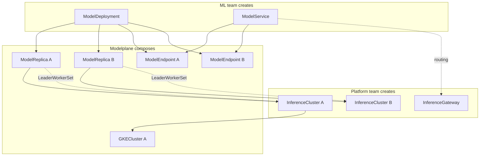

# Modelplane

**Status:** Accepted
**Date:** May 2026
**Author:** Nic Cope

## Executive summary

Modelplane is an open-source, fleet-level inference control plane built on
Crossplane. It manages GPU clusters across clouds and regions, schedules model
deployments across the fleet, and routes inference traffic through a unified
gateway. An ML team deploys a model like this:

```yaml
apiVersion: modelplane.ai/v1alpha1
kind: ModelDeployment
metadata:
  name: qwen3-8b
  namespace: ml-team
spec:
  replicas: 1
  clusterSelector:
    matchLabels:
      modelplane.ai/region: us
  engines:
  - name: qwen3-8b
    members:
    - role: Standalone
      nodeSelector:
        devices:
        - name: gpu
          count: 1
          selectors:
          - cel: |
              device.capacity["gpu.nvidia.com"].memory.compareTo(quantity("20Gi")) >= 0
      template:
        spec:
          containers:
          - name: engine
            image: vllm/vllm-openai:v0.23.0
            args:
            - "--model=Qwen/Qwen3-8B"
            - "--served-model-name=qwen"
            - "--max-model-len=16384"
            - "--gpu-memory-utilization=0.92"
            - "--reasoning-parser=qwen3"
            - "--default-chat-template-kwargs={\"enable_thinking\": false}"
            - "--enable-auto-tool-choice"
            - "--tool-call-parser=hermes"
```

Modelplane handles fleet scheduling, multi-cluster routing, and infrastructure
composition. Each `ModelDeployment` becomes one or more `ModelReplica`s, each a
complete serving instance on an `InferenceCluster`. A `ModelService` routes
traffic across replicas and (optionally) external SaaS endpoints. The resource
hierarchy mirrors Kubernetes core: ModelDeployment → ModelReplica → ModelService
→ ModelEndpoint parallels Deployment → Pod → Service → Endpoint.

## Background

Open-weight inference is becoming the default for enterprises. Cost control,
governance, and data sovereignty are pushing organizations away from hosted
proprietary models and toward running open-weight models on infrastructure
they control. Kubernetes is the primary substrate. Platform teams are being
asked to provide GPU infrastructure to internal ML teams the same way they
provide cloud infrastructure today.

Within a single cluster, the ecosystem is strong. vLLM and SGLang serve
models. LeaderWorkerSet handles multi-node topologies. DRA binds GPUs to
pods. llm-d adds model-aware routing and prefill/decode coordination. NVIDIA
Dynamo brings KV cache management and GPU-to-GPU weight transfer. Running a
model on a Kubernetes cluster is increasingly a solved problem.

The missing part is the fleet. Organizations have GPU clusters across regions
and clouds, or will soon. Scheduling models to the right hardware, routing
inference traffic across clusters, managing fleet-wide capacity, and providing
self-service to ML teams with organizational governance are all problems that
sit above any single cluster. Nobody ships this layer today.

Platform teams at companies like Apple and JPMC already use Crossplane to manage
cloud infrastructure: unifying AWS, GCP, and Azure behind declarative APIs on a
central control plane. Inference infrastructure is the same pattern. Modelplane
is a fleet-level inference platform built on Crossplane. It solves the same
problems as tools like KServe and Dynamo (scheduling models to hardware, routing
traffic, managing lifecycle and scaling) but across a fleet of clusters rather
than within one.

## Goals

Modelplane does for a fleet of inference clusters what Kubernetes does for one.
It's an open source control plane for AI inference: a fleet-wide system of
record across clouds, neoclouds, on-premise environments, and regions. A handful
of goals shape the API.

**Fleet-scale.** Provisioning, scheduling, scaling, caching, and routing all
operate at the fleet level.

**Universal.** Modelplane serves any model, on any engine, on any accelerator.
When a new engine or a new parallelism strategy ships, you can author a
ModelDeployment that uses it without upgrading Modelplane and without waiting
for us to release support for it.

**Self-service.** ML teams own *what to run*: the model, the hardware it needs,
and how the engine is tuned to run it. Platform teams own *what's available*:
which clusters and hardware exist, and who may use them. Modelplane takes care
of everything between (scheduling, routing, etc).

## Target personas

### Platform team

The platform team already operates Crossplane to manage infrastructure for the
wider engineering organization. They control which GPU clusters exist, what
hardware is available, and what policies govern resource usage. In the
Modelplane model, they create `InferenceCluster` resources describing the GPU
clusters in their fleet, select or author `InferenceClass` resources that bundle
hardware capabilities with cloud-specific provisioning recipes, and set
organizational metadata via Kubernetes labels (tier, region, provider,
compliance posture). They may also build Crossplane Compositions over
`ModelDeployment` to provide simpler interfaces for their ML teams, but
Modelplane doesn't prescribe that boundary. Their primary concern is
operational: can they provide inference capacity without becoming a bottleneck?

### Machine learning team

The machine learning (ML) team needs to run inference against open-weight models
as part of their product or research. They create a `ModelDeployment` specifying
everything needed to run the model: the engines, their hardware requirements,
and how they're served. They create a `ModelService` to get a unified
endpoint, and optionally create manual `ModelEndpoint` resources to route to
external SaaS providers (Together, BaseTen) alongside self-hosted replicas.
Modelplane handles scheduling, composition, and routing. The ML team thinks
about what model to deploy and how it should be configured, not where it runs.

## API design

I propose seven resources. The API group is `modelplane.ai`.




| Resource | Scope | Created by | Purpose |
|----------|-------|------------|---------|
| `InferenceGateway` | Cluster | Platform team | Control plane routing infrastructure |
| `InferenceClass` | Cluster | Platform team (or Modelplane defaults) | Hardware recipe: devices + provisioning |
| `InferenceCluster` | Cluster | Platform team | A GPU cluster in the inference fleet |
| `ModelDeployment` | Namespace | ML team | Self-contained model deployment spec |
| `ModelReplica` | Namespace | Modelplane (composed) | One complete serving instance |
| `ModelService` | Namespace | ML team | Weighted routing across endpoints |
| `ModelEndpoint` | Namespace | Modelplane (composed) or ML team | Reachable inference endpoint |


Each resource is implemented as a Crossplane Composite Resource (XR) with a
corresponding composition function. The composition function is the controller:
it reads the XR's spec, reads other resources in the fleet (using Crossplane
v2's required resources mechanism), and composes the underlying infrastructure
and workload resources.

### InferenceClass

A tested recipe for a GPU node pool. Each class describes the **devices** a node
of this class has (what the scheduler matches against) and optionally
**provisioning** (how to create the pool on a specific cloud).

Devices follow DRA's model ([KEP-4381]). Each device has a `driver`, a `count`
(how many per node), typed `attributes` (`{string: "Hopper"}`, `{version:
"9.0.0"}`), and `capacity` (Kubernetes Quantities). This is the shape the NVIDIA
DRA driver publishes in a ResourceSlice, except a real driver publishes one
entry per physical device where we publish one per *kind* with a `count`: the
eight identical H200s in a node collapse to `count: 8`.

A `claim` discriminator says how Modelplane treats the device. `DRA` (the
default) emits the device as a request in a `ResourceClaim`, and DRA binds a
matching device to the pod at admission time; use it for hardware a real DRA
driver exposes, today GPUs. `Synthetic` describes the device for scheduling
only, never claiming it; use it for hardware that matters for placement but has
no DRA driver yet, like an InfiniBand fabric.

The driver, attribute keys, and capacity keys are a contract between the
platform team who authors InferenceClasses and the ML team who writes
`nodeSelector`. For `claim: DRA` devices they should mirror what the DRA driver
publishes, so a `nodeSelector` written against the class also selects the right
device at claim time.

[KEP-4381]: https://github.com/kubernetes/enhancements/tree/master/keps/sig-node/4381-dra-structured-parameters

Provisioning is optional. Classes without it are for existing clusters where the
pool already exists. The `provisioning.provider` discriminator selects the
cloud-specific sibling block (gke, eks, aks).

```yaml
apiVersion: modelplane.ai/v1alpha1
kind: InferenceClass
metadata:
  name: gke-h200-8x-a3-ib
spec:
  description: "GKE a3-ultragpu-8g, 8x H200, GPUDirect-TCPX"
  provisioning:
    provider: GKE
    gke:
      machineType: a3-ultragpu-8g
      accelerator:
        type: nvidia-h200-141gb
        count: 8
      diskSizeGb: 200
      networking:
        gpuDirectTCPX: true
  devices:
  - name: gpu
    claim: DRA                      # default; emitted as a request in the ResourceClaim
    driver: gpu.nvidia.com
    count: 8
    attributes:
      # These mirror what the NVIDIA DRA driver publishes per device.
      architecture: { string: Hopper }
      productName: { string: "NVIDIA H200 141GB HBM3e" }
      cudaComputeCapability: { version: "9.0.0" }
    capacity:
      memory: { value: "141Gi" }
  - name: nic
    claim: Synthetic                # described for scheduling only; not claimed
    driver: nic.nvidia.com          # no real DRA driver yet; we author it anyway
    count: 8
    attributes:
      linkType: { string: gpudirect-tcpx }
    capacity:
      bandwidth: { value: "200Gi" }  # bits per second
```

Keys are bare names (`architecture`, `memory`), not qualified ones. The domain
comes from the device's `driver`, as in a real ResourceSlice: a `nodeSelector`
reads them back as `device.attributes["gpu.nvidia.com"].architecture`.

Different clouds and different networking imply different classes. A GKE H200
pool with GPUDirect-TCPX is `gke-h200-8x-a3-ib`. A Coreweave H200 pool with
InfiniBand is `h200-8x-ib` (no provisioning).

### InferenceCluster

A GPU cluster in the inference fleet. Cluster-level metadata is captured in
standard Kubernetes labels, which are the matching surface for
`ModelDeployment.clusterSelector`. Each pool references an `InferenceClass` for
its hardware capabilities and (for provisioned clusters) provisioning recipe.

```yaml
apiVersion: modelplane.ai/v1alpha1
kind: InferenceCluster
metadata:
  name: prod-gke-us-east
  labels:
    modelplane.ai/tier: production
    modelplane.ai/cloud: gcp
    modelplane.ai/region: us-east1
spec:
  cluster:
    source: GKE
    gke:
      project: acme-ml-platform
      region: us-east1
      kubernetesVersion: "1.35"
  nodePools:
  - name: frontier
    class: gke-h200-8x-a3-ib
    maxNodeCount: 4
    minNodeCount: 0
    nodeCount: 0

  - name: dev
    class: gke-l4-1x-g2
    maxNodeCount: 4
    nodeCount: 1
```

For provisioned clusters (e.g. source: GKE), the composition function reads
`InferenceCluster.cluster.gke` for the project and region, and each pool's
`InferenceClass.provisioning.gke` for the machine type and GPU config. It
combines them to provision the GKE node pool. System pools (non-GPU, for running
the inference stack) are provisioned using opinionated defaults.

For existing clusters (source: Existing), a kubeconfig Secret provides access.
Modelplane installs all of the software it needs on the cluster but doesn't
provision infrastructure. The class provides capabilities for scheduling only.

```yaml
apiVersion: modelplane.ai/v1alpha1
kind: InferenceCluster
metadata:
  name: prod-coreweave-us-east
  labels:
    modelplane.ai/tier: production
    modelplane.ai/cloud: coreweave
    modelplane.ai/region: us-east-1
spec:
  cluster:
    source: Existing
    existing:
      secretRef:
        name: coreweave-kubeconfig
        key: kubeconfig
  nodePools:
  - name: frontier
    class: h200-8x-ib
    maxNodeCount: 4
```

Modelplane assumes exclusive ownership of every InferenceCluster. GPU capacity
on the cluster is managed solely by Modelplane; the fleet scheduler's capacity
accounting relies on this. Modelplane has opinions about how clusters are set
up: Kubernetes version, installed components, cluster configuration, and
required features like DRA. For provisioned clusters Modelplane handles all of
this directly. For existing clusters the platform team is responsible for
meeting these requirements.

Modelplane installs a software stack onto every InferenceCluster it manages,
including existing clusters. This stack provides the cluster-level primitives
Modelplane composes onto: support for multi-node serving workloads (for example
LeaderWorkerSet), GPU binding via DRA, and whatever else Modelplane's
composition functions depend on. The contract is that Modelplane controls what
runs on the cluster.

### ModelDeployment

A model deployment spec. The ML team creates one to deploy a model to the fleet.
Modelplane creates a `ModelReplica` for each replica and schedules it to an
`InferenceCluster`. A ModelDeployment describes two things: the *shape* of its
inference engines (`spec.engines`) and how those engines are *served* at the
cluster edge (`spec.serving`). It describes a deployment's shape, not how the
model is run; inference engine configuration is opaque to Modelplane.

At its simplest, a small model on a single GPU is one engine with one
`Standalone` member, fronted by `Unified` serving (the default):

```yaml
apiVersion: modelplane.ai/v1alpha1
kind: ModelDeployment
metadata:
  name: qwen3-8b
  namespace: ml-team
spec:
  replicas: 1
  clusterSelector:
    matchLabels:
      modelplane.ai/region: us
  engines:
  - name: qwen3-8b
    members:
    - role: Standalone
      nodeSelector:
        devices:
        - name: gpu
          count: 1
          selectors:
          - cel: |
              device.capacity["gpu.nvidia.com"].memory.compareTo(quantity("20Gi")) >= 0
      template:
        spec:
          containers:
          - name: engine
            image: vllm/vllm-openai:v0.23.0
            args:
            - "--model=Qwen/Qwen3-8B"
            - "--served-model-name=qwen"
            - "--max-model-len=16384"
            - "--gpu-memory-utilization=0.92"
            - "--reasoning-parser=qwen3"
            - "--default-chat-template-kwargs={\"enable_thinking\": false}"
            - "--enable-auto-tool-choice"
            - "--tool-call-parser=hermes"
```

The rest of this section works up from there.

#### Two-level matching

Cluster-level matching uses `clusterSelector.matchLabels` against standard
Kubernetes labels on InferenceCluster. This is organizational metadata: tier,
region, provider, compliance posture. String equality is sufficient.

Node-level matching uses each member's `nodeSelector.devices`, a list of device
requests mirroring a DRA `ResourceClaim`. Each request has a `name`, a `count`,
and a list of `selectors`. A pool matches a request when it has a device whose
`count` covers the request and whose `driver`, `attributes`, and `capacity`
satisfy every selector, and matches the member when it satisfies every request.

GPUs bind to pods only through DRA: each `claim: DRA` request becomes a
`DeviceRequest` in the `ResourceClaim` the serving pods claim GPUs through, so a
member with no device requests gets no GPU. A member's selectors are how the ML
team says what the model needs. A 0.5B model and a 70B model want very different
GPUs.

The CEL is real DRA CEL: `device.driver`,
`device.attributes["gpu.nvidia.com"].architecture` for a typed attribute under
the driver's domain, `device.capacity["gpu.nvidia.com"].memory` for a Quantity,
with `quantity()` and `semver()` to construct comparable values. Someone who
knows DRA writes the same expressions they'd write in a `ResourceClaim`.

#### Engines

`spec.engines` describes a ModelReplica's topology as an array of engines. An
engine is one serving unit: a standalone pod, or a gang of pods coordinating
across nodes. Each engine may be copied (but not autoscaled) within a
ModelReplica.

- `name`: identifies the engine.
- `copies`: how many identical copies of this engine to run per `ModelReplica`.
- `phase`: the engine's phase in a disaggregated deployment, `Prefill` or
  `Decode`. Only set when `spec.serving.mode` is `PrefillDecode`.
- `members`: the engine's pods. An engine must either have a single `Standalone`
  member or a `Leader` and a `Worker`.

Each member has:

- `role`: `Standalone` (default), `Leader`, or `Worker`.
- `nodeSelector`: the member's per-node device request.
- `worker.nodes`: how many nodes the member spans, for a `Worker` only. Each
  node runs one worker pod, so this is how big the gang is: a leader plus
  `worker.nodes` workers. Defaults to 1.
- `template`: a curated subset of a Kubernetes `PodTemplateSpec`, in the same
  structural shape so fields can be added without restructuring. It carries a
  single container named `engine` (the inference engine) with its image, command,
  args, and env, plus `imagePullSecrets`. Secret references are passed through;
  the referenced objects must exist on every InferenceCluster the deployment may
  target.

A `Standalone` engine composes to a Deployment. A `Leader`/`Worker` engine
composes to a LeaderWorkerSet whose gang size is one leader plus its
`worker.nodes` workers. Which workload kind backs each is an implementation
detail.

Modelplane expects the user to provide all the engine commands and flags needed
to form a topology. Some of those commands need to find other pods in the
engine: in a multi-node tensor+pipeline gang, for instance, the Ray followers
need the Ray head's address. Modelplane injects a small set of `MODELPLANE_` env
vars into the engine containers for this (today just
`MODELPLANE_LEADER_ADDRESS`). For the LWS backend it aliases the variable to
`LWS_LEADER_ADDRESS`.

A model too large for one node shows this: tensor-parallel within each node,
pipeline-parallel across two. One engine with a `Leader` and one `Worker`
composes to a LeaderWorkerSet of two pods. The leader runs the engine's
coordination head and serves; the follower joins it, addressing the leader
through `MODELPLANE_LEADER_ADDRESS`. The asymmetry between running the head and
joining it lives in the two members' commands, which the user writes. Both
members want the same GPUs, so they repeat the same `nodeSelector` and the
scheduler places the whole gang on one pool. It schedules as 2 nodes, 8 GPUs
each.

```yaml
spec:
  serving:
    mode: Unified
  engines:
  - name: llama-405b
    members:
    - role: Leader
      nodeSelector:
        devices:
        - name: gpu
          count: 8
          selectors:
          - cel: device.capacity["gpu.nvidia.com"].memory.compareTo(quantity("64Gi")) >= 0
      template:
        spec:
          containers:
          - name: engine
            image: vllm/vllm-openai:v0.11.0
            command:
            - /bin/sh
            - -c
            - >-
              ray start --head --port=6379;
              exec vllm serve
              --model=meta-llama/Llama-3.1-405B-Instruct
              --tensor-parallel-size=8
              --pipeline-parallel-size=2
              --port=8000
    - role: Worker
      worker:
        nodes: 1
      nodeSelector:
        devices:
        - name: gpu
          count: 8
          selectors:
          - cel: device.capacity["gpu.nvidia.com"].memory.compareTo(quantity("64Gi")) >= 0
      template:
        spec:
          containers:
          - name: engine
            image: vllm/vllm-openai:v0.11.0
            command:
            - /bin/sh
            - -c
            - exec ray start --address=${MODELPLANE_LEADER_ADDRESS}:6379 --block
```

Note the relationship between `ModelDeployment` replicas, engine copies, and
worker nodes:

- `ModelDeployment` replicas specifies how many replicas of the entire model
  topology and serving apparatus should be stamped out. Replicas often run on
  different InferenceClusters. This is the scaling axis: Modelplane scales a
  model by adding and removing whole replicas.
- Engine copies specifies how many identical copies of an engine each
  `ModelReplica` stamps out: a fixed number, sized once, never autoscaled.
  Always within the same InferenceCluster, but potentially on different pools.
- Worker nodes specifies how big each copy of an engine's gang is, how many
  worker nodes it has.

Engine copies serves two purposes. In disaggregated serving, with a prefill
engine and a decode engine, engine copies are how you control the
prefill-to-decode ratio. They also size the ModelReplica itself: engine copies
maps to the underlying Deployment or LeaderWorkerSet's replicas, so one
ModelReplica holds many pods. Without it, running ten copies of a single-node
model means ten ModelReplicas of one pod each, and the fleet scheduler ends up
placing individual pods on clusters with less information than the cluster's own
scheduler has. Engine copies lets the fleet scheduler pick a cluster and leaves
placing pods on nodes to that cluster's scheduler.

#### Serving

`spec.serving` specifies how an InferenceCluster should serve a ModelReplica:
how it should expose it as a usable ModelEndpoint target. It's optional, and if
omitted defaults to:

```yaml
spec:
  serving:
    mode: Unified
```

Modelplane has two layers of inference request routing. The InferenceGateway
runs on the Modelplane control plane, offering an OpenAI compatible inference
URL per ModelService. It can only route to the InferenceCluster edge. Each
InferenceCluster also runs a gateway, responsible for routing from cluster edge
to the actual model engines (vLLM etc). This is what `spec.serving` configures.

Modelplane is pretty opinionated about this layer. We consider which inference
gateway we use an implementation detail, like using LWS or llm-d. Where possible
we infer this layer's configuration from the shape of the `engines` block.

By default, under `Unified` serving, Modelplane assumes:

- Every Standalone or Leader member exposes an OpenAI endpoint on port 8000.
- Every Standalone or Leader member should be part of one Kubernetes Service.
- The Kubernetes Service should be exposed by a Gateway API HTTPRoute.

The only other valid mode is `PrefillDecode`, for disaggregated serving, where
each engine marks its `phase` as `Prefill` or `Decode` (the full spec is below).
`mode` is the single explicit statement that a deployment is disaggregated;
`phase` marks which engine plays which part. Validation ties them together:
`PrefillDecode` requires exactly two engines, one `Prefill` and one `Decode`,
and `phase` may not be set under any other mode. The mode enum leaves room for
other topologies with special serving needs (e.g. `EncodePrefillDecode` for
multimodal models, where a third engine would mark `phase: Encode`).

Under `PrefillDecode` Modelplane configures inference-aware routing optimized
for disaggregated serving and assumes:

- Every Standalone or Leader member exposes an OpenAI endpoint on port 8000.
- Every Standalone or Leader member should be part of one GAIE InferencePool.
- The InferencePool should be exposed by a Gateway API HTTPRoute.

Disaggregated serving requires an endpoint picker (EPP) to pick a decode and a
prefill worker for each request. The decode worker runs a sidecar that
dispatches prefill to the chosen worker; the engines themselves transfer the KV
cache over their configured connector. Modelplane injects the sidecar, labels
the pods as either prefill or decode, and configures the endpoint picker
accordingly.

Because the engines transfer the KV cache over their connector (e.g. vLLM's
`NixlConnector`), the engine image must ship that connector's runtime: the NIXL
library. Recent vanilla `vllm/vllm-openai` images include it, so a disaggregated
deployment pins a current tag rather than an old one. Since the engine image and
flags are the user's, this is a deployment prerequisite Modelplane does not
provide; failing it surfaces as engines crashlooping with `NIXL is not
available`.

A disaggregated deployment splits prefill and decode into separate engines on
their own hardware, serving the same model: three single-GPU prefill copies and
two two-GPU decode copies, sized by each engine's `copies`. Decode gets more GPU
per copy for KV-cache capacity. The KV producer/consumer roles are engine flags.
Everything that differs between the phases, hardware and KV role and copy count,
is carried by the two engines. It schedules as 7 nodes co-located in one network
domain on one cluster: 3×1 GPU for prefill and 2×2 GPU for decode, in
potentially different pools.

```yaml
spec:
  serving:
    mode: PrefillDecode
  engines:
  - name: prefill
    phase: Prefill
    copies: 3
    members:
    - role: Standalone
      nodeSelector:
        devices:
        - name: gpu
          count: 1
          selectors:
          - cel: device.capacity["gpu.nvidia.com"].memory.compareTo(quantity("24Gi")) >= 0
      template:
        spec:
          containers:
          - name: engine
            image: vllm/vllm-openai:v0.11.0
            args:
            - --model=meta-llama/Llama-3.1-8B-Instruct
            - --kv-transfer-config={"kv_connector":"NixlConnector","kv_role":"kv_producer"}
  - name: decode
    phase: Decode
    copies: 2
    members:
    - role: Standalone
      nodeSelector:
        devices:
        - name: gpu
          count: 2
          selectors:
          - cel: device.capacity["gpu.nvidia.com"].memory.compareTo(quantity("40Gi")) >= 0
      template:
        spec:
          containers:
          - name: engine
            image: vllm/vllm-openai:v0.11.0
            args:
            - --model=meta-llama/Llama-3.1-8B-Instruct
            - --tensor-parallel-size=2
            - --kv-transfer-config={"kv_connector":"NixlConnector","kv_role":"kv_consumer"}
```

### ModelReplica

Composed by `ModelDeployment`, one per `spec.replicas`. A `ModelReplica` is
schematically identical to a `ModelDeployment`, but:

* Without `spec.replicas`
* With `spec.clusterName` instead of `spec.clusterSelector`

Each replica is one complete serving instance on a chosen InferenceCluster,
containing all the pods needed for that instance: every engine, every copy, and
every member, plus the serving surface that exposes them.

The fleet scheduler picks `(InferenceCluster, pool)` per replica independently.
Replicas of the same deployment can land on different clusters or the same
cluster depending on capacity and (in future) anti-affinity policy.

Replicas are pinned to a cluster at creation time via `spec.clusterName`.
The scheduler retains the pin across reconciles: an existing replica stays
on its cluster even if the cluster temporarily becomes unavailable. The
parent `ModelDeployment` reflects the degraded state via its conditions,
and the replica's endpoint is dropped from routing while the cluster has
no gateway address. If the cluster is deleted entirely the scheduler
re-places the replica on another viable cluster.

The `ModelReplica` is the intermediate representation between the user-facing
ModelDeployment and the cluster-level serving workload. The composition function
maps the ModelReplica's engines and serving config to the appropriate
cluster-level resources.

### ModelService

A weighted routing surface across `ModelEndpoint`s. Always uses
`spec.endpoints`: a single-entry list for the simple case, multiple entries with
weights for canary, A/B, or SaaS overflow routing. Each entry selects
`ModelEndpoint` resources by label.

Simple — one deployment's replicas behind one endpoint:

```yaml
apiVersion: modelplane.ai/v1alpha1
kind: ModelService
metadata:
  name: kimi-k2
  namespace: ml-team
spec:
  endpoints:
  - selector:
      matchLabels:
        modelplane.ai/api: OpenAI
        modelplane.ai/deployment: kimi-k2
```

Weighted SaaS fallback:

```yaml
apiVersion: modelplane.ai/v1alpha1
kind: ModelService
metadata:
  name: assistant
  namespace: ml-team
spec:
  endpoints:
  # 95% to all replicas of kimi-k2 (round-robin across them).
  - weight: 95
    selector:
      matchLabels:
        modelplane.ai/api: OpenAI
        modelplane.ai/deployment: kimi-k2
  # 5% to a manually-created external endpoint.
  - weight: 5
    selector:
      matchLabels:
        modelplane.ai/api: OpenAI
        modelplane.ai/endpoint: together-kimi-k2
```

A route with no `weight` defaults to weight 1 (equal weighting). Composed
endpoints carry the `modelplane.ai/deployment` label set by the deployment
composition and `modelplane.ai/cluster` label specifying the cluster they
target. Manual endpoints carry whatever labels the deployer puts on them.

### ModelEndpoint

A reachable inference endpoint. Composed by `ModelDeployment` (one per
`ModelReplica`) or created manually for break-glass routing to external
services. Both shapes use the same schema. `ModelService` doesn't care where
they came from.

```yaml
# Composed (one per replica)
apiVersion: modelplane.ai/v1alpha1
kind: ModelEndpoint
metadata:
  name: kimi-k2-coreweave-us-east-0
  namespace: ml-team
  labels:
    modelplane.ai/deployment: kimi-k2
    modelplane.ai/cluster: prod-gke-us-east
    modelplane.ai/api: OpenAI
spec:
  url: http://10.0.1.50/ml-team/kimi-k2/

---
# Manual (external SaaS)
apiVersion: modelplane.ai/v1alpha1
kind: ModelEndpoint
metadata:
  name: together-kimi-k2
  namespace: ml-team
  labels:
    modelplane.ai/endpoint: together-kimi-k2
    modelplane.ai/api: OpenAI
spec:
  url: https://api.together.xyz/v1
  auth:
    secretRef:
      name: together-api-key
```

### InferenceGateway

Configures the control plane's routing infrastructure, the gateway that sits
between ML teams and inference clusters. Cluster-scoped and singleton in
practice (one gateway per control plane). The default implementation is Envoy
Gateway.

```yaml
apiVersion: modelplane.ai/v1alpha1
kind: InferenceGateway
metadata:
  name: default
spec:
  type: Envoy
  envoyGateway:
    version: v1.3.0
  gateway:
    port: 80
status:
  address: 34.56.129.3
```

The ModelService composition function configures routing rules on the gateway.
The status contract is minimal: just `status.address`. Gateway implementation
details (Gateway API resources, Envoy configuration) are composed under the
hood.

## Fleet scheduling

When an ML team creates a ModelDeployment:

1. The deploy function runs the fleet scheduler (described below) to place each
   replica on a cluster.
2. It composes a ModelReplica targeting that cluster and a ModelEndpoint for
   routing.
3. The replica function reads the engines and serving config from the
   ModelReplica and composes the serving workload on the target cluster.
4. The service function reads the InferenceGateway and matched ModelEndpoints,
   and composes routing resources on the control plane.

The fleet scheduler places each ModelReplica on one InferenceCluster. It is
really co-scheduling a set of engine members to a single cluster: the unit of
pool placement is the member. Each member may have a different (even disjoint)
nodeSelector, and therefore may need a different node pool.

A member's cost is counted in nodes:

```
nodes = pods × engine copies
pods = 1 (Standalone or Leader), or Worker nodes
```

A member with no nodeSelector costs zero nodes. Its pods claim no devices, so
they don't occupy a node the way a pod that claims all of a node's GPUs does;
the cluster's scheduler packs them onto the gang's nodes alongside the pods that
do. At least one engine member must have a nodeSelector.

When placing an engine, the scheduler prefers one pool that satisfies every
member, with enough free nodes for all of them. A gang's members most likely
want to talk over the pool's fabric, so splitting a gang across pools can
silently degrade interconnect. Only when no single pool satisfies all members
does the scheduler place each member on its own pool. A member with no
nodeSelector matches every pool, so it always lands with its gang. All of a
ModelReplica's members must be co-scheduled onto one cluster.

The scheduler's pool choice is enforced, not advisory. Every pod carries a
Kubernetes nodeSelector on the `modelplane.ai/pool` node label, which Modelplane
stamps on every node it provisions (operators of BYO clusters must label their
nodes). Without it the cluster's scheduler could place a pod on any pool whose
devices satisfy its DRA claim, and the fleet scheduler's per-pool accounting
would drift from where pods actually run.

That accounting is node-granular and deliberately coarse. It assumes a member's
pods each occupy one node, which holds when a pod claims all of a node's
devices. A pod claiming fewer (say 1 GPU of 8) still charges a whole node, so
the scheduler may refuse a placement that would physically fit. It never
overcommits; device-level contention is left to DRA admission on the workload
cluster, which is authoritative.

Modelplane will support affinity and anti-affinity in a future version.

DRA binds devices on every InferenceCluster. Because each member's
`nodeSelector` is already a list of DRA device requests, forming the
`ResourceClaim` is mechanical: each request whose matched device is `claim: DRA`
becomes one `DeviceRequest`, carrying the request's `count` and CEL selectors
verbatim, referencing the driver's DeviceClass. Requests matching a `claim:
Synthetic` device are dropped; the fleet scheduler already enforced them by pool
selection. DRA binds device-to-node at pod admission time.

## Autoscaling

Replicas are the only scaling axis. Each ModelReplica is a complete,
fixed-topology serving instance. Scaling `spec.replicas` adds or removes whole
instances. There's no in-cluster pod autoscaling, no KEDA or similar on workload
clusters.

The ModelDeployment XRD declares a Kubernetes scale subresource
(`specReplicasPath: .spec.replicas`, `statusReplicasPath: .status.replicas.total`).
`status.replicas.total` is the count of scheduled replicas, mirroring how
Deployment and LeaderWorkerSet report `status.replicas` as the observed total and
keep readiness in a separate field. Autoscaling is opt-in via `kubectl scale` or a
separate KEDA `ScaledObject` (or similar).

## Alternatives considered

### An opinionated topology block

An earlier design had `spec.workers` carry a `topology` block of named
parallelism axes (`tensor`, `pipeline`, `data`, `dataLocal`), from which
Modelplane derived and injected the engine's parallelism flags
(`--tensor-parallel-size` and the like). Those flags are engine-specific, so
deriving them takes on the per-engine knowledge Modelplane otherwise avoids, and
it creates two sources of truth: the user writes the flags in `args` and
Modelplane derives them again from `topology`. `spec.engines` and `spec.serving`
replaced it. [Unopinionated ModelDeployments](./unopinionated-deployments.md)
has the full argument.

### A single flat CEL expression for nodeSelector

`nodeSelector` could be one CEL expression over a pool's merged attributes and
capacity, rather than a list of device requests. It's simpler for the common
case of one GPU kind. But it can't describe a node with a GPU *and* a NIC as
distinct devices: everything flattens onto one synthetic device, so an ML team
can't filter on "a GPU like X and a NIC like Y," and the `ResourceClaim`
translation isn't mechanical for multi-device requirements. The device list
costs a little verbosity in the common case to make the multi-device case
expressible and the DRA translation one-to-one.

### Model catalog (ClusterModel / Model)

I considered splitting model identity and deployment configuration across
separate resources: `Model` (platform-curated catalog) and `ModelDeployment`
(thin reference). The appeal was separation of concerns: the platform team
maintains tested model configurations, the ML team deploys from the catalog
without understanding engine details.

When we looked at best in class SaaS services we found they weren't hiding model
detailed from the end user. We realized the more important separation of
concerns was who manages the capacity vs who uses it. Not trying to hide how
models are configured from the end user.

`Model` also complicated the design in that some ML teams will almost certainly
want to specify their own. This'd require diverging the API - e.g. model
specification can be either inline or a reference.

### Per-placement pod autoscaling

I initially had KEDA on each workload cluster, autoscaling pod replicas
within each placement's LLMInferenceService. Scaling happened at two levels:
fleet (how many clusters) and in-cluster (how many pods per cluster).

I simplified to one scaling axis: whole replicas. Each ModelReplica is a
fixed-topology serving instance. Scaling adds or removes complete instances.
This eliminates KEDA on every workload cluster, per-cluster Prometheus
scraping, and the conceptual complexity of two scaling axes.

### Multiple inference orchestrators

I considered exposing the cluster-level orchestrator (KServe, Dynamo, etc.) as
a user-selectable field, with model configurations carrying a discriminator to
match against compatible clusters.

This creates a lowest-common-denominator problem: if ModelDeployment can target
any orchestrator, it can only express features every orchestrator supports.
Instead, I'd prefer Modelplane to be opinionated about which orchestrator to
use, dispatching based on topology and engine requirements. Users describe what
they want; Modelplane picks the lightest composition path that satisfies it.

