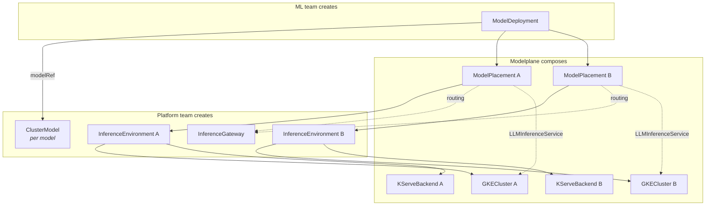

# Modelplane v0.1 — Design Document

**Status:** Draft  
**Date:** March 2026  
**Author:** Nic Cope

## Executive summary

Modelplane is an open-source, Crossplane-based inference platform from Upbound.
It gives platform teams a declarative API for inference infrastructure and gives
ML teams a self-service interface to deploy models. An ML team deploys a model
like this:

```yaml
apiVersion: modelplane.ai/v1alpha1
kind: ModelDeployment
metadata:
  name: llama
  namespace: ml-team
spec:
  modelRef:
    kind: ClusterModel
    name: llama-8b
  environments: 1
```

The platform team pre-configures the inference environment and model catalog
that make this possible. Under the hood, each ModelDeployment composes
`ModelPlacements` (one per target environment) that deploy the model on each
cluster and wire it into the routing layer. The ML team gets a unified
OpenAI-compatible endpoint; Modelplane handles per-environment composition,
status aggregation, and routing.

## Background

Open-weight inference is going to be the default for enterprises. Cost control,
governance, and data secrecy will push them away from hosted proprietary models
and toward running open-weight models on infrastructure they control. Kubernetes
is the primary substrate, with KServe, vLLM, and the broader ecosystem maturing
fast.

Projects like KServe, KubeAI, llm-d, and NVIDIA Dynamo are getting good at
running models on Kubernetes, but they're not platforms in the same way
Kubernetes isn't a platform. They're scoped to one cluster, they expose
infrastructure concepts to their consumers, and they have no opinions about
teams or organizational policy. A platform team that adopts KServe still has to
build the multi-cluster topology, the self-service abstraction layer, and the
governance model on top of it.

Platform teams at companies like Apple and JPMC already use Crossplane to do
this kind of work for cloud infrastructure: unifying AWS, GCP, and Azure behind
declarative APIs on a central control plane. These teams are now being asked to
provide inference infrastructure to internal ML teams. Modelplane is what they'd
build: an opinionated platform layer on top of Crossplane v2, managing a fleet
of inference environments across clusters and regions.

## Goals

v0.1 is a proof-of-concept. Its job is to demonstrate that a Crossplane-native
inference platform is viable and compelling — not to be production-complete.

v0.1 is successful if:

1. **End-to-end demo works:** A platform team can install Modelplane, create an
   InferenceEnvironment, register a model, and an ML team can create a
   ModelDeployment and get a working OpenAI-compatible endpoint.

2. **Multi-environment demo works:** A ModelDeployment targeting multiple
   InferenceEnvironments creates ModelPlacements on each. A unified endpoint
   routes requests across placements.

3. **The abstraction layer is credible:** The XR APIs are clean enough that an
   enterprise platform team can look at them and see how they'd extend to their
   requirements. The resource model makes intuitive sense.

4. **Modelplane feels like a real project:** Someone discovering Modelplane
   should see an open-source inference platform, not "just a Crossplane
   Configuration." That means its own identity (name, repo, docs, examples), a
   getting-started experience that doesn't require deep Crossplane knowledge,
   and enough polish that it's worth showing to people outside Upbound.

It's explicitly **not** a goal for v0.1 to:

- Support advanced policy (cost-based routing, advanced scheduling)
- Support non-LLM workloads (embeddings, speech-to-text, image generation)
- Support multiple cloud providers (GKE is the sole provider)
- Include LoRA adapter management

## Target personas

### Platform team (provider)

The platform team already operates Crossplane to manage infrastructure for the
wider engineering organization. They control which Kubernetes clusters exist,
what GPU hardware is available, and what policies govern resource usage. In the
Modelplane model, they:

- Install and configure Modelplane on their Crossplane control plane
- Define `InferenceEnvironment` resources that describe available inference
  targets and their capabilities
- Optionally curate a catalog of `ClusterModel` resources for approved
  open-weight models
- Set organizational defaults for engine configuration, resource limits, and
  security policies
- Monitor inference workloads across clusters

Their primary concern is operational: can they provide inference capacity
without becoming a bottleneck, while maintaining the guardrails their
organization requires?

### ML / application team (consumer)

The consumer team needs to run inference against open-weight models as part of
their product or research. They don't want to learn Kubernetes, Helm, or GPU infrastructure. In the Modelplane model, they:

- Create a `ModelDeployment` resource in their namespace specifying what model
  they want and optionally which environments to target
- Receive a unified OpenAI-compatible endpoint that routes across all target
  environments
- Optionally bring their own fine-tuned model weights via a `Model` resource
- Inspect per-environment `ModelPlacement` resources to debug issues on specific
  clusters

Their primary concern is velocity: how quickly can they go from "I need Llama 3
70B running" to "here's my endpoint"?

## Proposal

### API design

Modelplane defines six Crossplane composite resources (XRs). The API group is
`modelplane.ai`.

| CRD | Scope | Created by | Purpose |
|-----|-------|------------|---------|
| `InferenceGateway` | Cluster | Platform team | Control plane routing infrastructure |
| `InferenceEnvironment` | Cluster | Platform team | Inference environment with cluster and inference stack |
| `ClusterModel` | Cluster | Platform team | Model catalog |
| `Model` | Namespace | ML team | Private fine-tuned models |
| `ModelDeployment` | Namespace | ML team | Multi-environment deployment |
| `ModelPlacement` | Namespace | Typically composed by ModelDeployment | Per-environment deployment and routing |

`InferenceGateway`, `ClusterModel`, and `InferenceEnvironment` are
cluster-scoped (platform infrastructure). `Model`, `ModelDeployment`, and
`ModelPlacement` are namespace-scoped (team resources). This eliminates
cross-namespace references. Namespaced resources reference cluster-scoped
resources or resources in their own namespace.

### ClusterModel and Model

`ClusterModel` (cluster-scoped) and `Model` (namespace-scoped) share the same
schema. `ClusterModel` is for the platform team's curated catalog: approved
open-weight models available organization-wide. `Model` is for ML teams to
register their own fine-tuned models privately within their namespace.

#### ClusterModel (`clustermodels.modelplane.ai/v1alpha1`)

```yaml
apiVersion: modelplane.ai/v1alpha1
kind: ClusterModel
metadata:
  name: llama-3.1-70b-instruct       # No namespace — cluster-scoped
  labels:
    modelplane.ai/family: llama
    modelplane.ai/size: 70b
spec:
  # Model identity
  model:
    name: meta-llama/Llama-3.1-70B-Instruct    # Model name passed to the serving engine

  # Where to download the model from (source and its config object are paired)
  source: HuggingFace                # HuggingFace | S3 | GCS | PVC
  huggingFace:
    repo: meta-llama/Llama-3.1-70B-Instruct
    revision: main                   # Git revision (branch, tag, commit)
    secretRef:                       # Optional: for gated models
      namespace: platform-system
      name: hf-token

  # Hardware requirements — total VRAM the model needs. The scheduler divides
  # this by per-GPU VRAM of each candidate environment to compute GPU count.
  resources:
    vram: "140Gi"

  # Serving profiles — how this model is served. Each profile is a complete,
  # tested configuration for a specific (engine, image, args) combination.
  # Array order is priority: the first profile that matches wins.
  serving:
  - name: vllm
    engine:
      name: vLLM                     # Currently only vLLM is supported
      image: vllm/vllm-openai:v0.8.0
      args:                          # Opaque — passed through to the engine
      - "--max-model-len=32768"
      - "--gpu-memory-utilization=0.9"

status:
  conditions:
    - type: Ready                    # Summary condition: model is registered
      status: "True"
      reason: Available
      lastTransitionTime: "2026-03-03T10:00:00Z"
      observedGeneration: 1
```

Each serving profile is a complete, tested engine configuration for serving the
model. The `engine` block carries the container image and opaque CLI args. Modelplane does not interpret engine args; they're passed
through to the container. Engine flags evolve with every engine release; treating
them as opaque avoids a perpetual schema maintenance burden. The only things
Modelplane derives from the model are the model name/URI on the container and
the GPU count from VRAM.

Most ClusterModels have a single serving profile. Multiple profiles are useful
when a model needs different engine configurations for different hardware. A
profile that uses FP8 quantization (requiring Hopper GPUs) can require specific
environments via `environmentSelector`:

```yaml
  serving:
  - name: vllm-fp8
    environmentSelector:
      matchLabels:
        modelplane.ai/gpu-arch: hopper
    engine:
      name: vLLM
      image: vllm/vllm-openai:v0.8.0
      args: ["--quantization=fp8", "--max-model-len=32768"]
  - name: vllm-default
    engine:
      name: vLLM
      image: vllm/vllm-openai:v0.8.0
      args: ["--max-model-len=32768", "--gpu-memory-utilization=0.9"]
```

The ML team picks from the catalog without needing to understand engine
profiles. The ClusterModel name no longer encodes the engine — it's just the
model. Advanced ML teams that want to tune engine flags can create a namespaced
`Model` with their own serving profiles.


### InferenceGateway (`inferencegateways.modelplane.ai/v1alpha1`)

An `InferenceGateway` configures the control plane's routing infrastructure —
the gateway that sits between ML teams and inference environments. It's
cluster-scoped and singleton in practice (one gateway per control plane). It
parallels `InferenceEnvironment`: one is "where models run", the other is "how
you reach them."

The `backend` discriminator selects the gateway implementation. v0.1 supports
Envoy Gateway; future versions could add LiteLLM for intelligent routing
(cost-aware, performance-aware, model-name-aware). The nested `loadBalancer`
discriminator handles how the gateway gets an external address — MetalLB for
kind and bare-metal clusters, omitted for cloud environments where a native LB
controller is available.

```yaml
apiVersion: modelplane.ai/v1alpha1
kind: InferenceGateway
metadata:
  name: default
spec:
  backend: EnvoyGateway                  # EnvoyGateway | (LiteLLM in v0.2)
  envoyGateway:
    version: v1.3.0
    loadBalancer: MetalLB                # Optional — for kind/bare-metal
    metallb:
      addressPool: "172.18.255.200-172.18.255.250"
  gateway:
    port: 80

status:
  address: 34.56.129.3                   # External address of the gateway
```

The status contract is deliberately minimal: just `status.address`. No
gateway-specific fields like Gateway API names or namespaces — those are
implementation details of the Envoy Gateway backend. A LiteLLM backend would
surface the same `status.address` without any Gateway API concepts leaking
through.

ModelPlacements read the InferenceGateway to configure routing for their
environment. They compose an Envoy Gateway Backend and HTTPRoute on the control
plane so the gateway routes traffic to the remote cluster where the model runs.

### InferenceEnvironment (`inferenceenvironments.modelplane.ai/v1alpha1`)

An `InferenceEnvironment` represents a target where inference workloads can run.
It is cluster-scoped: InferenceEnvironments are infrastructure managed by
platform teams, not owned by any single namespace.

`spec.cluster` configures how the cluster is obtained. The `source` discriminator
selects provisioning or bring-your-own: `source: GKE` tells Modelplane to
provision a GKE cluster; `source: Existing` brings a pre-existing cluster via
kubeconfig. Either way, Modelplane installs its inference stack on the cluster.
Users configure the cluster; Modelplane handles what runs on it.

Modelplane is opinionated about its inference stack. The Kubernetes inference
ecosystem is fragmented at the orchestration layer (KServe, KubeAI, KubeRay,
NVIDIA Dynamo), but converging on shared building blocks: [Gateway API Inference
Extension][gaie] for model-aware routing (7 gateway implementations,
multi-vendor maintainers), [LeaderWorkerSet][lws] for multi-node topologies, and
[vLLM][vllm] as the dominant serving engine. Even NVIDIA Dynamo is [adopting
Gateway API Inference Extension][dynamo-gaie] rather than building a competing
routing standard. [KServe][kserve] is the most mature orchestration layer
integrating these primitives. It's a CNCF Incubating project with vendor-neutral
governance, its [LLMInferenceService][llmis] API supports NVIDIA and AMD GPUs,
and [llm-d][llmd] extends it with disaggregated serving.

Modelplane uses KServe as its inference stack. Users don't select or see it;
it's an implementation detail. This lets Modelplane expose the full depth of
KServe's capabilities without worrying about portability across stacks, and
since the stack isn't in the API, it can be replaced or evolved without breaking
the user contract. See [Alternatives: Multiple inference
backends](#multiple-inference-backends) for the rationale.

[gaie]: https://github.com/kubernetes-sigs/gateway-api-inference-extension
[lws]: https://github.com/kubernetes-sigs/lws
[vllm]: https://github.com/vllm-project/vllm
[kserve]: https://github.com/kserve/kserve
[llmis]: https://kserve.github.io/website/master/modelserving/llm/llminferenceservice/
[llmd]: https://github.com/llm-d/llm-d
[dynamo-gaie]: https://github.com/ai-dynamo/dynamo/tree/main/deploy/inference-gateway

v0.1 assumes dedicated inference environments. The environment exists solely for
Modelplane workloads, with no shared scheduling or noisy-neighbor concerns. This
simplifies RBAC, resource accounting, and composition significantly.

The cloud-specific config is designed for progressive disclosure. The only
required GKE fields are `project` and `region`. If `nodePools` is omitted,
Modelplane provisions a default system pool (e2-standard-4, 2 nodes) and a
single GPU pool (g2-standard-4, 1x nvidia-l4).

```yaml
apiVersion: modelplane.ai/v1alpha1
kind: InferenceEnvironment
metadata:
  name: gpu-us-east                      # No namespace — cluster-scoped
  labels:
    modelplane.ai/tier: production
    modelplane.ai/region: us-east
spec:
  cluster:
    source: GKE                          # GKE | Existing
    gke:
      project: acme-ml-platform
      region: us-east1
      # nodePools is optional. If omitted, Modelplane provisions a default
      # system pool and a single L4 GPU pool.
      nodePools:
      - name: system
        machineType: e2-standard-4
        nodeCount: 2
      - name: gpu
        machineType: a3-highgpu-8g
        gpu:
          acceleratorType: nvidia-h100-80gb
          acceleratorCount: 8
          memory: 80Gi
        nodeCount: 2
        maxNodeCount: 8

status:
  conditions:
    - type: Ready                        # Summary: environment is accepting deployments
      status: "True"
      reason: AllComponentsHealthy
    - type: ClusterReady                 # Underlying cluster is provisioned and healthy
      status: "True"
      reason: ClusterRunning
    - type: BackendReady                 # Inference stack is installed and healthy
      status: "True"
      reason: BackendHealthy
    - type: GatewayReady                 # Envoy gateway is healthy and has an address
      status: "True"
      reason: AddressAssigned
  capacity:
    gpuPools:
      - acceleratorType: nvidia-h100-80gb
        memory: 80Gi
        countPerNode: 8
        nodes: 8
  gateway:
    address: 10.0.1.50
```

Platform teams with existing Kubernetes clusters can bring their own
infrastructure instead of having Modelplane provision it:

```yaml
apiVersion: modelplane.ai/v1alpha1
kind: InferenceEnvironment
metadata:
  name: gpu-us-east-byo
spec:
  cluster:
    source: Existing
    existing:
      secretRef:
        name: gpu-cluster-kubeconfig
        key: kubeconfig
```

Modelplane still installs and manages the inference stack on the cluster. It
just doesn't provision the cluster itself. This covers enterprise platform teams
that manage clusters via Terraform, Cluster API, or their own Crossplane
Compositions and don't want Modelplane recreating them.

Labels on InferenceEnvironment serve a dual purpose: informational metadata and
selection targets. ModelDeployments can target environments by label selector
(e.g., `modelplane.ai/tier: production`), which is how multi-environment
deployment works without hard-coded environment references.

### ModelDeployment (`modeldeployments.modelplane.ai/v1alpha1`)

A `ModelDeployment` is the primary consumer-facing API. ML teams create one to
deploy a model across one or more InferenceEnvironments. Modelplane creates a
`ModelPlacement` for each matched environment and aggregates their status.

ModelDeployment handles environment discovery, scheduling, fan-out, and routing
aggregation. It composes a Gateway API HTTPRoute that load-balances across all
its placements' Envoy Gateway Backends, which are composed by ModelPlacement.

The simplest possible deployment:

```yaml
apiVersion: modelplane.ai/v1alpha1
kind: ModelDeployment
metadata:
  name: llama-70b-production
  namespace: ml-team-a
spec:
  # What model to deploy
  modelRef:
    kind: ClusterModel          # ClusterModel | Model
    name: llama-3.1-70b-instruct

  # How many environments to deploy to (required)
  environments: 1

status:
  conditions:
    - type: Ready                    # Summary: at least one placement is serving traffic
      status: "True"
      reason: PlacementsAvailable
  endpoint:
    url: https://llama-70b-production.inference.example.com
  placements:
    total: 1
    ready: 1
  model:
    name: meta-llama/Llama-3.1-70B-Instruct
```

Modelplane matches model serving profiles against available environments. For
each candidate environment, Modelplane walks the ClusterModel's `serving[]`
array and selects the first profile whose `environmentSelector` (if any)
matches the environment's labels. Environments with no matching profile are
eliminated. VRAM-based capacity filtering ensures the model fits on the
environment's GPUs.

For power users who need to target specific environments, `environmentSelector`
is an optional escape hatch:

```yaml
apiVersion: modelplane.ai/v1alpha1
kind: ModelDeployment
metadata:
  name: llama-70b-global
  namespace: ml-team-a
spec:
  modelRef:
    kind: ClusterModel
    name: llama-3.1-70b-instruct

  # Deploy to 2 of the matching environments
  environments: 2

  # Optional: target specific environments by label
  environmentSelector:
    matchLabels:
      modelplane.ai/tier: production

status:
  conditions:
    - type: Ready
      status: "True"
      reason: PlacementsAvailable
  endpoint:
    url: https://llama-70b-global.inference.example.com
  placements:
    total: 2
    ready: 2
  model:
    name: meta-llama/Llama-3.1-70B-Instruct
```

If a new InferenceEnvironment appears that matches the selector (or model
requirements, when no selector is specified), Modelplane automatically creates a
ModelPlacement for it.

Each ModelDeployment gets a unique endpoint derived from the InferenceGateway
address and the deployment's namespace and name:
`http://<gateway-address>/<namespace>/<deployment-name>/v1/chat/completions`.
The control plane gateway matches the path prefix and rewrites it to the
remote KServe path, load-balancing across all placements. Since every placement
uses the ClusterModel name as the LLMInferenceService name on its remote
cluster, the rewrite target is uniform across environments.

Future versions with model-name-aware routing (e.g., LiteLLM as the
InferenceGateway backend) could simplify this to a single gateway-wide
endpoint where the `model` field in the request body selects the backend.

Individual placement endpoints are available on the ModelPlacement resources
for debugging, but the intended production pattern is to always go through
the unified gateway endpoint.

### ModelPlacement (`modelplacements.modelplane.ai/v1alpha1`)

A `ModelPlacement` is the resource that actually deploys a model and registers
it with the routing layer. When Modelplane creates a ModelPlacement, it
composes an `LLMInferenceService` on the target cluster and routing resources
(an Envoy Gateway Backend and HTTPRoute) on the control plane so the gateway
can reach the model.

The placement function reads the ClusterModel's matched serving profile to get
the engine name, container image, and args, then composes the
LLMInferenceService with those parameters. An InferenceEnvironment provisions
infrastructure and installs the inference stack, but no models are running
until a ModelPlacement targets it. A ClusterModel describes how a model should
be served, but it's inert until referenced by a ModelPlacement.

ModelDeployments create ModelPlacements automatically — one per matched
InferenceEnvironment. ML teams aren't intended to create them directly, but
nothing stops them from doing so.

```yaml
apiVersion: modelplane.ai/v1alpha1
kind: ModelPlacement
metadata:
  name: llama-70b-global-us-east      # Generated by ModelDeployment composition
  namespace: ml-team-a
  labels:
    modelplane.ai/deployment: llama-70b-global
spec:
  # What to deploy
  modelRef:
    kind: ClusterModel
    name: llama-3.1-70b-instruct

  # Where to deploy it
  inferenceEnvironmentRef:
    name: gpu-cluster-us-east

status:
  conditions:
    - type: Ready                    # Model is serving traffic on this environment
      status: "True"
      reason: Available
    - type: ModelCached              # Weights were found in cache at startup
      status: "True"
      reason: CacheAvailable
    - type: EndpointAvailable        # Per-environment endpoint is reachable
      status: "True"
      reason: GatewayRouteConfigured
  servingProfile:                    # Resolved by compose-model-deployment
    name: vllm
    engine:
      name: vLLM
      image: vllm/vllm-openai:v0.8.0
  model:
    name: meta-llama/Llama-3.1-70B-Instruct
  endpoint:
    internalURL: http://llama-70b-global.ml-team-a.svc.cluster.local:8000
```

```
$ kubectl get modelplacements -n ml-team-a
NAME                        ENVIRONMENT          READY
llama-70b-global-us-east    gpu-cluster-us-east  True
llama-70b-global-us-west    gpu-cluster-us-west  True
```

ModelPlacement's spec is just `modelRef` and `inferenceEnvironmentRef`. The
deploy function resolves which serving profile to use during placement creation.
The matched profile, including engine name and image, is written to
`status.servingProfile` as computed output. The placement function reads the
full profile (including opaque args) from the ClusterModel to compose the
LLMInferenceService.

### Composition architecture

Each XRD has a corresponding Composition powered by a Python composition
function. 

The following diagram shows how the six public resources relate to each other
and to the internal XRs that Modelplane composes under the hood:



Five composition functions, one per concern:

| Function | Responsibility |
|----------|---------------|
| `function-modelplane-gateway` | Composes the control plane routing infrastructure. Dispatches on gateway backend (Envoy Gateway, LiteLLM). Surfaces `status.address` for ModelPlacements. |
| `function-modelplane-env` | Dispatches on cloud provider discriminator. Composes `GKECluster` and `KServeBackend` XRs, wires them together, populates `status.capacity`. Adding a new cloud provider means adding a branch here. |
| `function-modelplane-model` | Validates model catalog entries for both `ClusterModel` and `Model`. Registration and validation only — caching is an environment concern. |
| `function-modelplane-deploy` | Fan-out and routing aggregation. Resolves target environments, matches serving profiles to environments (by optional label selector and VRAM capacity), stamps placements, composes a Gateway API HTTPRoute that load-balances across all placements, aggregates status. |
| `function-modelplane-placement` | Reads the referenced Model (including its matched serving profile), InferenceEnvironment, and InferenceGateway. Uses the serving profile's engine configuration to compose an LLMInferenceService on the remote cluster and routing resources (Envoy Gateway Backend) on the control plane. |

The `GKECluster` and `KServeBackend` XRs are internal implementation details —
they have their own XRDs and composition functions but are not part of
Modelplane's public API. They provide clean boundaries: the env function
delegates to specialist XRs and wires them together.

The composition functions rely on Crossplane v2's **required resources**
mechanism to read across XR boundaries. `function-modelplane-deploy` requests
InferenceEnvironments for fan-out. `function-modelplane-placement` requests the
referenced Model, InferenceEnvironment, and InferenceGateway for backend
composition and routing.

## Alternatives considered

### Separate engine configuration CRs

I considered separate Engine CRs that would decouple engine configuration from
model identity. This has real appeal: the platform team maintains models and
engine profiles as independent catalogs, engine config updates happen in one
place, and the model catalog is purely about model identity.

The problem is that engine args are inherently both model-specific and
engine-specific. `--max-model-len=32768` is a vLLM flag that varies per model.
If an engine profile must contain all engine configuration (no merging from
multiple sources), two different models would almost never share a profile.
If instead the model carries per-engine arg overrides to merge with a shared
profile, the model is engine-aware anyway — and you've reinvented serving
profiles split across two resources.

Additionally, centralized engine version management (upgrade one profile,
all models change) is the wrong operational model. In practice you want to
upgrade engine versions per-model: test with one model, roll out gradually,
keep others pinned. A shared profile upgrades every model simultaneously with
no way to canary.

Serving profiles on ClusterModel preserve the "complete deployable unit"
property. Each profile is a tested combination of (model, engine, image, args).
The ML team still sees one ref; no engine concepts leak to consumers. See
[#18](https://github.com/modelplaneai/modelplane/issues/18) for the full
design rationale.

### Namespace-as-environment

Using Kubernetes namespaces as the environment boundary has appeal (clean RBAC,
GitOps-friendly) but conflates the organizational boundary (teams and stages)
with the infrastructure boundary (GPU clusters). In practice, one GPU cluster
serves multiple teams. Cluster-scoped InferenceEnvironments shared by namespaced
ModelDeployments matches how enterprise platform teams actually manage shared
infrastructure.

### Custom InferenceEnvironment Compositions

I considered letting platform teams provide their own Compositions for
InferenceEnvironment (or for the internal GKECluster and KServeBackend XRs) as
the customization mechanism for bring-your-own infrastructure. This is how
Crossplane customization normally works — the XRD is the contract, the
Composition is swappable.

The problem is that Modelplane's composition functions cross resource
boundaries. The deploy function reads InferenceEnvironments to decide where to
place models. The placement function reads the InferenceEnvironment to figure
out how to deploy a model on it. A custom InferenceEnvironment Composition
doesn't help if the platform team wants a different inference stack; they'd
also need a custom placement function, and potentially a custom deploy
function. That's too much surface area to customize from outside the project.

The bring-your-own-cluster path (`source: Existing` with a kubeconfig Secret)
covers the realistic customization need: the platform team controls cluster
provisioning, Modelplane controls the inference stack and model deployment.

### Multiple inference backends

I considered exposing the inference backend (KServe, Dynamo, etc.) as a
user-selectable field on InferenceEnvironment, with serving profiles on
ClusterModel carrying a `backend` discriminator to match models to compatible
environments. The original v0.1 design worked this way, supporting both KServe
and NVIDIA Dynamo.

The problem is lowest-common-denominator convergence
([#26](https://github.com/modelplaneai/modelplane/issues/26)). ModelDeployment
is backend-agnostic: the ML team says "deploy this model" without knowing
what's underneath. But backends don't all support the same features. If the API
can only express features that every backend supports, the surface shrinks as
backends are added. Autoscaling made this concrete
([#5](https://github.com/modelplaneai/modelplane/issues/5),
[#27](https://github.com/modelplaneai/modelplane/issues/27)). Fixed replicas
and concurrency-based autoscaling are portable, but richer strategies
(SLA-driven, KV-cache-aware) are backend-specific. Exposing them portably means
reducing to the common subset and losing the knobs that make them useful.

Being opinionated about the inference stack lets Modelplane expose the full
depth of its capabilities without worrying about portability. It also
substantially reduces the maintenance surface: every composition function that
touches model serving had backend dispatch logic; every feature needed testing
on each backend; every new backend multiplied the integration work.

Since the stack isn't exposed in the API, this doesn't close the door on
changing it. If something better than KServe emerges, or if we want to replace
KServe components with our own, users don't see the change.

## Future work

Capabilities deferred from v0.1, ordered roughly by how soon I think they'll be
needed.

**Immutable deployments and propagation control.** v0.1 follows Crossplane's
continuous reconciliation. Changes to Model config propagate to running
placements automatically. 

**Intelligent routing.** v0.1 uses Envoy Gateway for basic model-name routing
across environments. Future versions should support cost-aware and
performance-aware routing: selecting environments based on GPU pricing, latency,
throughput, and queue depth.

**External inference endpoints.** Enterprises won't run all inference on their
own infrastructure. SaaS providers like BaseTen, Together AI, and Fireworks AI
are part of the picture. Rather than modeling SaaS providers as backends (which
would require a backend abstraction), ModelDeployment could accept optional
external OpenAI-compatible endpoints that get added to its routing alongside
ModelPlacements. The ML team would say "deploy to 2 of my
environments, and also route to this BaseTen endpoint." This is a routing
concern, not a backend concern; it keeps the single-backend architecture intact
while enabling hybrid self-hosted and SaaS deployments.

**Policy.** Typed policy resources (PlacementPolicy, ResourcePolicy,
RoutingPolicy, ModelPolicy, etc.). These could be namespace-scoped, one per
namespace. . The namespace is the enforcement boundary, following the LimitRange
/ PodSecurity pattern.

**`modelplane` CLI.** `modelplane deploy`, `modelplane status`, `modelplane
logs`. Out of scope for v0.1 where `kubectl` suffices.

**LoRA adapter orchestration.** Dynamic adapter loading, routing, and lifecycle
management.

**Canary deployments.** Progressive rollout with traffic splitting. Depends on
immutable deployments and the Gateway API Inference Extension.

**Cost estimation and observability.** Estimated GPU cost per ModelDeployment,
Prometheus/Grafana dashboards for inference metrics.

## Open questions

**Autoscaling complexity:** KEDA + Prometheus + vLLM custom metrics is a lot of
machinery for the placement function to compose. Should v0.1 ship with simpler
scaling (fixed replicas + HPA on a basic metric) and defer KEDA integration to
v0.2?

**InferenceEnvironment lifecycle coupling:** If a platform team deletes an
InferenceEnvironment, what happens to ModelPlacements targeting it?
ModelPlacements are owned by ModelDeployments, not InferenceEnvironments. The
deploy function would need to detect the missing environment and remove the
orphaned placement. The placement function would need to handle the unresolvable
ref with a clear status condition rather than failing silently.

**Inferring model resource requirements:** `ClusterModel` and `Model` currently
require the platform team or ML team to specify `spec.resources` (GPU count,
memory, CPU) and `modelSize` manually. In principle these could be inferred from
the model source — HuggingFace model cards include parameter counts and
safetensors headers include tensor shapes and dtypes, which is enough to
estimate VRAM requirements and disk size. OME does this via automatic parsing of
safetensors headers. The question is whether v0.1 should require explicit
resource specs (simpler, no source-specific logic in the model function) or
infer them when possible and let the spec override.

**Environment capacity and scheduling for BYO clusters:** When Modelplane
provisions a cluster, it knows the GPU capacity from the node pool config. For
bring-your-own clusters, capacity is unknown — and even for provisioned
clusters, node autoscaling means declared capacity may not reflect reality. The
deploy function uses capacity to check whether the model's VRAM requirements
fit on the environment's GPUs. For BYO clusters this information isn't
available. One option is to make capacity purely informational and let the actual
scheduling happen at the Kubernetes level when the ModelPlacement composes
the LLMInferenceService. If the cluster can't schedule the pods, the
placement reports that via status conditions rather than being rejected upfront.
