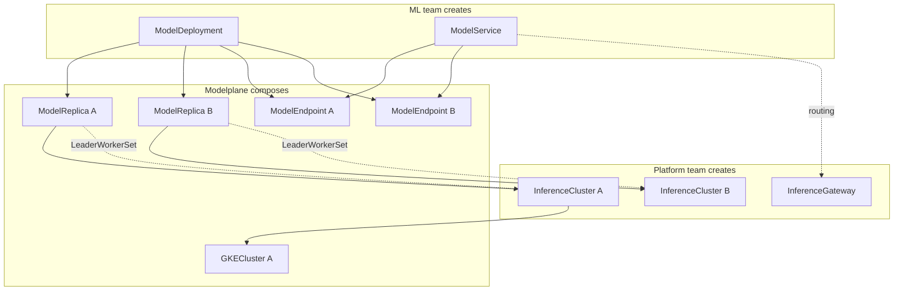

# Modelplane

**Status:** Draft
**Date:** May 2026
**Author:** Nic Cope

## Executive summary

Modelplane is an open-source, fleet-level inference control plane built on
Crossplane. It manages GPU clusters across clouds and regions, schedules model
deployments across the fleet, and routes inference traffic through a unified
gateway. An ML team deploys a model like this:

```yaml
apiVersion: modelplane.ai/v1alpha1
kind: ModelDeployment
metadata:
  name: kimi-k2
  namespace: ml-team
spec:
  clusterSelector:
    matchLabels:
      modelplane.ai/tier: production
  replicas: 1
  nodeSelector:
    cel: |
      capacity["gpu.nvidia.com/memory"].compareTo(quantity("141Gi")) >= 0 &&
      attributes["gpu.nvidia.com/cudaComputeCapability"].isGreaterThan(version("9.0.0")) &&
      attributes["modelplane.ai/networkInterNode"].string == "infiniband"
  workers:
    topology:
      tensor: 8
      pipeline: 2
    template:
      containers:
      - name: engine
        image: vllm/vllm-openai:v0.8.5
        args:
        - "--model=moonshotai/Kimi-K2-Instruct"
        - "--trust-remote-code"
        - "--max-model-len=65536"
```

Modelplane handles fleet scheduling, multi-cluster routing, and infrastructure
composition. Each `ModelDeployment` becomes one or more `ModelReplica`s, each a
complete serving instance on an `InferenceCluster`. A `ModelService` routes
traffic across replicas and (optionally) external SaaS endpoints. The resource
hierarchy mirrors Kubernetes core: ModelDeployment → ModelReplica → ModelService
→ ModelEndpoint parallels Deployment → Pod → Service → Endpoint.

## Background

Open-weight inference is becoming the default for enterprises. Cost control,
governance, and data sovereignty are pushing organizations away from hosted
proprietary models and toward running open-weight models on infrastructure
they control. Kubernetes is the primary substrate. Platform teams are being
asked to provide GPU infrastructure to internal ML teams the same way they
provide cloud infrastructure today.

Within a single cluster, the ecosystem is strong. vLLM and SGLang serve
models. LeaderWorkerSet handles multi-node topologies. DRA binds GPUs to
pods. llm-d adds model-aware routing and prefill/decode coordination. NVIDIA
Dynamo brings KV cache management and GPU-to-GPU weight transfer. Running a
model on a Kubernetes cluster is increasingly a solved problem.

The hard part is the fleet. Organizations have GPU clusters across regions and
clouds, or will soon. Scheduling models to the right hardware, routing inference
traffic across clusters, managing fleet-wide capacity, and providing
self-service to ML teams with organizational governance are all problems that
sit above any single cluster. Nobody ships this layer today.

Platform teams at companies like Apple and JPMC already use Crossplane to manage
cloud infrastructure: unifying AWS, GCP, and Azure behind declarative APIs on a
central control plane. Inference infrastructure is the same pattern. Modelplane
is a fleet-level inference platform built on Crossplane. It solves the same
problems as KServe and Dynamo (scheduling models to hardware, routing traffic,
managing lifecycle and scaling) but across a fleet of clusters rather than
within one.

This document proposes Modelplane's v0.1 API: seven resources that give
platform teams a fleet management layer and ML teams a self-service
deployment interface, with scheduling, routing, and composition handled by
Crossplane composition functions.

## Goals

v0.1 demonstrates that a fleet-level inference control plane is viable and
compelling.

v0.1 is successful if:

1. **End-to-end demo works.** A platform team can install Modelplane, create an
   InferenceCluster, and an ML team can create a ModelDeployment and get a
   working OpenAI-compatible endpoint routing across its replicas.

2. **Frontier models work.** The same API can express deployments for Kimi K2
   and Qwen3-Coder-480B. The API is credible for the models enterprises actually
   want to deploy.

3. **The API is credible.** An enterprise platform team can look at the resource
   model and see how we could extend it to their requirementss

## Target personas

### Platform team

The platform team already operates Crossplane to manage infrastructure for the
wider engineering organization. They control which GPU clusters exist, what
hardware is available, and what policies govern resource usage. In the
Modelplane model, they create `InferenceCluster` resources describing the GPU
clusters in their fleet, select or author `InferenceClass` resources that bundle
hardware capabilities with cloud-specific provisioning recipes, and set
organizational metadata via Kubernetes labels (tier, region, provider,
compliance posture). They may also build Crossplane Compositions over
`ModelDeployment` to provide simpler interfaces for their ML teams, but
Modelplane doesn't prescribe that boundary. Their primary concern is
operational: can they provide inference capacity without becoming a bottleneck?

### Machine learning team

The machine learning (ML) team needs to run inference against open-weight models
as part of their product or research. They create a `ModelDeployment` specifying
everything needed to run the model: the worker template, hardware requirements,
and the compute topology. They create a `ModelService` to get a unified
endpoint, and optionally create manual `ModelEndpoint` resources to route to
external SaaS providers (Together, BaseTen) alongside self-hosted replicas.
Modelplane handles scheduling, composition, and routing. The ML team thinks
about what model to deploy and how it should be configured, not where it runs.

## API design

I propose seven resources. The API group is `modelplane.ai`.




| Resource | Scope | Created by | Purpose |
|----------|-------|------------|---------|
| `InferenceGateway` | Cluster | Platform team | Control plane routing infrastructure |
| `InferenceClass` | Cluster | Platform team (or Modelplane defaults) | Hardware recipe: attributes, capacity + provisioning |
| `InferenceCluster` | Cluster | Platform team | A GPU cluster in the inference fleet |
| `ModelDeployment` | Namespace | ML team | Self-contained model deployment spec |
| `ModelReplica` | Namespace | Modelplane (composed) | One complete serving instance |
| `ModelService` | Namespace | ML team | Weighted routing across endpoints |
| `ModelEndpoint` | Namespace | Modelplane (composed) or ML team | Reachable inference endpoint |


Each resource is implemented as a Crossplane Composite Resource (XR) with a
corresponding composition function. The composition function is the controller:
it reads the XR's spec, reads other resources in the fleet (using Crossplane
v2's required resources mechanism), and composes the underlying infrastructure
and workload resources.

### InferenceClass

A tested recipe for a GPU node pool. Each class bundles **attributes and
capacity** (what this hardware has, used by the scheduler) and optionally
**provisioning** (how to create it on a specific cloud).

Attributes and capacity follow DRA's schema ([KEP-4381]) for structure:
attributes are typed key-value pairs (`{string: "Hopper"}`, `{version:
"9.0.0"}`), capacity is a map of Kubernetes Quantities. Keys use DRA's
qualified-name convention (`domain/name`).

The keys and values are a contract between the platform team (who authors
InferenceClasses) and the ML team (who writes `nodeSelector.cel` on
ModelDeployments). Modelplane doesn't enforce or validate specific keys or
values. Keys that correspond to real DRA device attributes (e.g.
`gpu.nvidia.com/architecture`, `gpu.nvidia.com/memory`) should match what the
DRA driver publishes in ResourceSlices on the actual node pools. The composition
function passes these through to DRA ResourceClaim selectors when binding GPUs
to pods. Keys prefixed with `modelplane.ai/*` are fleet-scheduling attributes —
pool-level properties like GPU count per node or inter-node networking that
don't correspond to per-device DRA attributes. These are filtered out when
forming ResourceClaims.

[KEP-4381]: https://github.com/kubernetes/enhancements/tree/master/keps/sig-node/4381-dra-structured-parameters

Provisioning is optional. Classes without it are for existing clusters where the
pool already exists. The `provisioning.provider` discriminator selects the
cloud-specific sibling block (gke, eks, aks).

```yaml
apiVersion: modelplane.ai/v1alpha1
kind: InferenceClass
metadata:
  name: gke-h200-8x-a3-ib
spec:
  description: "GKE a3-ultragpu-8g, 8x H200, GPUDirect-TCPX"
  provisioning:
    provider: GKE
    gke:
      machineType: a3-ultragpu-8g
      accelerator:
        type: nvidia-h200-141gb
        count: 8
      diskSizeGb: 200
      networking:
        gpuDirectTCPX: true
  attributes:
    # These match what the NVIDIA DRA driver publishes per device.
    gpu.nvidia.com/architecture:
      string: Hopper
    gpu.nvidia.com/productName:
      string: "NVIDIA H200 141GB HBM3e"
    gpu.nvidia.com/cudaComputeCapability:
      version: "9.0.0"
    # These are fleet-scheduling attributes. They don't correspond to
    # per-device DRA attributes and are filtered out of ResourceClaims.
    modelplane.ai/interconnectIntraNode:
      string: nvswitch
    modelplane.ai/networkInterNode:
      string: gpudirect-tcpx
  capacity:
    # Matches what the NVIDIA DRA driver publishes per device.
    gpu.nvidia.com/memory:
      value: "141Gi"
    # Fleet-scheduling capacity. Filtered out of ResourceClaims.
    modelplane.ai/gpuCount:
      value: "8"
    modelplane.ai/networkBandwidth:
      value: "200Gi"           # bits per second
```

Different clouds and different networking imply different classes. A GKE H200
pool with GPUDirect-TCPX is `gke-h200-8x-a3-ib`. A Coreweave H200 pool with
InfiniBand is `h200-8x-ib` (no provisioning).

### InferenceCluster

A GPU cluster in the inference fleet. Cluster-level metadata is captured in
standard Kubernetes labels, which are the matching surface for
`ModelDeployment.clusterSelector`. Each pool references an `InferenceClass` for
its hardware capabilities and (for provisioned clusters) provisioning recipe.

```yaml
apiVersion: modelplane.ai/v1alpha1
kind: InferenceCluster
metadata:
  name: prod-gke-us-east
  labels:
    modelplane.ai/tier: production
    modelplane.ai/cloud: gcp
    modelplane.ai/region: us-east1
spec:
  cluster:
    source: GKE
    gke:
      project: acme-ml-platform
      region: us-east1
      kubernetesVersion: "1.35"
  nodePools:
  - name: frontier
    class: gke-h200-8x-a3-ib
    maxNodeCount: 4
    minNodeCount: 0
    nodeCount: 0

  - name: dev
    class: gke-l4-1x-g2
    maxNodeCount: 4
    nodeCount: 1
```

For provisioned clusters (e.g. source: GKE), the composition function reads
`InferenceCluster.cluster.gke` for the project and region, and each pool's
`InferenceClass.provisioning.gke` for the machine type and GPU config. It
combines them to provision the GKE node pool. System pools (non-GPU, for running
the inference stack) are provisioned using opinionated defaults.

For existing clusters (source: Existing), a kubeconfig Secret provides access.
Modelplane installs all of the software it needs on the cluster but doesn't
provision infrastructure. The class provides capabilities for scheduling only.

```yaml
apiVersion: modelplane.ai/v1alpha1
kind: InferenceCluster
metadata:
  name: prod-coreweave-us-east
  labels:
    modelplane.ai/tier: production
    modelplane.ai/cloud: coreweave
    modelplane.ai/region: us-east-1
spec:
  cluster:
    source: Existing
    existing:
      secretRef:
        name: coreweave-kubeconfig
        key: kubeconfig
  nodePools:
  - name: frontier
    class: h200-8x-ib
    maxNodeCount: 4
```

Modelplane assumes exclusive ownership of every InferenceCluster. GPU capacity
on the cluster is managed solely by Modelplane; the fleet scheduler's capacity
accounting relies on this. Modelplane has opinions about how clusters are set
up: Kubernetes version, installed components, cluster configuration, and
required features like DRA. For provisioned clusters Modelplane handles all of
this directly. For existing clusters the platform team is responsible for
meeting these requirements.

Modelplane installs a software stack onto every InferenceCluster it manages,
including existing clusters. This stack provides the cluster-level primitives
Modelplane composes onto: support for multi-node serving workloads (for example
LeaderWorkerSet), GPU binding via DRA, and whatever else Modelplane's
composition functions depend on. The contract is that Modelplane controls what
runs on the cluster.

### ModelDeployment

A model deployment spec. The ML team creates one to deploy a model to the fleet.
Modelplane creates a `ModelReplica` for each replica and schedules it to an
`InferenceCluster`. `ModelDeployment` carries everything about what to deploy
and how: the worker template, hardware requirements via CEL, the compute
topology, and the replica count.

`workers.template` is a curated subset of a Kubernetes `PodTemplateSpec` in the
same structural shape, so that fields can be added without restructuring. v0.1
exposes `containers` (carrying `name`, `image`, `args`, `env`, and `envFrom`)
and `imagePullSecrets`. The container named `engine` is the inference engine;
additional containers pass through as sidecars. The composition function maps
the template to the appropriate workload resource on the target cluster.
References to Secrets in `env` or `imagePullSecrets` are passed through; the
referenced objects must exist on every InferenceCluster the deployment may
target.

```yaml
apiVersion: modelplane.ai/v1alpha1
kind: ModelDeployment
metadata:
  name: mixtral-8x7b
  namespace: ml-team
spec:
  clusterSelector:
    matchLabels:
      modelplane.ai/tier: production
  replicas: 2
  nodeSelector:
    cel: |
      capacity["gpu.nvidia.com/memory"].compareTo(quantity("80Gi")) >= 0
  workers:
    topology:
      tensor: 2
    template:
      containers:
      - name: engine
        image: vllm/vllm-openai:v0.8.5
        args:
        - "--model=mistralai/Mixtral-8x7B-Instruct-v0.1"
        - "--tensor-parallel-size=2"
        - "--max-model-len=32768"
        - "--gpu-memory-utilization=0.9"
```

#### Two-level matching

Cluster-level matching uses `clusterSelector.matchLabels` against standard
Kubernetes labels on InferenceCluster. This is organizational metadata: tier,
region, provider, compliance posture. String equality is sufficient.

Node-level matching uses `nodeSelector.cel`, a CEL expression evaluated against
the pool's `InferenceClass` attributes and capacity. The attribute schema
follows DRA's typed format (`{string: "Hopper"}`, `{version: "9.0.0"}`) with
qualified keys (`gpu.nvidia.com/*`, `modelplane.ai/*`). Capacity uses
Kubernetes Quantity values. Keys matching real DRA device attributes pass
through to ResourceClaim selectors; `modelplane.ai/*` keys are filtered out.

#### Workers and topology

`workers` groups the worker count and compute topology. `workers.topology`
describes the shape of one worker; `workers.count` (default 1) says how many
workers of that shape exist per ModelReplica.

`topology` has four fields, all parallelism axes. `tensor` is required.
`pipeline`, `data`, and `dataLocal` default to 1. The axes are independent and
compose multiplicatively — there is no strategy discriminator because the
derivation formula is the same regardless of which axes are active:

| | Formula |
|---|---|
| Nodes per worker | `pipeline * (data / dataLocal)` |
| GPUs per node | `tensor * dataLocal` |
| Total GPUs per worker | `tensor * data * pipeline` |


The scheduler derives the physical shape from the topology. No separate node
count or GPU count fields; the topology fully determines the resource
requirements. The scheduler checks: does the matched pool's InferenceClass have
`modelplane.ai/gpuCount` >= GPUs-per-node, and does the pool have enough
available nodes?

#### Disaggregated prefill/decode

The top-level `nodeSelector` and `workers` are always the decode (or unified)
settings. Adding a `prefill` block makes the deployment disaggregated. The
`prefill` block is self-contained: it repeats all settings rather than
inheriting from the root, because explicit repetition is easier to reason about
than implicit merge.

The P:D ratio is expressed via `workers.count` on each role. It's a topology
parameter (fixed per deployment), not a scaling knob. Decode and prefill must
land on the same InferenceCluster (KV cache transfer needs co-location) but can
target different pools within that cluster.

```yaml
apiVersion: modelplane.ai/v1alpha1
kind: ModelDeployment
metadata:
  name: llama-405b-disagg
  namespace: ml-team
spec:
  clusterSelector:
    matchLabels:
      modelplane.ai/tier: production
  replicas: 1

  # Top-level = decode. 3 decode workers, each TP=8 PP=2.
  nodeSelector:
    cel: |
      capacity["gpu.nvidia.com/memory"].compareTo(quantity("141Gi")) >= 0 &&
      attributes["modelplane.ai/networkInterNode"].string == "infiniband"
  workers:
    count: 3
    topology:
      tensor: 8
      pipeline: 2
    template:
      containers:
      - name: engine
        image: vllm/vllm-openai:v0.9.1
        args:
        - "--model=meta-llama/Llama-3.1-405B-Instruct"
        - "--max-model-len=131072"
        - '--kv-transfer-config={"kv_role":"kv_consumer"}'

  # Prefill: 5 workers, each single-GPU. Self-contained.
  prefill:
    nodeSelector:
      cel: |
        capacity["gpu.nvidia.com/memory"].compareTo(quantity("80Gi")) >= 0 &&
        attributes["modelplane.ai/networkInterNode"].string == "infiniband"
    workers:
      count: 5
      topology:
        tensor: 1
      template:
        containers:
        - name: engine
          image: vllm/vllm-openai:v0.9.1
          args:
          - "--model=meta-llama/Llama-3.1-405B-Instruct"
          - '--kv-transfer-config={"kv_role":"kv_producer"}'
```

### ModelReplica

Composed by `ModelDeployment`, one per `spec.replicas`. A `ModelReplica` is
schematically identical to a `ModelDeployment`, but:

* Without `spec.replicas`
* With `spec.clusterName` instead of `spec.clusterSelector`

Each replica is one complete serving instance on a chosen InferenceCluster,
containing all the pods needed for that instance: one pod for single-node,
multiple pods via LeaderWorkerSet for multi-node, and both decode and prefill
workloads for disaggregated serving.

The fleet scheduler picks `(InferenceCluster, pool)` per replica independently.
Replicas of the same deployment can land on different clusters or the same
cluster depending on capacity and (in future) anti-affinity policy.

The `ModelReplica` is the intermediate representation between the user-facing
ModelDeployment and the cluster-level serving workload. The composition function
maps the ModelReplica's topology to the appropriate cluster-level resource.

### ModelService

A weighted routing surface across `ModelEndpoint`s. Always uses
`spec.endpoints`: a single-entry list for the simple case, multiple entries with
weights for canary, A/B, or SaaS overflow routing. Each entry selects
`ModelEndpoint` resources by label.

Simple — one deployment's replicas behind one endpoint:

```yaml
apiVersion: modelplane.ai/v1alpha1
kind: ModelService
metadata:
  name: kimi-k2
  namespace: ml-team
spec:
  endpoints:
  - selector:
      matchLabels:
        modelplane.ai/api: OpenAI
        modelplane.ai/deployment: kimi-k2
```

Weighted SaaS fallback:

```yaml
apiVersion: modelplane.ai/v1alpha1
kind: ModelService
metadata:
  name: assistant
  namespace: ml-team
spec:
  endpoints:
  # 95% to all replicas of kimi-k2 (round-robin across them).
  - weight: 95
    selector:
      matchLabels:
        modelplane.ai/api: OpenAI
        modelplane.ai/deployment: kimi-k2
  # 5% to a manually-created external endpoint.
  - weight: 5
    selector:
      matchLabels:
        modelplane.ai/api: OpenAI
        modelplane.ai/endpoint: together-kimi-k2
```

A route with no `weight` defaults to weight 1 (equal weighting). Composed
endpoints carry the `modelplane.ai/deployment` label set by the deployment
composition and `modelplane.ai/cluster` label specifying the cluster they
target. Manual endpoints carry whatever labels the deployer puts on them.

### ModelEndpoint

A reachable inference endpoint. Composed by `ModelDeployment` (one per
`ModelReplica`) or created manually for break-glass routing to external
services. Both shapes use the same schema. `ModelService` doesn't care where
they came from.

```yaml
# Composed (one per replica)
apiVersion: modelplane.ai/v1alpha1
kind: ModelEndpoint
metadata:
  name: kimi-k2-coreweave-us-east-0
  namespace: ml-team
  labels:
    modelplane.ai/deployment: kimi-k2
    modelplane.ai/cluster: prod-gke-us-east
    modelplane.ai/api: OpenAI
spec:
  url: http://10.0.1.50/ml-team/kimi-k2/

---
# Manual (external SaaS)
apiVersion: modelplane.ai/v1alpha1
kind: ModelEndpoint
metadata:
  name: together-kimi-k2
  namespace: ml-team
  labels:
    modelplane.ai/endpoint: together-kimi-k2
    modelplane.ai/api: OpenAI
spec:
  url: https://api.together.xyz/v1
  auth:
    secretRef:
      name: together-api-key
```

### InferenceGateway

Configures the control plane's routing infrastructure, the gateway that sits
between ML teams and inference clusters. Cluster-scoped and singleton in
practice (one gateway per control plane). v0.1 uses Envoy Gateway.

```yaml
apiVersion: modelplane.ai/v1alpha1
kind: InferenceGateway
metadata:
  name: default
spec:
  type: Envoy
  envoyGateway:
    version: v1.3.0
  gateway:
    port: 80
status:
  address: 34.56.129.3
```

The ModelService composition function configures routing rules on the gateway.
The status contract is minimal: just `status.address`. Gateway implementation
details (Gateway API resources, Envoy configuration) are composed under the
hood.

## Fleet scheduling

When an ML team creates a ModelDeployment:

1. The deploy function runs the fleet scheduler (described below) to pick
   `(cluster, pool)` for each replica.
2. It composes a ModelReplica targeting that cluster and a ModelEndpoint for
   routing.
3. The replica function reads the worker template and topology from the
   ModelReplica and composes the serving workload on the target cluster.
4. The service function reads the InferenceGateway and matched ModelEndpoints,
   and composes routing resources on the control plane.

The fleet scheduler picks `(InferenceCluster, pool)` for each ModelReplica:

1. **Filter clusters** by `clusterSelector.matchLabels` against InferenceCluster
   labels.
2. **Filter pools** by evaluating `nodeSelector.cel` against each pool's
   InferenceClass attributes and capacity.
3. **Derive physical shape** from `workers.topology`: nodes per worker, GPUs per
   node.
4. **Check capacity.** Does the pool have enough available nodes? Available =
   `maxNodeCount` minus nodes consumed by existing ModelReplicas on that
   cluster.

Modelplane will support affinity and anti-affinity in a future version.

DRA is the device binding mechanism on every InferenceCluster. The composition
function forms `ResourceClaim`s from the matched pool's InferenceClass. It
references the driver's DeviceClass (e.g. `gpu.nvidia.com`) and adds CEL
selectors derived from the InferenceClass's attributes and capacity, filtering
out `modelplane.ai/*` keys. Because the remaining keys use the same qualified
names the DRA driver publishes, the translation is a straightforward split of
`domain/name` into `device.attributes["domain"].name`. DRA handles actual
device-to-node binding at pod admission time.

## Autoscaling

Replicas are the only scaling axis. Each ModelReplica is a complete,
fixed-topology serving instance. Scaling `spec.replicas` adds or removes whole
instances. There's no in-cluster pod autoscaling, no KEDA or similar on workload
clusters.

The ModelDeployment XRD declares a Kubernetes scale subresource
(`specReplicasPath: .spec.replicas`, `statusReplicasPath: .status.replicas`).
Autoscaling is opt-in via a separate KEDA `ScaledObject` (or similar), the same
pattern as Kubernetes Deployment + HPA.

## Alternatives considered

### Model catalog (ClusterModel / Model)

I considered splitting model identity and deployment configuration across
separate resources: `Model` (platform-curated catalog) and `ModelDeployment`
(thin reference). The appeal was separation of concerns: the platform team
maintains tested model configurations, the ML team deploys from the catalog
without understanding engine details.

When we looked at best in class SaaS services we found they weren't hiding model
detailed from the end user. We realized the more important separation of
concerns was who manages the capacity vs who uses it. Not trying to hide how
models are configured from the end user.

`Model` also complicated the design in that some ML teams will almost certainly
want to specify their own. This'd require diverging the API - e.g. model
specification can be either inline or a reference.

### Per-placement pod autoscaling

I initially had KEDA on each workload cluster, autoscaling pod replicas
within each placement's LLMInferenceService. Scaling happened at two levels:
fleet (how many clusters) and in-cluster (how many pods per cluster).

I simplified to one scaling axis: whole replicas. Each ModelReplica is a
fixed-topology serving instance. Scaling adds or removes complete instances.
This eliminates KEDA on every workload cluster, per-cluster Prometheus
scraping, and the conceptual complexity of two scaling axes.

### Multiple inference orchestrators

I considered exposing the cluster-level orchestrator (KServe, Dynamo, etc.) as
a user-selectable field, with model configurations carrying a discriminator to
match against compatible clusters.

This creates a lowest-common-denominator problem: if ModelDeployment can target
any orchestrator, it can only express features every orchestrator supports.
Instead, I'd prefer Modelplane to be opinionated about which orchestrator to
use, dispatching based on topology and engine requirements. Users describe what
they want; Modelplane picks the lightest composition path that satisfies it.

