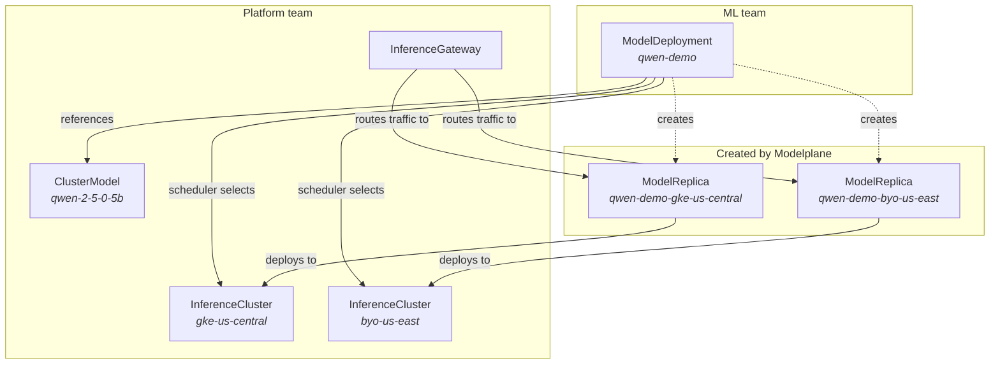

# Concepts

Modelplane manages AI model inference as declarative infrastructure. It draws a
boundary between two teams: platform teams who provision infrastructure and
curate a model catalog, and ML teams who deploy from that catalog.

This page explains the key resources and how they relate.

## Resource model



## InferenceGateway

The InferenceGateway creates a unified, OpenAI-compatible endpoint on the
control plane cluster. It installs [Envoy
Gateway](https://gateway.envoyproxy.io) and creates a Gateway that routes
requests to model replicas on remote inference clusters.

Create one InferenceGateway per control plane. It must be named `default`. When
running the control plane in kind, set `loadBalancer: MetalLB` to get a
LoadBalancer IP inside the Docker network.

Once ready, the gateway's external address is available in the resource's
status:

```bash
kubectl get ig default
```

## InferenceCluster

An InferenceCluster represents a Kubernetes cluster configured for model
serving. Platform teams create these to provide GPU capacity.

Each cluster has:

- A **cluster source**: `GKE` (Modelplane provisions the full cluster) or
  `Existing` (bring a cluster you manage yourself).
- One or more **GPU node pools** describing the available accelerators.

Modelplane installs the inference stack (including cert-manager, Envoy Gateway,
Prometheus, and KEDA) on the cluster automatically.

The cluster's GPU capacity is used by the scheduler when placing models. For
`GKE` clusters, the capacity is computed from the node pool configuration. For
`Existing` clusters, you describe the node pools so the scheduler knows what's
available.

InferenceClusters must have the label `modelplane.ai/cluster: "true"` to be
discoverable by the scheduler.

## ClusterModel and Model

A ClusterModel (cluster-scoped) or Model (namespaced) registers a model in the
platform catalog. It describes:

- Where to download weights from (currently HuggingFace).
- How much VRAM the model needs.
- One or more **serving profiles**, each specifying an engine (currently vLLM)
  and a container image.

Serving profiles are listed in priority order. When the scheduler places a model
on a cluster, it picks the first applicable profile.

ML teams don't need to know about serving profiles. They reference a catalog
model by name and the platform decides how to serve it.

## ModelDeployment

A ModelDeployment is the ML team's interface. It says "deploy this model to N
clusters" and produces a working endpoint.

When a ModelDeployment is created, the scheduler:

1. Discovers all InferenceClusters with the `modelplane.ai/cluster` label.
2. Applies any `clusterSelector` label filter from the deployment.
3. Selects a serving profile from the model's catalog entry.
4. Checks GPU capacity (model VRAM vs available pool VRAM, minus other
   replicas).
5. Creates a ModelReplica for each selected cluster.
6. Creates an HTTPRoute on the control plane gateway to route traffic to the
   replicas.

The deployment's endpoint URL follows this pattern:

``` http://<gateway-address>/<namespace>/<deployment-name>/v1/chat/completions
```

### Scaling

ModelDeployments support two scaling modes:

- **Fixed**: a static number of replicas per ModelReplica.
- **Concurrency**: autoscaling based on active concurrent requests per replica,
  using KEDA and Prometheus. Supports scale-to-zero when `minReplicas` is 0.

The default is fixed scaling with 1 replica.

## ModelReplica

A ModelReplica is created by the ModelDeployment's composition function. Users
don't create these directly.

Each replica represents a model deployed to a specific cluster. It resolves the
serving profile, computes how many GPUs the model needs, and creates the
inference resources (an `LLMInferenceService`) on the remote cluster.

The replica also creates an Envoy Gateway `Backend` on the control plane to
route traffic from the gateway to the remote cluster's inference endpoint.
