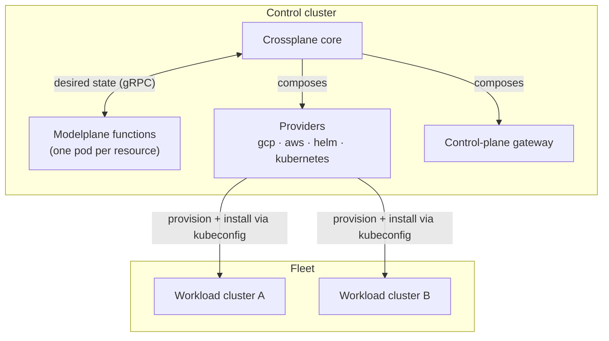
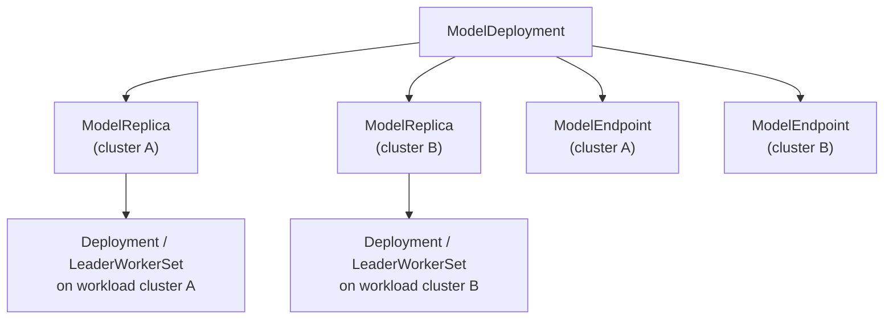
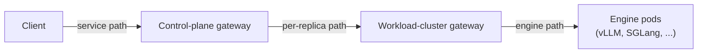

<!-- vale write-good.Passive = NO -->
Modelplane's central design choice is to build the control plane on
[Crossplane](https://crossplane.io) rather than as a bespoke set of Kubernetes
controllers. Everything else here follows from that. This section assumes you're
comfortable with Kubernetes; the rest of the Crossplane vocabulary you need is
below.

## Crossplane in brief

[Crossplane](https://crossplane.io) extends Kubernetes to manage things beyond
the cluster, cloud infrastructure, SaaS, and in Modelplane's case inference
fleets, through the same declarative, reconciled API model. Three of its concepts
matter here:

- **Composite Resources (XRs)** are custom resources whose controller, instead of
  talking to an external API directly, declares a set of other resources that
  should exist. Every Modelplane API, `InferenceCluster`, `ModelDeployment`,
  `ModelService`, is an XR.
- **Composition functions** are that controller logic. A function is a small gRPC
  service handed the observed XR and the resources it depends on, which returns
  the desired child resources. An XR runs a pipeline of one or more functions
  every reconcile; in Modelplane each is typically a single function, so the rest
  of this section says "the function" for short.
- **Providers** are controllers that manage external systems through their own
  managed resources: `provider-gcp` and `provider-aws` for cloud APIs,
  `provider-helm` for Helm releases, `provider-kubernetes` for arbitrary objects
  on any cluster. A composition function composes these like any other resource.

Put together: a Modelplane API is an XR, its logic is a composition function, and
the function composes a mix of plain Kubernetes objects, other Modelplane XRs, and
provider resources.

The resource model mirrors Kubernetes core, one scope up:
`ModelDeployment` → `ModelReplica` → `ModelService` → `ModelEndpoint` parallels
`Deployment` → `Pod` → `Service` → `Endpoint`, but across a fleet of clusters
rather than within one. A `ModelDeployment` composes a `ModelReplica` per replica,
a `ModelReplica` composes the serving workload on its target cluster, and a
`ModelService` routes across the `ModelEndpoint`s. If you know how those core
objects relate, you already know the shape of Modelplane's.

## Why Crossplane?

Modelplane is, at its core, a system that turns declarative resources into
composed infrastructure spanning cloud accounts, many Kubernetes clusters, and
the workloads on them. That's the problem Crossplane solves, and it helps in two
ways: providers and functions.

**Providers** give us reach. Modelplane has to provision Kubernetes clusters and
all the infrastructure they need across different clouds, then install software
onto them. That's an enormous surface, and providers cover it without us rolling
our own controllers for each cloud API and Helm release.

**Functions** are where Modelplane's own logic lives, and writing it as
composition functions buys several things:

- **Business logic, not controller plumbing.** A function computes desired state
  from observed state. Crossplane handles the fiddly Kubernetes controller
  details, the watches, requeues, finalizers, and drift correction, that a
  hand-written controller gets wrong in a dozen subtle ways. Less plumbing to
  write and maintain means we move faster.
- **Testability.** A function is a pure function of its inputs, so you can test
  it as a black box: feed it an XR and its dependencies, assert on the resources
  it returns. The whole test runs in process, with no API server to stand up.
- **The right language for each job.** Functions can be written in any language.
  Modelplane's are Python, for fast iteration on the serving and scheduling logic
  and because Python is the common language of the ML world, which lowers the bar
  for contributors. The performance-sensitive distributed-systems core stays in
  Go, where Crossplane and its providers already are.

The bet underneath both is that inference infrastructure is the same shape of
problem as cloud infrastructure, which Crossplane manages well. Building on it
lets Modelplane spend its effort on the part that's actually inference-specific.

## The control cluster and the fleet

Modelplane runs on a **control cluster** and manages a fleet of **workload
clusters**, the `InferenceCluster`s. The split is deliberate: the control plane
holds no GPUs and serves no tokens. It schedules, composes, and routes; the
workload clusters do the serving.

The control cluster runs Crossplane, the Modelplane composition functions (one
per resource, each a pod Crossplane calls per reconcile), the providers, and the
control-plane gateway. It also holds every Modelplane resource and the
`ProviderConfig`s that let the providers reach each workload cluster, built from
that cluster's kubeconfig.

Crossplane core drives everything. Each reconcile it asks a function what a
resource should compose and gets back the desired resources. Core then reconciles
them, applying the provider resources that the providers act on. A function only
computes desired state. It never reaches a provider or a cluster itself.

Modelplane installs a serving stack on each workload cluster: the components a
cluster needs to serve models, providing inference-aware routing through Gateway
API, multi-node serving, GPU binding through DRA, and observability, among others.
The exact components evolve, but Modelplane composes and owns all of them. For
provisioned clusters the providers also create the cluster and its node pools
first.

## How a deployment is composed

A resource composes others, which compose others, until the tree bottoms out in
provider resources and plain Kubernetes objects. A `ModelDeployment` is the
clearest example. Its function schedules the replicas, then composes a
`ModelReplica` for each, and a `ModelEndpoint` for each replica that's ready to
serve. Each `ModelReplica` function composes the serving workload, a Deployment or
a LeaderWorkerSet, onto its target workload cluster through provider-kubernetes.

The platform resources compose the same way. An `InferenceCluster` composes a
`GKECluster` or `EKSCluster` (the cloud infrastructure, via the cloud providers)
and a `ServingStack` (the per-cluster software install, via provider-helm and
provider-kubernetes). Engines bind GPUs through DRA: each `claim: DRA` device in a
member's `nodeSelector` becomes a request in the `ResourceClaim` the serving pods
claim through.

## The request path

A served request crosses two gateways, both built on Gateway API. The
**control-plane gateway** is the front door: a `ModelService` composes an
`HTTPRoute` on it that matches the service's path prefix and forwards to the
matched `ModelEndpoint`s, each of which is a `Service` pointing at a workload
cluster's gateway address. The **workload-cluster gateway** then routes from the
cluster edge to the engine pods.

Each hop rewrites the path: the control plane rewrites the public prefix to the
replica's path, and the workload gateway strips that down to what the engine
serves. This per-backend path rewriting is the main thing the control-plane
gateway has to support, and it narrows which Gateway API implementations can fill
the role.

Which gateway sits at each layer is internal, not part of the API. The
[`InferenceGateway`]() `backend` field
is an enum precisely so the control-plane gateway can grow other options over
time. Target the `ModelService` URL rather than either gateway directly.
<!-- vale write-good.Passive = YES -->
