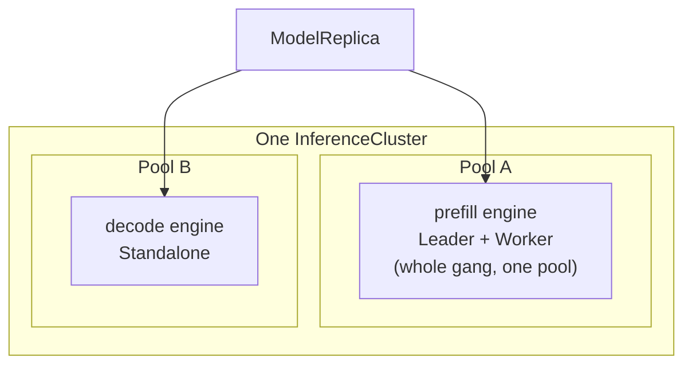

**API:** [`modelplane.ai/v1alpha1` · ModelDeployment]()
<!-- vale write-good.Passive = NO -->
When an ML team creates a [ModelDeployment](),
the fleet scheduler decides which cluster each replica runs on and which node
pool each engine uses. Platform teams don't drive it directly, but what they
publish, the clusters, their labels, and each pool's
[InferenceClass](), is exactly what the
scheduler matches against. This page explains how it places work and where it
deliberately stops short, so you can reason about why a deployment landed where it
did.

## A pure function of observed state

The scheduler recomputes the whole placement from scratch on every reconcile. It
reads the deployment, every `InferenceCluster` with its published capacity, and
every existing `ModelReplica`, and returns a placement. Given the same inputs it
returns the same placement, so it's safe to run continuously.

The key consequence is stability. Existing replicas are *inputs*, not decisions.
A healthy replica is never moved to improve the global picture, even if a better
cluster appears later. This keeps placement from churning underneath a running
deployment.

## Two-level matching

The scheduler picks a `(cluster, pool)` for each replica in two stages, matching
against what the platform team published.

1. **Clusters** are filtered by `clusterSelector.matchLabels` against the
   standard Kubernetes labels on each `InferenceCluster`: tier, region, provider,
   compliance posture. This is organizational metadata, so string equality is
   enough. An unset selector matches every cluster.
2. **Pools** are filtered by matching each device request in a member's
   `nodeSelector.devices` against the devices a pool's `InferenceClass` publishes.
   A request is a real DRA request: a `count` and CEL selectors over a device's
   attributes and capacity, such as "a GPU with at least 141Gi of memory." A pool
   fits a member when it has devices satisfying every request, with `count` to
   cover them.

The CEL is the same expression an ML engineer would write in a DRA
`ResourceClaim`, evaluated against the devices the `InferenceClass` declares. The
keys a platform team puts on a class are the contract: a `nodeSelector` matches a
pool only if the class publishes the attributes and capacity it asks for.

## Co-scheduling and pools

A replica is a set of engines placed together on one cluster. Within a replica,
every member of a single engine is placed on **one** pool: each member carries
its own `nodeSelector`, but the scheduler requires a single pool that satisfies
them all.

It works this way because a gang's members coordinate over their pool's
interconnect fabric, and the scheduler can't reason about fabric. Pool identity
is the finest grain it has. An engine split across pools risks landing its
members on different fabrics. The collective then never forms, and the gang hangs
with no clear error. To avoid that, the scheduler never splits an engine: an engine that no
single pool satisfies isn't scheduled on that cluster. Different engines of the same replica
can use different pools, but all on the same cluster.



A member with no `nodeSelector` claims no devices. It matches the engine's pool
at no node cost and rides along on the gang's nodes, packed there by the
cluster's own scheduler.

## Counting capacity in nodes

Capacity is gated on **nodes**, not on individual GPUs. The only number the
scheduler reads from a member is its node cost:

```text
nodes = pods × copies
pods  = 1 for a Standalone or Leader, or worker.nodes for a Worker
```

A member that resolves no `claim: DRA` device, because it carried no
`nodeSelector` or matched only synthetic devices, costs zero nodes. The scheduler
sums the cost of a replica's members and places the replica only where every
engine's pool has enough free nodes, tracking a running ledger so it never
overcommits a cluster.

This accounting is deliberately coarse. The control-plane scheduler answers
"could this cluster plausibly host this replica," not "exactly which GPU does
each pod get." Device-level contention between deployments is left to DRA
admission on the workload cluster, which is authoritative: it rejects a pod whose
`ResourceClaim` can't be satisfied, and the next reconcile sees the updated
state.

## Pinning placement to a pool

The scheduler's pool choice is enforced, not advisory. Each scheduled pod carries
a Kubernetes `nodeSelector` on the `modelplane.ai/pool` node label, so it can only
land on the pool the scheduler chose. Without it, the cluster's scheduler could
place a pod on any pool whose devices match its DRA claim, and the fleet's
per-pool accounting would drift from where pods actually run.

Modelplane labels the nodes of every pool it provisions. On a BYO
(`source: Existing`) cluster it doesn't provision the nodes, so the operator must
label each pool's nodes `modelplane.ai/pool=<nodePools[].name>` themselves, or
worker pods for that pool stay `Pending`.

## Scaling, retention, and re-placement

Scheduling runs in two phases each reconcile:

<!-- vale write-good.TooWordy = NO -->
- **Retain.** Each existing replica keeps its cluster if the cluster still exists
  and every member's pinned pool still matches its (possibly edited)
  `nodeSelector`. A degraded cluster, one that's not Ready or has no gateway
  address, is still retained; transient outages surface through the deployment's
  conditions, not re-placement.
- **Fill.** If the deployment wants more replicas than were retained, the
  shortfall is placed one at a time, each onto the eligible cluster hosting the
  fewest of this deployment's replicas, spreading before packing. If it wants
  fewer, the highest-index replicas are dropped first.
<!-- vale write-good.TooWordy = YES -->

A replica never changes cluster. If its cluster is deleted, the replica stops
being emitted, Crossplane garbage-collects it, and the fill phase mints a fresh
replica elsewhere. Moving is always delete-plus-create, mirroring how Kubernetes
treats a pod whose node is gone.

## Known limitations

The scheduler is built to be conservative and predictable rather than optimal.
Two limits follow from that, both tracked for future work:

- **A whole node is charged per pod**
  ([#172](https://github.com/modelplaneai/modelplane/issues/172)). A pod that
  claims one GPU of an eight-GPU node still charges the whole node in the
  scheduler's accounting. This is safe, it can only under-count a pool's
  capacity, never overcommit it, but it can strand GPUs on deployments of
  sub-node engines.
- **An engine can't span pools, even on one fabric**
  ([#149](https://github.com/modelplaneai/modelplane/issues/149)). Because the
  scheduler has no concept of fabric, it refuses to split a gang across pools at
  all. That forecloses a legitimate case, GPU workers on one pool and a no-GPU
  coordinator on another within the same fabric, until fabric-aware placement
  lands.
<!-- vale write-good.Passive = YES -->
