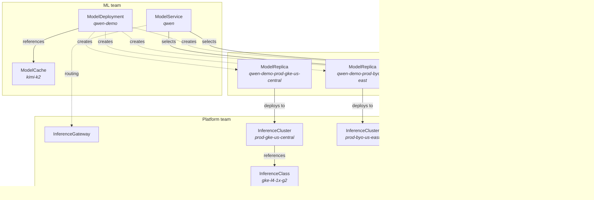

Modelplane manages AI model inference across a fleet of GPU clusters. It draws a
boundary between two teams: platform teams who provision infrastructure and
define hardware classes, and ML teams who deploy models and get unified
endpoints.

This page explains the key resources and how they relate.

## Resource model



## InferenceGateway

The InferenceGateway creates a unified, OpenAI-compatible endpoint on the
control plane cluster. It installs [Envoy
Gateway](https://gateway.envoyproxy.io) and creates a Gateway that routes
requests to model endpoints on remote inference clusters.

Create one InferenceGateway per control plane. It must be named `default`. When
running the control plane in kind, set `loadBalancer: MetalLB` to get a
LoadBalancer IP inside the Docker network.

Once ready, read the gateway's external address from the resource's status:

```bash
kubectl get ig default
```

## InferenceClass

An InferenceClass is a tested recipe for a GPU node pool. It bundles:

- **Resources**: what hardware the class exposes (GPU count, memory). Used by
  the scheduler to match deployments to clusters.
- **Provisioning** (optional): how to create a node pool of this class on a
  specific cloud. Classes without provisioning are for existing clusters where
  the pool already exists.

Different clouds and GPU types imply different classes. A GKE L4 pool is
`gke-l4-1x-g2`. A bare-metal H100 pool is `h100-8x-ib` (no provisioning).

## InferenceCluster

An InferenceCluster represents a Kubernetes cluster configured for model
serving. Platform teams create these to provide GPU capacity.

Each cluster has:

- A **cluster source**: `GKE` (Modelplane provisions the full cluster) or
  `Existing` (bring a cluster you manage yourself).
- One or more **node pools**, each referencing an `InferenceClass` for its
  hardware capabilities and provisioning recipe.
- **Labels** for organizational metadata: tier, region, provider. These are the
  matching surface for `ModelDeployment.clusterSelector`.

Modelplane installs an inference stack (e.g. LeaderWorkerSet, llm-d, Dynamo,
Envoy Gateway, etc) on every cluster it manages. This includes existing
clusters, which Modelplane assumes are solely for its use.

## ModelDeployment

A ModelDeployment is the ML team's interface. It carries everything needed to
deploy a model to the fleet: the worker template, hardware topology, replica
count, and an optional [ModelCache](#modelcache) reference for staged weights.

When you create a ModelDeployment, the scheduler:

1. Discovers all ready InferenceClusters (filtered by `clusterSelector` labels
   if set).
2. Derives the physical shape from `workers.topology`: GPUs per node (tensor)
   and nodes per worker (pipeline, default 1).
3. Checks GPU capacity: does the cluster have a pool with enough GPUs per node
   and enough available nodes?
4. Creates a `ModelReplica` for each selected cluster.
5. Creates a `ModelEndpoint` for each replica, carrying the URL and rewrite path
   for routing.

The worker template is a curated subset of `PodTemplateSpec`. The container
named `engine` is the inference engine (e.g. vLLM); additional containers pass
through as sidecars.

### Scaling

Replicas are the only scaling axis. Each `ModelReplica` is a complete,
fixed-topology serving instance. Scaling `spec.replicas` adds or removes whole
instances. There's no in-cluster pod autoscaling.

## Multi-node Inference

When a model is too large to fit on one node's GPUs, set
`workers.topology.pipeline` greater than 1. Modelplane composes a
LeaderWorkerSet gang of pods that serve the model together: pipeline
parallelism splits the model across nodes, tensor parallelism splits it
across GPUs within a node.

Multi-node deployments require a [ModelCache](#modelcache) referenced via
`spec.modelCacheRef.name`.

## ModelCache

A ModelCache stages a model artifact on workload-cluster storage as a
first-class resource. Modelplane composes a ReadWriteMany PVC on each matched
cluster and hydrates it once with a Job that fetches the artifact from the
configured source. ModelDeployments reference a cache via
`spec.modelCacheRef.name`; the cache's PVC is mounted at `/mnt/models`
read-write into every serving pod automatically, shared across the LWS gang of
a multi-node worker. The engine reads weights locally from the mount instead of
fetching them at boot.

Without a cache, the engine fetches the model at pod startup, so the
ModelDeployment must supply any required credentials (e.g. `HF_TOKEN` via the
engine container's `env`).

Each cache has:

- A **source**: a discriminated union of where to fetch the artifact, with
  source-specific fields (e.g. `huggingFace.repo` and `huggingFace.sizeGiB`
  today). Future types (`dragonfly` for P2P distribution, `oci` for NIM-style
  bundled artifacts) will declare different fields under their own
  discriminator.
- An optional **clusterSelector** to scope replication. Omitting
  `spec.clusterSelector` stages the cache on every matched cluster; setting
  `matchLabels` restricts it to clusters carrying those labels.

The cache mounts at `/mnt/models` on every consuming pod; engine container
args should reference this path (e.g. `--model=/mnt/models` for vLLM).

ModelCache is required for multi-node deployments and optional for single-node
cold-start optimization.

### Storage prerequisites

The cache PVC needs an RWX StorageClass on the workload cluster. What the
platform admin must set up depends on the cloud:

- **GKE:** auto-provisioned. Modelplane composes the `modelplane-rwx` Filestore
  StorageClass and enables `file.googleapis.com`. Nothing for the admin to do.
- **EKS:** bring-your-own for v0.1. On the workload cluster the admin must
  install the `aws-efs-csi-driver` EKS add-on (with an IRSA role bound to
  `AmazonEFSCSIDriverPolicy`); create an EFS file system with a mount target in
  each node subnet and a security group allowing inbound NFS (2049) from the
  node security group; and create a StorageClass named `modelplane-rwx-efs`
  with `provisioner: efs.csi.aws.com`, `provisioningMode: efs-ap`, and
  `fileSystemId: <fs-id>`. Set `eks.cache.storageClassName` if the admin's
  class has a different name. EFS is elastic, so the cache's `sizeGiB` is
  informational on EKS — the PVC API still requires a size, but EFS ignores it.
  Auto-provisioning EFS is tracked in
  [#114](https://github.com/modelplaneai/modelplane/issues/114).

## ModelReplica

The ModelDeployment's composition function creates ModelReplicas. Don't create
them directly.

Each replica represents a model deployed to a specific cluster. It reads the
worker template and topology, finds the engine container, and composes the
serving workload by topology: a native Kubernetes Deployment + Service +
HTTPRoute for a single self-contained pod (pipeline = 1), or an llm-d
LeaderWorkerSet with Gateway API Inference Extension routing (InferencePool +
endpoint picker) for multi-pod deployments (pipeline > 1).

## ModelEndpoint

A ModelEndpoint is a reachable inference endpoint. Modelplane composes one per
ModelReplica, but ML teams can also create them manually for external SaaS
providers (Together, BaseTen).

Each endpoint composes an Envoy Gateway `Backend` on the control plane.
ModelEndpoint surfaces the Backend's name in `status.routing.backendName` so
ModelService can reference it in its HTTPRoute.

## ModelService

A ModelService exposes one or more ModelEndpoints via a unified, OpenAI-
compatible endpoint. It selects endpoints by label and composes a Gateway API
`HTTPRoute` that load-balances across them.

Each backendRef in the HTTPRoute carries its own `URLRewrite` filter derived
from the endpoint's `spec.rewritePath`, so endpoints from different deployments
or external providers with different path layouts coexist correctly.

Read the service's public address from `status.address`:

```bash
kubectl get ms qwen -n ml-team -o jsonpath='{.status.address}'
```

## Custom Cache Backends

Modelplane provisions Filestore Enterprise on `GKE` clusters and expects a
StorageClass named `modelplane-rwx` on `Existing` clusters (created by the
admin). When the default doesn't fit — different cost profile, an RWX backend
the org already runs, etc. — platform teams point Modelplane at a different
StorageClass via `cluster.<source>.cache.storageClassName`. On GKE the admin
must first create the StorageClass on the workload cluster (any backend
supporting ReadWriteMany dynamic provisioning — WekaIO, NetApp Trident, FSx
for NetApp, and similar). On Existing clusters the field points at whatever
name the admin chose. The ML team's ModelCache and ModelDeployment specs are
unchanged regardless.

Backends that don't fit dynamic-PVC provisioning (e.g. Dragonfly's P2P
distribution to per-node local caches) will be added natively as new types
under `ModelCache.spec.source` rather than through this override.
