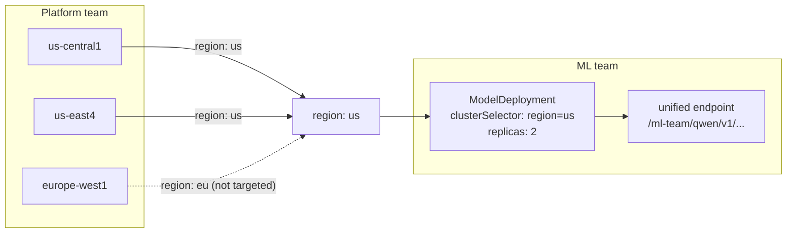

<!-- vale write-good.Passive = NO -->
Modelplane is an open source control plane for AI inference. It separates two
concerns: building a GPU cluster fleet with published hardware capabilities, and
deploying models against those capabilities. All without hardcoding cluster names
or cloud SKUs.

This guide uses a three cluster fleet (one `EU`, two `US`) as a working example,
then deploys a model to the `US` clusters through a single endpoint. You can
follow along with any number of clusters in any regions with adequate GPU
support. This guide uses AWS EKS, but Modelplane supports GKE as well.

The platform team publishes what hardware is available. The ML team expresses
what the model needs. Neither team needs to know what the other is doing to
change their side.

Once the platform is running, the ML team's side looks like this:

```yaml
apiVersion: modelplane.ai/v1alpha1
kind: ModelDeployment
metadata:
  name: qwen-demo
  namespace: ml-team
spec:
  replicas: 2
  clusterSelector:
    matchLabels:
      modelplane.ai/region: us       # target both US clusters by label
  engines:
  - name: qwen
    members:
    - role: Standalone
      nodeSelector:
        devices:
        - name: gpu
          count: 1
          selectors:
          - cel: |
              device.capacity["gpu.nvidia.com"].memory.compareTo(quantity("14Gi")) >= 0
      template:
        spec:
          containers:
          - name: engine
            image: vllm/vllm-openai:v0.7.3
            args:
            - "--model=Qwen/Qwen2.5-0.5B-Instruct"
            - "--dtype=half"
```

`clusterSelector` targets clusters by label;
the device selector matches against the hardware capacity those clusters
declare in their `InferenceClass`. Modelplane schedules one replica to each
matching cluster.

Provisioning three GPU clusters takes around 15-20 minutes.

## Prerequisites

- [kind](https://kind.sigs.k8s.io/), [kubectl](https://kubernetes.io/docs/tasks/tools/),
  [Helm](https://helm.sh/docs/intro/install/), and [Docker](https://www.docker.com/)
- An AWS account with permissions to create EKS clusters, VPCs, and IAM roles
- AWS access key ID and secret access key

---

## Part 1: Build your inference platform

This section is infrastructure work done once per environment. Deploying,
updating, and removing models in Part 2 doesn't require touching any of it.

### Install the control plane

In this guide, you'll use Crossplane in a local kind cluster to run Modelplane's
control plane. Crossplane gives you a reconciliation engine, package management,
and infrastructure as code to manage your inference platform.


You can run your Modelplane control plane anywhere. This guide uses kind for
illustration.


Once you create the control plane, Modelplane can provision GKE and EKS clusters
and install Helm releases on remote clusters.

```bash
kind create cluster --name modelplane
```

```bash
helm repo add crossplane-stable https://charts.crossplane.io/stable
helm repo update crossplane-stable
helm install crossplane crossplane-stable/crossplane \
  --namespace crossplane-system --create-namespace \
  --set "args={--enable-dependency-version-upgrades}" \
  --wait
```

Apply the bootstrap resources. This grants Crossplane the RBAC it needs for
Gateway API and MetalLB (required for kind), and a cluster-admin binding for `provider-helm` so it
can install Helm charts on remote clusters:

```shell 
kubectl apply -f 
```






### Install Modelplane

```bash
kubectl apply -f - <<'EOF'
apiVersion: pkg.crossplane.io/v1
kind: Configuration
metadata:
  name: modelplane
spec:
  package: xpkg.upbound.io/modelplane/modelplane:
EOF
```

Wait until the configuration is healthy:

```bash
kubectl wait configuration/modelplane --for=condition=Healthy --timeout=5m
```

### Configure cloud credentials

Create an AWS credentials file:


```ini {copy-lines="all"}
[default]
aws_access_key_id = $@<aws_access_key>$@
aws_secret_access_key = $@<aws_secret_key>$@
```





Create a Kubernetes secret:

```ini
kubectl create secret generic aws-creds \
  --from-file=credentials=$@</path/to/aws-credentials>$@ \
  -n crossplane-system
```

Apply the `ClusterProviderConfig` referencing your secret:



```bash
kubectl apply -f - <<'EOF'
apiVersion: aws.m.upbound.io/v1beta1
kind: ClusterProviderConfig
metadata:
  name: default
spec:
  credentials:
    source: Secret
    secretRef:
      namespace: crossplane-system
      name: aws-creds
      key: credentials
EOF
```

### Set up the InferenceGateway

The `InferenceGateway` installs Traefik Proxy and MetalLB on the control plane.
Traefik routes inference traffic to model replicas across the fleet. MetalLB
assigns Traefik's `LoadBalancer` service an external IP on clusters that don't
have a cloud load balancer, including the kind cluster this guide uses.
Create one per control plane, always named `default`.

Set `metallb.addressPool` to a range within your control plane's Docker network.
If you run the control plane on a cloud cluster with native `LoadBalancer`
support, omit the `loadBalancer` field entirely.



Wait until the resources are ready to continue:

```bash
kubectl wait --for=condition=Ready ig/default --timeout=5m
```

### Publish hardware capabilities and register the fleet

An `InferenceClass` is the capacity contract between platform and ML teams. The
platform team creates one class per hardware shape. The ML team writes device
selectors that match against that class's declared capacity. When the platform
team migrates from an `L4` to an `A10G`, or moves a cluster from GKE to EKS,
they update the `InferenceClass`. As long as the new hardware satisfies the same
capability requirements, Modelplane reschedules replicas to the new cluster
automatically. The ML team's `ModelDeployment` doesn't change.

An `InferenceCluster` registers a cluster with Modelplane. Each cluster
references an `InferenceClass` for its GPU node pools and carries labels that
ML teams target with `clusterSelector`. Modelplane provisions the cluster and
installs the serving stack automatically.
<!-- vale write-good.TooWordy = NO -->
Multiple clusters can share an `InferenceClass`. All three clusters below use
the same class because they run the same hardware shape. Create a new
`InferenceClass` only when the hardware shape differs (for example, a T4 pool
and an A100 pool need separate classes). The EU cluster is available but not
targeted in Part 2. In the next part, you'll target your deployment by labels,
not specific clusters.
<!-- vale write-good.TooWordy  = YES -->

```bash
kubectl apply -f - <<'EOF'
apiVersion: modelplane.ai/v1alpha1
kind: InferenceClass
metadata:
  name: t4-1x-g4dn
spec:
  description: "EKS g4dn.xlarge, 1x NVIDIA T4"
  provisioning:
    provider: EKS
    eks:
      instanceType: g4dn.xlarge
      diskSizeGb: 50
      accelerator:
        type: nvidia-tesla-t4
        count: 1
  devices:
  - name: gpu
    claim: DRA
    driver: gpu.nvidia.com
    deviceClassName: gpu.nvidia.com
    count: 1
    attributes:
      architecture: { string: Turing }
    capacity:
      memory: { value: "16384Mi" }
---
apiVersion: modelplane.ai/v1alpha1
kind: InferenceCluster
metadata:
  name: eks-eu-west
  labels:
    modelplane.ai/region: eu
spec:
  cluster:
    source: EKS
    eks:
      region: eu-west-1
  nodePools:
  - name: gpu-t4
    className: eks-t4-1x-g4dn
    nodeCount: 1
    minNodeCount: 1
    maxNodeCount: 1
    zones:
    - eu-west-1b
---
apiVersion: modelplane.ai/v1alpha1
kind: InferenceCluster
metadata:
  name: eks-us-east
  labels:
    modelplane.ai/region: us
spec:
  cluster:
    source: EKS
    eks:
      region: us-east-1
  nodePools:
  - name: gpu-t4
    className: eks-t4-1x-g4dn
    nodeCount: 1
    minNodeCount: 1
    maxNodeCount: 1
    zones:
    - us-east-1b
---
apiVersion: modelplane.ai/v1alpha1
kind: InferenceCluster
metadata:
  name: eks-us-west
  labels:
    modelplane.ai/region: us
spec:
  cluster:
    source: EKS
    eks:
      region: us-west-2
  nodePools:
  - name: gpu-t4
    className: eks-t4-1x-g4dn
    nodeCount: 1
    minNodeCount: 1
    maxNodeCount: 1
    zones:
    - us-west-2b
EOF
```

Modelplane provisions all three clusters in parallel. This takes roughly 20-30
minutes. Wait until all three are ready to continue:

```bash
kubectl get ic --watch
```

Modelplane has registered three clusters and installed the serving stack on
each. It can now schedule models.

---

## Part 2: Deploy and manage models

Labels are the contract between the two sides. The platform team owns cluster
names, regions, and providers. The ML team only ever sees the label.



Everything from here is model management. The platform infrastructure above
doesn't change when you add, update, or remove models.

### Deploy the model

Create a namespace and apply the deployment:

```bash
kubectl create namespace ml-team
```

```bash
kubectl apply -f - <<'EOF'
apiVersion: modelplane.ai/v1alpha1
kind: ModelDeployment
metadata:
  name: qwen-demo
  namespace: ml-team
spec:
  replicas: 2
  clusterSelector:
    matchLabels:
      modelplane.ai/region: us
  engines:
  - name: qwen
    members:
    - role: Standalone
      nodeSelector:
        devices:
        - name: gpu
          count: 1
          selectors:
          - cel: |
              device.capacity["gpu.nvidia.com"].memory.compareTo(quantity("14Gi")) >= 0
      template:
        spec:
          containers:
          - name: engine
            image: vllm/vllm-openai:v0.7.3
            args:
            - "--model=Qwen/Qwen2.5-0.5B-Instruct"
            - "--dtype=half"
EOF
```

The `clusterSelector` limits scheduling to `US` clusters. The device selector
matches against the `InferenceClass` capacity those clusters declare. In this
example, any T4 GPU node satisfies `>= 14Gi`. Modelplane places one replica on
each matching cluster.

Wait until `REPLICAS` returns `2` to continue:

```bash
kubectl get md -n ml-team --watch
```

To see which clusters the scheduler chose:

```bash
kubectl get modelreplica -n ml-team
```

The scheduler placed one replica on each matching cluster:

```shell
NAME              CLUSTER       SYNCED   READY   COMPOSITION                   AGE
qwen-demo-7323a   eks-us-west   True     True    modelreplicas.modelplane.ai   29m
qwen-demo-92535   eks-us-east   True     True    modelreplicas.modelplane.ai   29m
```

### Expose the model

A `ModelService` selects `ModelEndpoints` by label and creates a Gateway API
`HTTPRoute` that load-balances across them. Modelplane composes one
`ModelEndpoint` per replica, labeled with the deployment name:



### Send a request

Modelplane creates a Gateway API `HTTPRoute` for each replica and attaches it
to the Traefik gateway. Requests to the gateway IP are routed by Gateway API.

Send a request to the endpoint:
```bash
kubectl run -i --rm curl-test \
  --image=curlimages/curl \
  --restart=Never \
  -- curl -s http://172.18.255.200/ml-team/qwen/v1/chat/completions \
  -H "Content-Type: application/json" \
  -d '{
    "model": "Qwen/Qwen2.5-0.5B-Instruct",
    "messages": [{"role": "user", "content": "What is Crossplane in one sentence?"}],
    "max_tokens": 100
  }'
```

You should receive a reply in a few seconds:

```json
{
  "id": "chatcmpl-217f0efa-4b57-40bb-a7dc-f31047a9ba45",
  "object": "chat.completion",
  "created": 1781713612,
  "model": "Qwen/Qwen2.5-0.5B-Instruct",
  "choices": [
    {
      "index": 0,
      "message": {
        "role": "assistant",
        "content": "Crossplane is a cross-cloud service orchestration platform
        designed to facilitate seamless deployment and management of
        applications and infrastructure across various distributed cloud
        environments." },
      "finish_reason": "stop"
    }
  ],
  "usage": {
    "prompt_tokens": 37,
    "completion_tokens": 28,
    "total_tokens": 65
  }
}
```

The EU cluster is registered and available but not targeted by this deployment.
To add it, change `spec.replicas` to 3 and remove the `clusterSelector`. The
endpoint stays the same; the gateway picks up the new replica automatically.

---

## Clean up

Delete the `ModelDeployment` before the `InferenceCluster`. Deleting clusters
first leaves the deployment trying to reconcile against infrastructure that no
longer exists.

Delete `InferenceCluster` resources with foreground cascading deletion. The
serving stack runs on each workload cluster and must uninstall while those
clusters' API servers are still reachable. Foreground deletion holds each
cluster object until its stack finishes; background deletion can orphan cloud
resources (load balancer security groups that block VPC deletion).

Wait for all three clusters to fully spin down before deleting the kind
cluster. Crossplane orphans cloud resources if the control plane disappears
while it's still cleaning up.

```bash
kubectl delete md --all -n ml-team
kubectl delete ms --all -n ml-team
```

Wait for all model replicas to finish cleaning up before continuing:

```bash
kubectl get modelreplica -n ml-team --watch
```

Delete all inference clusters:

```bash
kubectl delete ic --all --cascade=foreground
```

Wait until all resources are deleted:

```bash
kubectl get ic --watch
```

Finally, delete the kind cluster:

```bash
kind delete cluster --name modelplane
```
<!-- vale write-good.Passive = YES -->

## Next steps

You just created and deployed an inference stack platform and walked through the
entire model management lifecycle with Modelplane.

For more information, check out:

* [Build the Inference Stack Platform]()
* [Deploy and Manage Models]()

Star the [Modelplane project on GitHub](https://github.com/modelplaneai/modelplane) and build with us.

