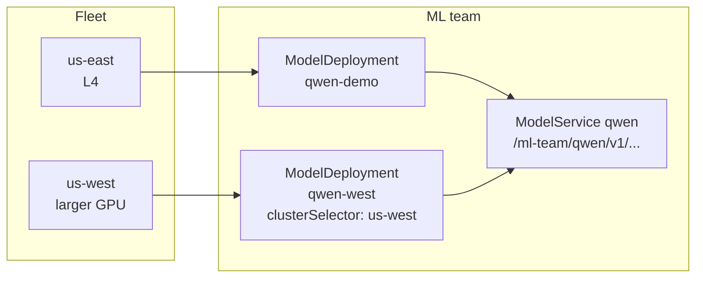

A `ModelService` can front more than one `ModelDeployment`. Here you add a second
deployment, pinned to a different region, and point the same service at both. The
endpoint you already curled stays the same. Behind it, traffic now load-balances
across two regions.



## Deploy to a second region

The new deployment uses a `clusterSelector` to pin its replica to the `us-west`
cluster you added in the last step, and selects the larger GPU there:










Wait until its replica is `Ready`, then check placement. You now have one replica
per region:

```bash
kubectl get modelreplica -n ml-team
```

```shell {nocopy=true}
NAME              CLUSTER       SYNCED   READY   COMPOSITION                   AGE
qwen-demo-7323a   eks-us-east   True     True    modelreplicas.modelplane.ai   42m
qwen-west-92535   eks-us-west   True     True    modelreplicas.modelplane.ai   8m
```

## Front both with one service

Update the `ModelService` to select both deployments. Each entry in
`spec.endpoints` adds its matching replicas to the same endpoint:



The endpoint URL doesn't change. Clients that had this URL before still have it;
they don't know the fleet changed. The gateway load-balances across both regions,
and losing one region keeps the other serving. Send the same request as before:

```bash
ADDRESS=$(kubectl get ms qwen -n ml-team -o jsonpath='{.status.address}')
```

```bash
kubectl run -i --rm curl-test \
  --image=curlimages/curl \
  --restart=Never \
  --env="ADDRESS=$ADDRESS" \
  -- sh -c 'curl -v "$ADDRESS/v1/chat/completions" \
  -H "Content-Type: application/json" \
  -d "{\"model\":\"Qwen/Qwen2.5-0.5B-Instruct\",\"messages\":[{\"role\":\"user\",\"content\":\"What is Kubernetes in one sentence?\"}],\"max_tokens\":100}"'
```

## That's the tour

You stood up a control plane, built a multi-region GPU fleet, deployed a model
across it, and ended with one stable endpoint serving requests. The platform
team published hardware. The ML team described what the model needs. Modelplane
placed them and served behind a single endpoint.

[Clean up]() tears everything down
when you're done.

For more on the resources you used:

* [InferenceClass]()
* [InferenceCluster]()
* [ModelDeployment]()
* [ModelService]()

Modelplane is in active development and we're building in the open. If you're
running your own inference fleet and want to shape where this goes, we'd love to
hear from you. Star the [repository](https://github.com/modelplaneai/modelplane),
join us in [Slack](https://slack.modelplane.ai), or read the
[manifesto](https://modelplane.ai).
