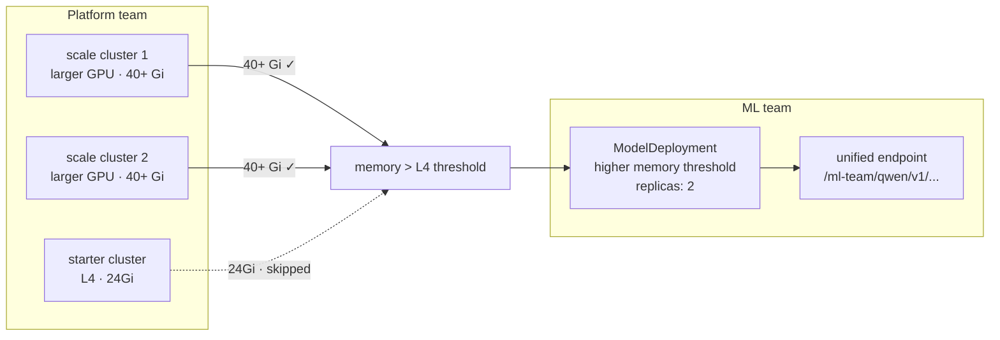

<!-- vale write-good.Passive = NO -->
This guide extends the setup from [the previous guide](). 

You'll add two larger GPU clusters in different regions and raise the memory
threshold in the `qwen-demo` deployment. Modelplane moves the replicas to the
qualifying hardware.

By the end, one `ModelDeployment` will run replicas across two larger-GPU clusters,
routed through the same endpoint you curled in Part 1. The `L4` cluster will
still be present but skipped because it no longer meets the selector.

Provisioning two more clusters takes about 10–15 minutes.


## Scale your inference fleet

<!-- vale write-good.TooWordy = NO -->



Register two more clusters with a bigger hardware class: `L40S` (`48 Gi`):




`g6e.xlarge` runs ~$2/hr on demand. Two of them plus the `L4` from Part 1 is a
few dollars for this guide. Delete the clusters when you're done (see [Clean
up](#clean-up)).



Register two more clusters with a bigger hardware class: `A100` (`40 Gi`).
Apply the manifest, setting each cluster's `project` to your GCP project:




```bash
curl -fsSL  \
  | sed 's/my-gcp-project/$@<your-gcp-project>$@/g' \
  | kubectl apply -f -
```



`a2-highgpu-1g` runs ~$3.50/hr on demand. Two of them plus the `L4` from Part 1 is a
few dollars for this guide. Delete the clusters when you're done (see [Clean
up](#clean-up)).




<!-- vale write-good.TooWordy  = YES -->

Modelplane provisions both clusters in parallel:

```bash
kubectl wait --for=condition=Ready ic --all --timeout=20m
```

## Request new hardware for your model


Update the `qwen-demo` deployment with a higher memory threshold and two replicas:










Wait until `REPLICAS` shows `2`:

```bash
kubectl get md -n ml-team --watch
```

Check replica placement:

```bash
kubectl get modelreplica -n ml-team
```



```shell {nocopy=true}
NAME              CLUSTER        SYNCED   READY   COMPOSITION                   AGE
qwen-demo-7323a   eks-us-west      True     True    modelreplicas.modelplane.ai   8m
qwen-demo-92535   eks-eu-central   True     True    modelreplicas.modelplane.ai   29m
```


```shell {nocopy=true}
NAME              CLUSTER        SYNCED   READY   COMPOSITION                   AGE
qwen-demo-7323a   gpu-us-west   True     True    modelreplicas.modelplane.ai   8m
qwen-demo-92535   gpu-us-east   True     True    modelreplicas.modelplane.ai   29m
```



The endpoint URL doesn't change. The gateway picks up the new replicas
automatically.

Any new qualifying cluster that becomes `Ready` is eligible automatically. The same
`ModelService` fronts both regions, so losing one cluster keeps the other
serving.

## Clean up

Delete model resources before clusters:

```bash
kubectl delete md --all -n ml-team
kubectl delete ms --all -n ml-team
```

Wait for all model replicas to finish:

```bash
kubectl get modelreplica -n ml-team --watch
```

Delete all clusters with foreground cascading deletion. The serving stack on
each workload cluster must uninstall while that cluster's API server is still
reachable. Foreground deletion holds each cluster object until its stack
finishes; background deletion can orphan cloud resources.

```bash
kubectl delete ic --all --cascade=foreground
```

Wait until all clusters are deleted:

```bash
kubectl get ic --watch
```

Delete the kind cluster:

```bash
kind delete cluster --name modelplane
```
<!-- vale write-good.Passive = YES -->

## Next steps

In this guide, you scaled an inference stack deployment hardware to support 
your model deployment. You created new clusters and were able to deploy models
to the appropriate cluster based on hardware needs.

* [ModelDeployment]()
* [InferenceCluster]()

Star the [Modelplane project on GitHub](https://github.com/modelplaneai/modelplane) and build with us.
