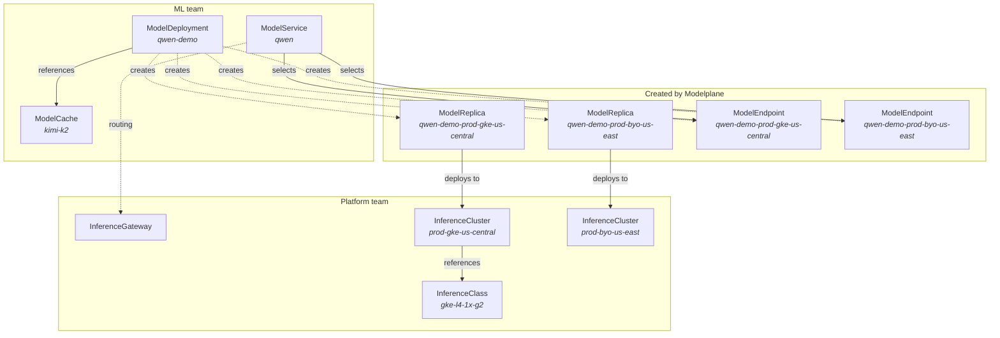

<!-- vale write-good.Passive = NO -->
Modelplane manages AI model inference across a fleet of GPU clusters. Its API
draws a boundary between two teams: [platform teams]()
who provision infrastructure and define hardware classes, and
[ML teams]() who deploy models and get unified
endpoints. This page defines every resource and the terms that connect them.

## Resource model

The hierarchy mirrors Kubernetes core, one scope up. ModelDeployment →
ModelReplica → ModelService → ModelEndpoint parallels Deployment → Pod → Service
→ Endpoint: a deployment fans out into replicas, and a service routes across the
endpoints they expose, except here it happens across a fleet of clusters rather
than within one. Each resource is a Crossplane composite, and its composition
function is the controller that reconciles it.

## Platform team resources

**[InferenceGateway]()**
The unified, OpenAI-compatible entry point on the control cluster. Installs Envoy
Gateway and routes requests to model endpoints on the inference clusters. One per
control plane, always named `default`.

**[InferenceClass]()**
A tested hardware recipe for a GPU node pool. Describes the devices a node of this
class offers (what the scheduler matches against) and, optionally, how to
provision the pool on a cloud. Platform teams define one class per GPU SKU and
cloud combination.

**[InferenceCluster]()**
A Kubernetes cluster in the inference fleet. Modelplane can provision it (GKE,
EKS) or bring it as-is (`Existing`, via a kubeconfig). Cluster metadata lives in
standard Kubernetes labels (tier, region, provider), which are what
`ModelDeployment.clusterSelector` matches. Modelplane installs the serving stack
on every registered cluster.

## ML team resources

**[ModelDeployment]()**
The ML team's primary resource. Declares the engine(s) to run, the replica count,
and an optional model cache. Each engine is one or more members (a `Standalone`,
or a `Leader` and `Worker`s) carrying device requests and the engine container.
The scheduler places each replica onto a cluster with matching hardware.

**[ModelCache]()**
Stages model weights on cluster storage ahead of serving. Composes a
ReadWriteMany volume per cluster and hydrates it once from the configured source
(Hugging Face today). Required for multi-node deployments; optional for
single-node cold-start optimization.

**[ModelService]()**
Exposes one or more `ModelEndpoints` as a single, OpenAI-compatible URL. Selects
endpoints by label and composes a Gateway API HTTPRoute that load-balances across
them, with weights for canary, A/B, and external-provider fallback.

## Resources Modelplane composes

**[ModelReplica]()**
One complete serving instance of a `ModelDeployment`, placed on a specific
cluster. Created automatically, one per replica. You don't create these directly.

**[ModelEndpoint]()**
A reachable inference endpoint. Modelplane composes one per `ModelReplica`. ML
teams can also create them manually to point a `ModelService` at an external
provider (Together, Baseten).

## Key terms

**Control cluster and inference clusters.** Modelplane runs on its own *control
cluster* (the control plane, with the gateway and the API). The *inference
clusters* are the GPU clusters in the fleet where models actually serve.

**Fleet scheduler and two-level matching.** The scheduler picks a `(cluster,
pool)` for each replica in two steps: filter clusters by their labels against the
deployment's `clusterSelector`, then filter pools by matching the deployment's
device requests against each pool's `InferenceClass`. Capacity is accounted at the
node level across the fleet.

**Devices, DRA, and CEL.** Hardware is modeled as DRA devices. A deployment's
`nodeSelector.devices` is a list of requests, each with a `count` and CEL
selectors over a device's attributes and capacity (for example, GPU memory or
architecture). The same expression that selects a pool also binds the device to
the pod at admission, through Dynamic Resource Allocation (DRA).

**Engines, members, and roles.** A `ModelDeployment` describes the *shape* of a
deployment, not how the engine runs. Each engine has members with a `role`:
`Standalone` (one pod), or a `Leader` and `Worker`s that form a multi-node gang.
Parallelism and KV transfer live in the engine flags you write, never in
Modelplane fields.

**Replicas as the scaling axis.** A `ModelReplica` is a complete, fixed-shape
serving instance. Scaling happens by adding or removing whole replicas; there's
no per-pod autoscaling inside a cluster.

**The serving stack.** The set of components Modelplane installs on every
inference cluster so it can compose workloads onto them: multi-node serving
support (LeaderWorkerSet), GPU binding (DRA), and the cluster-edge routing.



The resources platform teams create: gateway, hardware classes, and clusters.


The resources ML teams create: deployments, caches, services, and endpoints.


<!-- vale write-good.Passive = YES -->
