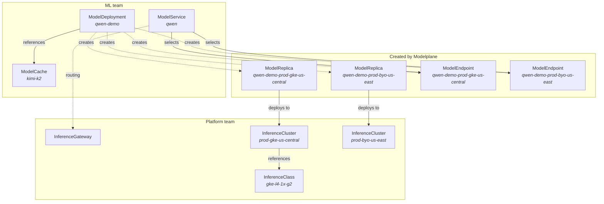

<!-- vale write-good.Passive = NO -->
Modelplane manages AI model inference across a fleet of GPU clusters. It draws a
boundary between two teams: [platform engineers]()
who provision infrastructure and define hardware classes, and
[ML teams]() who deploy models and get unified
endpoints.

## Resource model

## Glossary

**[InferenceGateway]()**
The unified, OpenAI-compatible endpoint on the control plane cluster. Installs
Envoy Gateway and routes requests to model endpoints on remote inference clusters.
One per control plane, always named `default`.

**[InferenceClass]()**
A hardware recipe for a GPU node pool. Includes GPU type, count, DRA device definitions,
and optional cloud provisioning config. Platform teams define one class per GPU
SKU and cloud combination.

**[InferenceCluster]()**
A Kubernetes cluster registered with Modelplane for model serving. Can be
provisioned by Modelplane (GKE, EKS) or brought as-is (`Existing`). Modelplane
installs the inference stack on every registered cluster.

**[ModelDeployment]()**
The ML team's primary resource. Declares the inference engines, replica count,
and optional model cache. The scheduler places each replica onto a ready cluster
with matching GPU capacity.

**[ModelCache]()**
Stages model weights on cluster storage ahead of serving. Composes a
ReadWriteMany PVC per cluster and hydrates it once from the configured source
(HuggingFace today). Required for multi-node deployments; optional for
single-node cold-start optimization.

**[ModelReplica]()**
One instance of a `ModelDeployment` placed on a specific cluster. Created
automatically by Modelplane. Don't create these directly.

**[ModelEndpoint]()**
A reachable inference endpoint. Modelplane composes one per `ModelReplica`.
ML teams can also create them manually to point a `ModelService` at an external
provider (Together, BaseTen).

**[ModelService]()**
Exposes one or more `ModelEndpoints` as a single, OpenAI-compatible URL.
Selects endpoints by label and composes a Gateway API HTTPRoute that
load-balances across them.
<!-- vale write-good.Passive = YES -->
