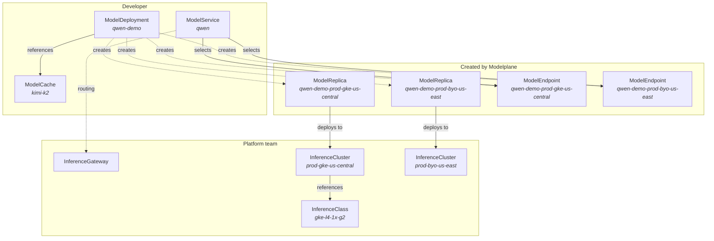

<!-- vale write-good.Passive = NO -->
Modelplane runs as a control plane on its own cluster, above the inference
clusters that actually serve models. It's built on [Crossplane](https://crossplane.io):
platform teams and developers describe what they want as Kubernetes resources, and
Modelplane composes the clusters, schedules replicas, and exposes endpoints to
match. This page is the high-altitude tour. The [Concepts]()
page covers each resource in full.

## The two-team boundary

Two sets of resources map onto the two teams, and Modelplane fills in everything
between them.

- **Platform teams** create an `InferenceGateway` (one unified, OpenAI-compatible
  entry point on the control plane), `InferenceClasses` (tested hardware recipes:
  GPU type and count), and `InferenceClusters` (the clusters themselves, labeled
  with tier, region, and provider).
- **Developers** create a `ModelDeployment` (the inference engine and replica
  count, with an optional `ModelCache` for staged weights) and a `ModelService`
  (one endpoint that routes across replicas).
- **Modelplane** composes the rest: a `ModelReplica` per cluster a model lands on,
  and a `ModelEndpoint` per replica for routing.

## What the control plane reconciles

Once the resources exist, Modelplane keeps the fleet matching them. Five concerns
run continuously:

1. **Provisioning.** From an `InferenceCluster`, Modelplane creates a full GKE or
   EKS cluster and its GPU node pools, or brings in a cluster you already run on
   any Kubernetes, and installs the serving stack on each.
2. **Scheduling.** A two-level scheduler places work. The fleet scheduler pins each
   `ModelReplica` to a cluster and node pool whose GPUs meet the model's device
   requests; the cluster's own scheduler, with Dynamic Resource Allocation (DRA),
   then binds the GPUs to the serving pods.
3. **Autoscaling.** Replicas are the scaling axis. Scaling a `ModelDeployment`'s
   `spec.replicas` adds or removes whole serving instances through the standard
   Kubernetes scale subresource.
4. **Routing.** A `ModelService` exposes one OpenAI-compatible endpoint through the
   gateway and load-balances across the deployment's `ModelEndpoints`, with weights
   for canary and A/B rollouts.
5. **Caching.** A `ModelCache` stages model weights on cluster storage once, so
   serving pods read them locally instead of re-downloading on every start.

## What happens when you deploy a model

Creating a `ModelDeployment` kicks off the loop end to end. The scheduler discovers
the ready clusters (filtered by your label selector if you set one), matches each
engine's GPU requests against their node pools, and pins the replicas to clusters
that fit. Modelplane composes a `ModelReplica` on each chosen cluster, creates a
`ModelEndpoint` per replica, and your `ModelService` routes traffic across them
through one stable endpoint. Scale the deployment up or down and the same loop
re-converges.

For the full resource reference, including multi-node inference, disaggregation,
and cache backends, read [Concepts](). To do it yourself,
start with [Getting started]().
<!-- vale write-good.Passive = YES -->
